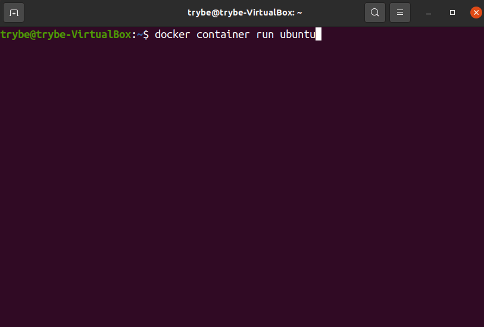
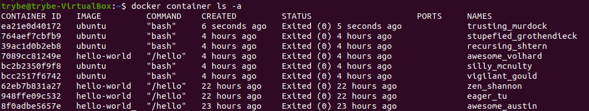
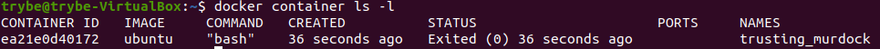
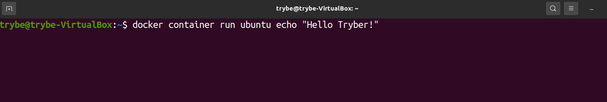
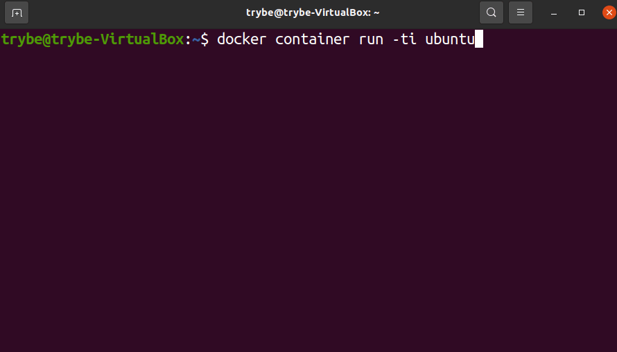

## O que são e como rodar containers ##

Antes de começar, no vídeo abaixo, vamos entender melhor o que é e qual a aplicação do Docker no contexto de desenvolvimento:

Como dito anteriormente, containers são como "pacotes", porém eles funcionam numa dinâmica um pouco diferente.
E aqui precisamos distinguir o que é um container e o que é uma imagem :

O container é um processo Docker que, internamente, possui tudo aquilo que é necessário para seu funcionamento: Sistema Operacional (Binários e Bibliotecas) e recursos necessários para sua aplicação;

A imagem é uma espécie de "fotografia" de um container , nós resgatamos uma imagem, quando queremos iniciar um novo container a partir de uma estrutura já conhecida.

## Containers ##

Containers lembram muito - mas não são - máquinas virtuais*, já que podemos rodar uma aplicação Linux em qualquer ambiente (Windows, Mac ou no próprio Linux) através dele.

* Máquinas virtuais são softwares que simulam (virtualizam) computadores completos (desde o hardware até o software), leia mais sobre isso nesse artigo . https://pt.wikipedia.org/wiki/M%C3%A1quina_virtual

Um container não é uma máquina virtual , pois embora compartilhem de mesmas características, o container é uma instância isolada (tem apenas uma finalidade) e compartilha dos mesmos recursos do sistema operacional hospedeiro, o que damos o nome de Virtualização a nível de Sistema Operacional (OS-level virtualization) .

Um container não deve ser utilizado para abrigar várias aplicações, e é justamente por isso que ele ocupa muito menos espaço que uma VM. Sua tendência é de manter somente o essencial no seu conteúdo.

## Imagens ##

Imagens podem se referir a praticamente qualquer tipo de container . Um exemplo disso é pensar o próprio sistema operacional Ubuntu, que possui uma imagem oficial no Docker Hub . https://hub.docker.com/_/ubuntu

O Docker Hub https://hub.docker.com/ é o principal repositório de imagens Docker atualmente. Nele, possuímos o que é chamado de Registro  https://docs.docker.com/registry/introduction/ (Registry) *, onde requisitamos essas imagens.
* O Registry é um sistema de armazenamento e entrega, no qual podemos ter um usuário com nossas próprias imagens. Algo que lembra muito o GitHub, já que podemos dar pull nessas imagens para uso posterior. Veremos isso mais adiante.

## Fluxo padrão ##

Para explicar melhor a dinâmica entre containers e imagens, falaremos um pouco de como funciona o fluxo padrão do Docker :

Tudo começa em um arquivo chamado Dockerfile . Este arquivo possui as instruções* necessárias para que possamos gerar uma imagem;

* Aqui vão instruções de qual sistema operacional usar, tal como quais comandos devem ser executados quando a imagem for rodada em um container .

Após isso, podemos dar push ou pull (como em um repositório do GitHub) em uma imagem no Registry *;
* Você pode dar pull na sua própria imagem (caso tenha dado push nela) ou em outra a sua escolha, como foi o caso do hello-world ).

O Registro mais comum é o Docker Hub , mas temos outros exemplos, como mostrado na imagem.

Por último, rodamos a imagem em um container , utilizando o comando run , que veremos mais adiante *.

* Após isso, temos que dizer pro container o que deve acontecer, se ele deve se manter ativo ou não, caso o contrário, o container é encerrado. O que faz parte de seu ciclo de vida.

## Rodando o sistema operacional Ubuntu em um container ##

Um ponto importante antes de começarmos, é entender que os comandos do Docker funcionam no seguinte formato:

docker <comando> <sub-comando> <parâmetros>

Sendo que podemos abreviar alguns comandos, como foi o caso do docker run hello-world , que também poderia ser escrito como docker container run hello-world . Utilizaremos esta última forma aqui por ser mais atual e verbosa .

Como comentamos anteriormente, o comando run serve para rodar uma imagem em um container , vamos testar isso com a imagem oficial do Ubuntu ? https://hub.docker.com/_/ubuntu
O formato do comando par

docker container run ubuntu

Se tudo correr bem, você deve enxergar o seguinte resultado:

se der erro de permissão ao conectar ao docker daemon digite o seguinte código:

sudo chmod 666 /var/run/docker.sock
https://www.digitalocean.com/community/questions/how-to-fix-docker-got-permission-denied-while-trying-to-connect-to-the-docker-daemon-socket

Aqui você deve ter notado duas coisas:

Uma vez que sua máquina local não possua a imagem do registro ( Unable to find image 'ubuntu:latest' locally ) , o Docker deve se encarregar de baixar essa imagem, fazendo o pull automaticamente ( latest: Pulling from library/ubuntu ) ;

Uma vez que o Docker baixou a imagem e rodou o container , nada aconteceu! 🤔

Na verdade, esse é o comportamento normal! Lembram que comentamos que, se não dissermos para o container o que ele deve fazer a seguir, o container é simplesmente encerrado?

Pois foi isso mesmo que aconteceu! Um container foi criado e iniciado e, uma vez que não demos nenhuma outra instrução pra esse container , ele foi encerrado.

## Listando containers ##

No Docker , é possível saber quais containers estão ativos com o seguinte comando:

docker container ls

Mas no nosso caso, o container iniciou e parou logo em seguida, então só é possível enxergar ele se passarmos o parâmetro -a para mostrar todos os containers incluindo os inativos.

docker container ls -a

Se você rodou o comando docker run <imagem> mais de uma vez, para cada uma dessas vezes foi criado um container . Nesse caso o retorno deve ter sido semelhante a esse:

Isso significa que o comando run também cria um novo container para aquela imagem toda vez que é executado , mas não se preocupe! É possível remover esses containers que não estão sendo mais utilizados, veremos isso mais adiante.

E caso você queira saber somente sobre o último container criado (independente do status dele), você pode usar o parâmetro -l

docker container ls -l

Vamos entender qual o significado de cada coluna:

CONTAINER ID: Identificador único*;
IMAGE: O nome da imagem utilizada para a criação do container ;
COMMAND: O comando executado/ em execução dentro do container ;
CREATED: Quando foi criado o container ;
STATUS: O status atual do mesmo, no nosso caso, encerrado;
PORT: A porta que estamos utilizando para nos comunicar com o container**;
NAMES: O apelido do container , como não definimos nenhum, foi criado um aleatório.

* Quando executamos algum comando relacionado ao container , podemos nos referenciar tanto pelo campo ID (inteiro ou parte dele), quanto pelo campo NAMES .
** Veremos isso mais adiante, mas o docker pode disponibilizar uma porta de acesso para aplicação.
Para isso, conseguimos fazer uma atribuição de uma porta do sistema hospedeiro, apontando para uma outra porta, no sistema cliente, no formato <porta-do-host>:<porta-do-cliente> .
Exemplo 8080:3000 , em que a porta 8080 do meu sistema representa a porta 3000 do container .

## Rodando um comando adicional antes de terminar o container ##

No Docker é possível executar comandos de terminal no container antes que ele seja encerrado (sobretudo se quisermos manter ele ativo por mais tempo que o normal) .

Para executar comandos no terminal do container é só adiciona-los no final da execução do run , conforme o modelo:

docker container run <nome-da-imagem>:<tag> <comando> <argumentos-do-comando>

Vamos aqui imprimir na tela um "Hello Tryber!" no terminal do Ubuntu, usando o comando echo do shell :

docker container run ubuntu echo 'Hello Tryber!'
O comando deve imprimir o texto na tela para depois encerrar o container :

## Rodando o container de forma interativa ##

E se quisermos, por exemplo, utilizar um terminal dentro do container (à la inception) ? É só passar o parâmetro -ti * ao comando run que dá acesso a esse terminal*:

* O comando -ti são dois comandos juntos:

-t que indica pro docker que estamos requisitando um terminal no container que consiga imprimir o retorno dos nossos comandos;

-i que estabelece uma interface de comunicação física com esse terminal, no caso, por meio do teclado.

docker container run -ti ubuntu

Dessa forma é possível ter acesso a ao terminal de forma interativa dentro do container , esse terminal já vem por padrão em modo root ( # ):

 

## Aqui é possível notar que: ##

O domínio do usuário root no terminal do container é o CONTAINER ID do mesmo, nesse caso 65897a6b07fb ( root@65897a6b07fb ) ;

O comando cat /etc/lsb-release retorna os dados da distribuição, no caso, o Ubuntu 20.04 que é a imagem utilizada;

Para sair desse terminal interno do container e retornar ao seu terminal, é só utilizar o comando exit .

Até aqui, você entendeu os princípios básicos sobre o funcionamento de containers . A seguir, vamos listar os principais comandos para manipulação deles!
