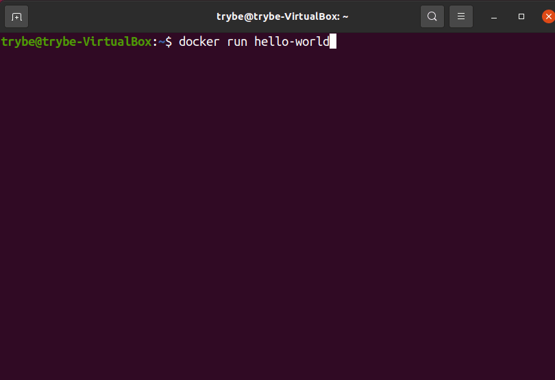

## Fazendo a instalação do Docker Engine ##

O primeiro passo para utilizar o Docker é realizar a instalação de seu motor , o que nos dará acesso a sua interface de linha de comando (CLI) *.

* No Linux, o Docker não possui uma interface gráfica de utilização (GUI) oficial, contudo, existem várias opções não-oficiais disponíveis, bem como uma extensão oficial da Microsoft para a plataforma no VSCode https://marketplace.visualstudio.com/items?itemName=ms-azuretools.vscode-docker , que pode ajudar muito no gerenciamento de seus containers .

Vamos fazê-la através do apt-get considerando uma máquina com Ubuntu LTS https://ubuntu.com/download/desktop (Suporte de longo prazo / Long-term support) 64-bit (amd64) *.
* Caso você queira ver as demais opções de instalações ou esteja utilizando outro SO , veja a documentação de instalação completa . https://docs.docker.com/engine/install/

Caso ocorra algum problema ou comportamento diferente em algum dos passos, por favor consulte o guia oficial . https://docs.docker.com/engine/install/ubuntu/

## Desinstalando versões anteriores ##

Caso você já possua alguma versão instalada na sua máquina e queira refazer o processo de instalação desde o princípio por qualquer motivo, seja pra atualizar ou para corrigir algum problema, primeiro você deve remover os pacotes da versão que está na sua máquina. Para isso, utilize o seguinte comando no terminal:

sudo apt-get remove docker* containerd runc

Caso nenhum dos pacotes esteja instalado, esse comando retornará um erro E: Impossível encontrar o <nome-do-pacote> , nesse caso, é só prosseguir com a instalação.

Detalhe, o Docker preserva informações sobre imagens, containers , volumes e redes na pasta /var/lib/docker/ . Nesse processo, esses arquivos não são apagados.
Para remoção completa do motor do Docker no seu sistema, consulte a seção Desinstalando o Docker Engine ao final desse tópico

## Atualizando os índices dos pacotes do apt ##

Na documentação https://docs.docker.com/engine/install/ubuntu/ de instalação do Docker no Ubuntu, é comentado que existem três formas de instalar o Docker : via repositórios, via pacotes .deb e via scripts específicos.
No nosso contexto, faremos a instalação via configuração de repositórios, pois isso facilita posteriormente a atualização desses mesmos pacotes.
No terminal, utilize o comando update para atualizar os índices dos pacotes do apt :

sudo apt-get update

Opcionalmente , atualize seus pacotes antes de fazer uma nova instalação:

sudo apt-get upgrade

## Habilitando HTTPS para o apt ##

Instale os seguintes pacotes, eles são recomendados pela documentação oficial para habilitar a utilização dos repositórios via HTTPS pelo apt-get , precisaremos disso para prosseguir a instalação:

sudo apt-get install \
    apt-transport-https \
    ca-certificates \
    curl \
    gnupg \
    lsb-release

## Adicionando uma chave de acesso ao repositório remoto ##

Adicione a chave GPG* oficial do Docker:

* Para adicionar uma camada de segurança nas transferências de dados entre computadores remotos no Linux, é possível que eles se comuniquem utilizando um sistema de chaves pública e privada, como o GPG (GnuPG) .

curl -fsSL https://download.docker.com/linux/ubuntu/gpg | sudo gpg --dearmor -o /usr/share/keyrings/docker-archive-keyring.gpg

Se tudo correr bem, você não deve receber nenhum retorno visual.

## Adicionando o repositório ##
Para adicionar o repositório oficial, execute o seguinte comando*:

echo \
  "deb [arch=amd64 signed-by=/usr/share/keyrings/docker-archive-keyring.gpg] https://download.docker.com/linux/ubuntu $(lsb_release -cs) stable" \
  | sudo tee /etc/apt/sources.list.d/docker.list > /dev/null

Perceba que adicionamos o repositório stable (em $(lsb_release -cs) stable ), isso significa que teremos somente o repositório com as versões estáveis do Docker .
* Em distribuições baseadas no Ubuntu (como o Linux Mint ), talvez você precise alterar o comando $(lsb_release -cs) para uma versão do ubuntu que seja compatível com aquele sistema. Exemplo: Caso você utilize o Linux Mint Tessa , você deve alterar o valor para bionic .
Atenção: O Docker não garante o funcionamento em sistemas fora do requisito de sistema operacional . https://docs.docker.com/engine/install/ubuntu/#os-requirements

## Instalando Docker Engine ##
Primeiro, vamos garantir que os índices dos pacotes do apt estão atualizados, já que adicionamos um novo repositório:

sudo apt-get update

Iremos instalar a última versão estável do Docker Engine - Commmunity , que é uma versão mantida pela própria comunidade, já que o Docker é Open-source . Faremos isso com a interface de linha de comando (CLI) e o containerd *.
* O containerd é um serviço que funciona em segundo plano ( daemon ) e é utilizado no funcionamento dos containers .

Para isso, execute no terminal:

sudo apt-get install docker-ce docker-ce-cli containerd.io

## Adicionando um usuário ao grupo de usuários docker ##

⚠️ Atenção ⚠️: Esse procedimento faz com que seu usuário tenha os mesmos privilégios do usuário root (o superusuário no linux) na execução dos comandos Docker *, então use-o com moderação, apenas em ambiente de desenvolvimento.
* Por padrão, o Docker faz a vinculação (bind) entre o sistema operacional hospedeiro e o cliente via socket Unix (um tipo de conexão que possui mais performance) e não via porta TCP (que possui menos performance) .

Sockets Unix são de uso exclusivo do usuário root . Sendo assim, qualquer comando do Docker que executarmos irá exigir ser iniciado como root , ou com sudo por qualquer usuário.

Para mais informações consulte a documentação oficial no site do Docker Docs .
Para evitar o uso de sudo em todos os comandos Docker que formos executar, vamos dar as devidas permissões ao nosso usuário. Primeiro crie um grupo chamado docker :

sudo groupadd docker

Caso ocorra uma mensagem: groupadd: grupo 'docker' já existe , é só prosseguir.
E então, adicione seu usuário a ele:

sudo usermod -aG docker $USER

Para ativar as alterações realizadas aos grupos, você pode realizar logout e login de sua sessão, ou executar no terminal:

newgrp docker

## Iniciando o Daemon do Docker ##
Para consultar o status do daemon do Docker, execute:

sudo systemctl status docker

Esse comando deve retornar algo como um pequeno relatório sobre o serviço, onde consta seu status de funcionamento:

● docker.service - Docker Application Container Engine
     Loaded: loaded (/lib/systemd/system/docker.service; enabled; vendor preset: enabled)
     Active: inactive (dead) since Thu 2021-09-23 11:55:11 -03; 2s ago
TriggeredBy: ● docker.socket
       Docs: https://docs.docker.com
    Process: 2034 ExecStart=/usr/bin/dockerd -H fd:// --containerd=/run/containerd/containerd.sock (code=exited, status=0>
   Main PID: 2034 (code=exited, status=0/SUCCESS

Caso o parâmetro Active esteja como stop/waiting ou no nosso caso, como inactive , rode o comando start para iniciá-lo:

sudo systemctl start docker

Ao consultar o status novamente, o processo deverá estar como start/ running/ active .
Habilite o daemon do Docker para iniciar durante o boot :

sudo systemctl enable docker

## Validando a instalação ##
Para validar se tudo ocorreu como deveria na instalação, vamos executar um hello world * do Docker:

docker run hello-world

O terminal deve retornar uma mensagem com dicas, conforme a seguir:

* Quando damos o comando docker run hello-world , estamos pedindo para que ele busque em seu repositório oficial, uma imagem chamada hello-world https://hub.docker.com/_/hello-world que é um exemplo simples de um container , esse que ao final, nos retorna uma mensagem de texto. Falaremos mais sobre isso adiante!
Pronto, temos o Docker prontinho para utilizarmos! 🐋
