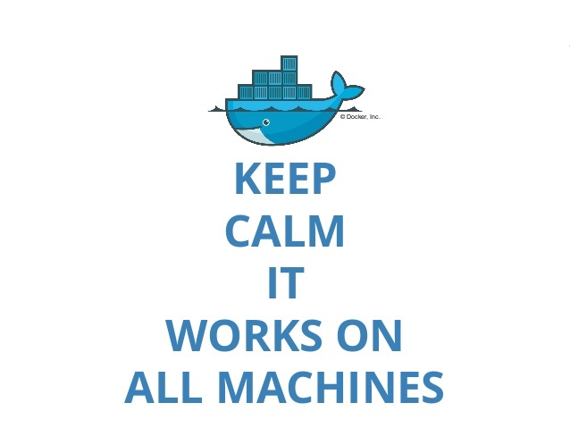

Por que isso é importante?

Vimos que para o desenvolvimento de aplicações utilizamos diversas ferramentas e tecnologias , vimos também que durante o ciclo de desenvolvimento é normal lidarmos com uma quantidade gigante ambientes distintos , principalmente em ambientes de desenvolvimento dinâmicos, onde ora seu aplicativo roda em um sistema, ora roda em outro.

Esse cenário exige que, ao desenvolver uma aplicação, seja necessário preparar e configurar todo o ambiente com as tecnologias necessárias, assim como integrá-las .
Fazer isso nem sempre é uma tarefa simples e o processo se torna ainda mais complexo quando há múltiplos ambientes, distintos entre si, e também a necessidade de rodar em diversas máquinas (desde sua máquina pessoal local, a servidores externos pagos, ou mesmo uma máquina virtual ) que, muitas vezes, possuem configurações e utilizam sistemas operacionais diferentes .
Dessa forma, além de nos preocuparmos com o código, temos que prover as dependências necessárias para rodá-lo em diferentes configurações. Daí surge a famosa frase:

"Na minha máquina roda..."

Boa parte da popularidade desta frase é causada por lidarmos com esses diferentes cenários que mencionamos anteriormente .
Por exemplo, se uma pessoa desenvolve utilizando uma distribuição 'A' de Linux , outra utiliza Windows, outra utiliza Mac e no servidor roda uma distribuição 'B' de Linux, todas elas estão trabalhando no mesmo projeto, e da mesma forma, estão disponibilizando-o para o ambiente de produção, em um servidor remoto comum (Ao que damos o nome de **processo de deploy ou implantação** ).

* Distribuições de Linux são 'versões' que, apesar de terem uma base/núcleo comum (serem frutos do mesmo projeto), podem se diferenciar em muitos aspectos , seja na disponibilidade de recursos e bibliotecas, seja na maneira como fazemos a operação desses sistemas.
Exemplos de "distros" Linux bem populares são o Ubuntu e seus derivados. Saiba mais sobre distribuições Linux em seu artigo no Wikipédia https://pt.wikipedia.org/wiki/Distribui%C3%A7%C3%A3o_Linux .

Além dos diferentes Sistemas Operacionais - S.O.s (Ou somente 'SO') , é muito comum que existam softwares, ferramentas e dependências distintas ou com versões diferentes em cada máquina.

Dessa maneira, é muito difícil garantir que o que funciona na máquina de uma pessoa funcionará na máquina de outra sem a necessidade de fazer novas configurações.
Inclusive, não conseguimos garantir também que funcionará nos servidores durante o processo de deploy .

Para resolver tais complexidades de compatibilidades, bem como economizar o tempo no processo de preparação de uma máquina para rodar um programa específico, foi criado o Docker .

Com ele, também conseguimos simular e testar facilmente um ambiente completo, de maneira leve e inteligente, em questão de minutos, podendo replicar tais configurações para outra máquina com facilidade, além de conseguir *trabalhar com nossas aplicações em escala* de forma simples!

* É bem provável que uma aplicação popular demande muitos recursos de uma máquina só, é por isso que existem técnicas que buscam aumentar esses recursos (por demanda), para que seja possível lidar com o processamento adicional.

É o que chamamos de escalabilidade vertical ou horizontal ! Falaremos disso mais adiante.

Portanto, por meio do Docker , resolvemos o problema de incompatibilidade com outros sistemas, dado que ele funciona como uma espécie de "empacotador" de todas essas dependências e requisitos para que sua aplicação funcione sem problemas! Isso torna simples sua disponibilização!

Devido essas diversas vantagens, o Docker ganhou grande espaço e seu uso é cada vez mais comum!

As maiores empresas de tecnologia hoje o utilizam para manter grandes arquiteturas, assim como as pequenas utilizam de suas facilidades para manter no ar aplicações de forma simples e com menos custos.

Se olharmos o Google Trends (dados sobre pesquisas no Google) , começando pelo ano de lançamento do Docker (2013), até o fim da década (2019) , conseguimos ter um bom indicador dessa popularidade por meio do número de pesquisas pelo software "Docker" nesse período. Muito disso se deve ao conceito de conteinerização* de aplicações, que é adotado por muitas tecnologias atualmente.

* No contexto de tecnologia informática, um container é uma espécie de "pacote" com tudo aquilo que seu software precisa para ser executado em um determinado ambiente. Falaremos disso mais adiante.

Dessa forma, é essencial saber Docker , tanto para se adequar ao mercado como para aproveitar seus benefícios durante o ciclo de vida de nossas aplicações.