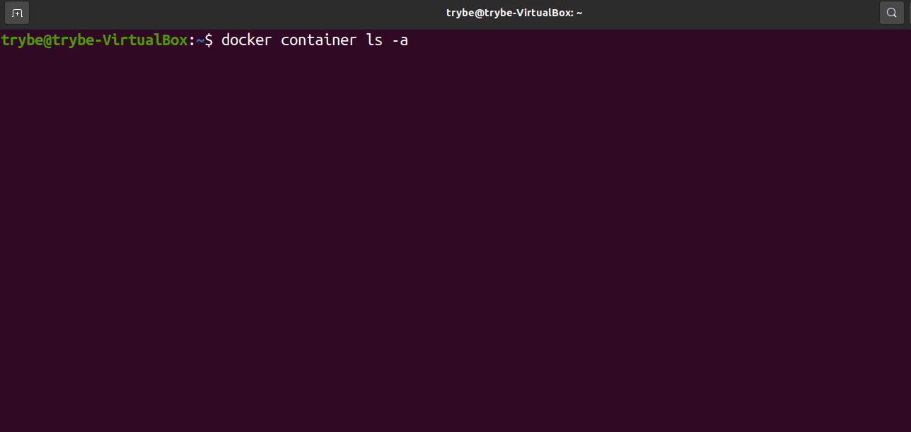
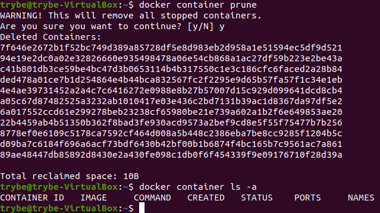
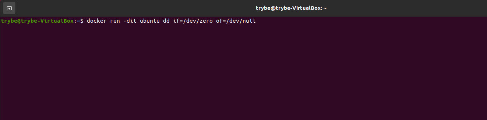

## Principais comandos do CLI ##

Passaremos um resumo do que foi visto até aqui, complementando com comandos adicionais que podem ser utilizados para manipulação de containers no CLI do Docker . Alguns deles devem ser resgatados nos próximos dias.

Pontos importantes:

docker <comando> <subcomando> <parâmetros> é o formato padrão para comandos não-abreviados no CLI;

Utilize o parâmetro --help no <comando> ou <subcomando> para ter a relação completa do que pode ser executado a partir deles;

Exemplo: docker container --help , ou docker container run --help .

Os <parâmetros> são opcionais na execução dos comandos;
O conteúdo faz referência a documentação oficial dos comandos no Docker Docs .

## Criar e rodar um container ##

Deve criar um novo container e roda-lo logo em seguida:

docker container run <parâmetros> <imagem>:<tag>

O parâmetro --name define um <nome-da-sua-escolha> para aquele container (ao invés de um nome aleatório) :

docker container run --name <nome-da-sua-escolha> <imagem>:<tag>

Modo 'Cleanup': O parâmetro --rm deve garantir que o container seja removido ao final da execução (útil para testar imagens sem ficar acumulando containers novos) :

docker container run --rm <imagem>:<tag>

O parâmetro -d (de --detach , desacoplado em português) rodará esse container em segundo plano*:

docker container run -d <imagem>:<tag>

  * Trabalhar em segundo plano significa que a aplicação está rodando, porém de forma assíncrona ao comando, ou seja, embora não esteja visível, o processo está lá, funcionando por de trás dos panos. É possível validar isso com o comando docker ps -a .

  O comando -d em outros aplicativos e serviços também pode estar associado ao conceito de daemon , que também é uma forma de se referenciar aplicativos que estão funcionando em segundo plano.

  No exemplo da imagem ubuntu, faz sentido passar o parâmetro -d associado ao -it como em: docker container run -dit ubuntu , o que manterá o container ativo em segundo plano, já com um terminal disponível para acesso;

(Comando antigo) * Abreviação do comando docker container run :
docker run <parâmetros> <imagem>:<tag>

  * Nas versões mais novas, o Docker vem adotando comandos mais verbosos, nos quais identificamos a entidade ( container , image , etc) que estamos trabalhando, antes de realizar o comando (o que o torna mais semântico).

  Isso não significa, contudo, que os comandos das primeiras versões estejam depreciados (caíram em desuso) , mas pode ser um alerta para futuras versões.

## Criar um container sem executá-lo ##

Cria um container com a imagem de referência, mas não o executa imediatamente:
docker container create <parâmetros> <imagem>:<tag>

O parâmetro -it nesse contexto, deve garantir que ao iniciar o container , ele se mantenha ativo e disponha de um terminal de acesso:
docker container create -it <imagem>:<tag>

(Comando antigo) Abreviação do comando docker container create :
docker create <parâmetros> <imagem>:<tag>

## Listar containers ##

Lista ( ls , list em inglês) todos os containers ativos :
docker container ls

Lista todos os containers ativos e inativos :
docker container ls -a

Lista o último container criado (independente do seu estado) :
docker container ls -l

(Comando antigo) Abreviação do comando docker container ls (que também pode ser chamado como docker container ps ):
docker ps <parâmetro>

## Iniciar, reiniciar, pausar, resumir e parar um container ##

Inicia* um container usando referências de sua identificação única (campo CONTAINER ID , parcialmente ou inteiro) , ou pelo nome (campo NAMES ) que foi definido:
docker container start <CONTAINER ID || NAMES>
  * Note que o comando start difere do comando run . O start apenas inicia o container que já havia sido criado (mas estava inativo), enquanto o run cria e executa um novo container!

Reinicia um container usando as referências citadas anteriormente:
docker container restart <CONTAINER ID || NAMES>

Pausa um container usando as referências citadas anteriormente:
docker container pause <CONTAINER ID || NAMES>

Tira um container do modo de pausa usando as referências citadas anteriormente:
docker container unpause <CONTAINER ID || NAMES>

Encerra um container usando as referências citadas anteriormente:
docker container stop <CONTAINER ID || NAMES>

(Comando antigo) São abreviações para os comandos anteriores:
docker <start || restart || pause || unpause || stop> <CONTAINER ID || NAMES>
  Dica: É possível realizar essas operações passando mais de uma referência de container por vez, como no exemplo abaixo:

## Retomando o acesso a um container interativo rodando em segundo plano ##

Caso você tenha iniciado um container em segundo plano utilizando -dit , você pode acessar esse container rodando o comando attach :
docker container attach <CONTAINER ID || NAMES>

Abreviação do comando docker container attach <CONTAINER ID || NAMES> :
docker attach <CONTAINER ID || NAMES>

## Excluindo containers específicos ##

Se o container não estiver ativo, esse comando deve remover o mesmo:
docker container rm <CONTAINER ID || NAMES>

Se o container estiver ativo, você deve passar o parâmetro -f (forçar) para parar sua execução e depois efetuar a remoção:
docker container rm -f <CONTAINER ID || NAMES>

(Comando antigo) Abreviação do comando docker container rm :
docker rm <CONTAINER ID || NAMES>

## Limpando containers que não estão sendo utilizados ##

⚠️ Use com moderação ⚠️: Esse comando deve remover todos os containers inativos do seu computador. O comando pede confirmação e o resultado é conforme a imagem a seguir:

docker container prune

## Monitorando os processos dentro de um container ##

O comando *top* , assim como nos terminais linux, traz as informações sobre os processos que estão sendo rodados, mas dentro daquele container , o que não inclui, por exemplo, serviços que são compartilhados com o sistema hospedeiro. Ele é útil para quando estamos os rodando em segundo plano:

docker container top <CONTAINER ID || NAMES>

Aqui o container é rodado com um comando dd if=/dev/zero of=/dev/null (que no nosso caso, serve para estressar o container ) que gerou um processo, esse que é mostrado na lista de processos.

## Utilizando os comandos do CLI na prática ##

1) docker container run hello-world
Essa imagem serve como funciona o container, fazemos o pull da imagem e o docker cria um container utilizando essa imagem, e quando ele roda o container ele retorna um texto como qo foi rodado. Depois ele fica inativo.

2) docker container ps só mostra os ativos, para mostrar todos é ps -a  e o último -l

3) docker container start id, só inicia o container

4) docker container stop id

5) deleta todos os inativos docker docker container prune

6) docker container tm id, deleta somente 1 inativo, se tiver ativo tem que passar rm -f

7) remover pelo nome docker container rm name