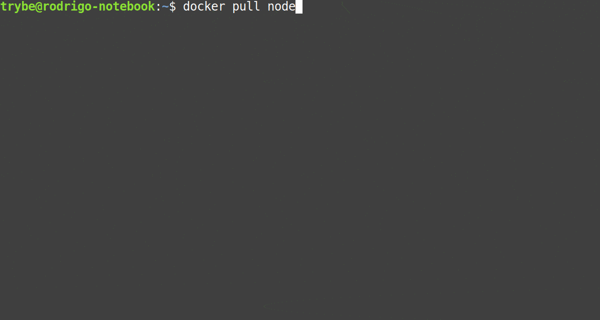
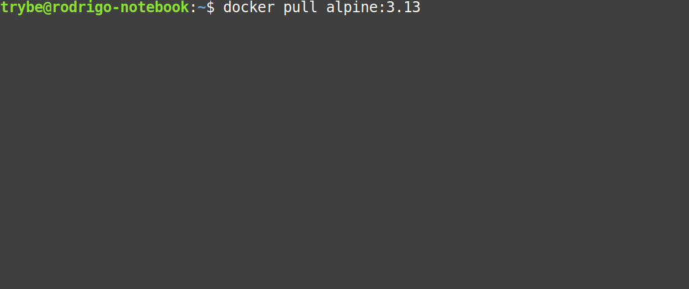
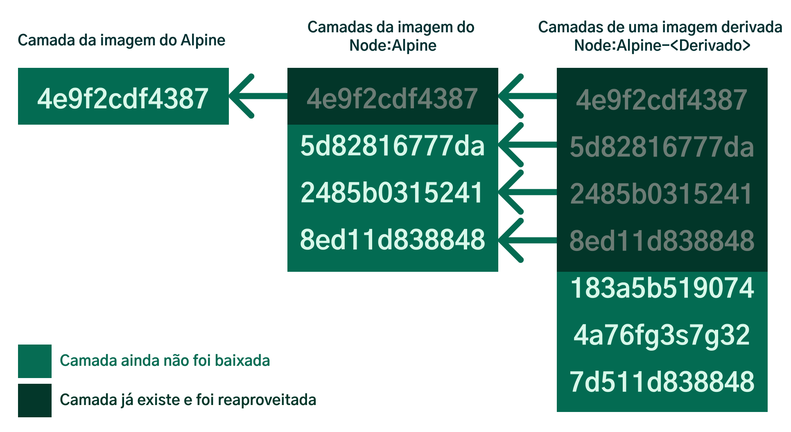
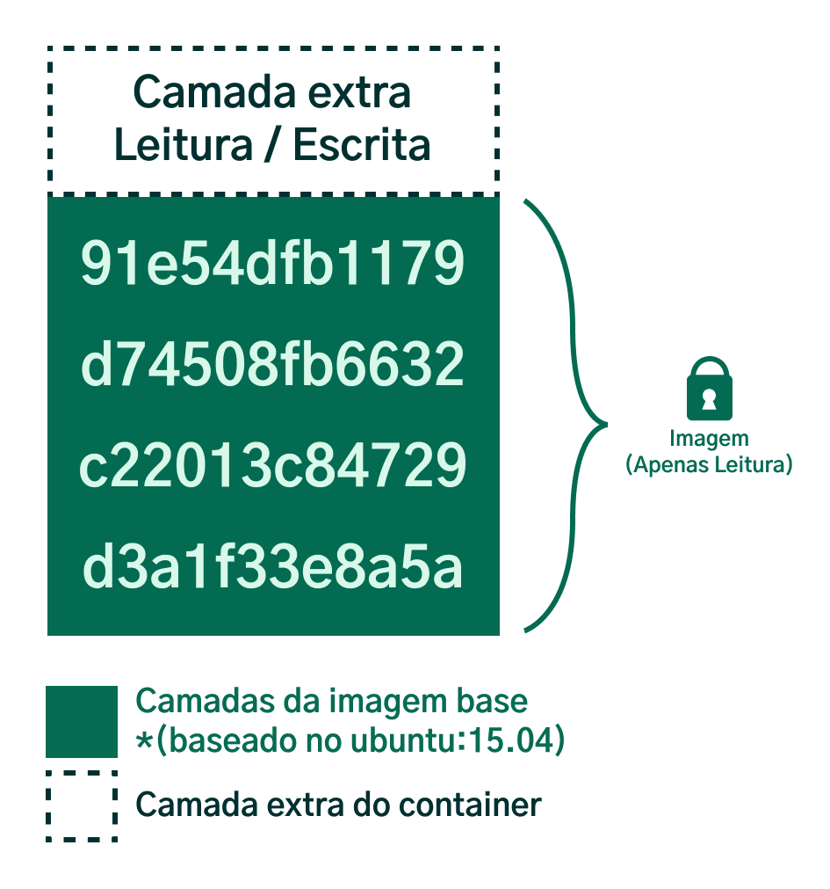
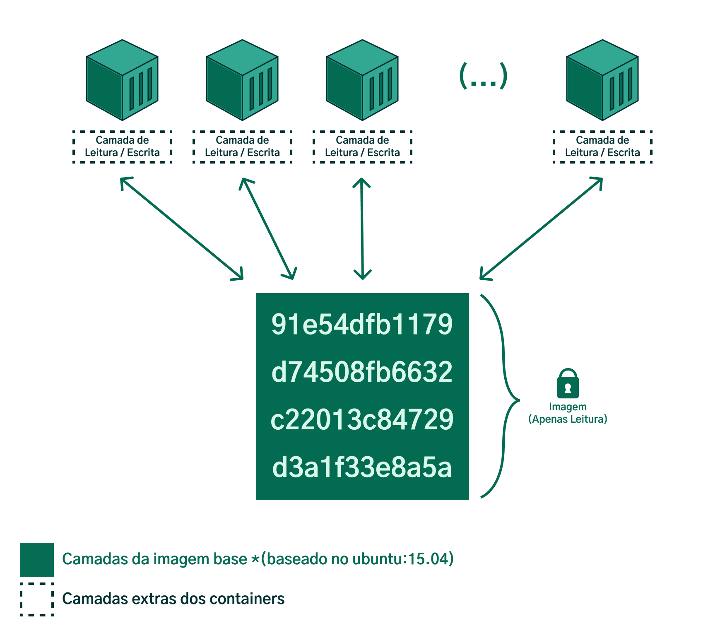

## Como funciona o sistema de camadas de uma imagem? ##

Quando fazemos o download de uma imagem (por exemplo, com o comando docker pull <imagem> , que baixa a imagem, mas não cria nenhum container) , podemos perceber nesse processo, a existência de vários downloads e extrações acontecendo. Cada um desses downloads representa uma camada :

Mas para que servem essas camadas? O Docker divide suas imagens em camadas para que elas possam ser reaproveitadas por outras imagens e não precisem ser instaladas em duplicidade.

Toda imagem no Docker pode ter uma ou várias camadas e esse sistema é conhecido como **Layered File System (Sistema de Arquivos em Camadas).**

Como em praticamente toda instância dentro Docker , cada camada também é representada por um código único (uma hash) . A finalidade dessas camadas *é que elas possam ser reaproveitadas por outras imagens.*

*Cada camada corresponde a um conjunto de instruções que, em alguns casos, são comuns a outras imagens.*

Exemplo: A distribuição linux Alpine https://www.alpinelinux.org/ é muito utilizada em imagens do Docker por ser uma distribuição que possui somente o essencial para seu funcionamento, o que torna ela uma opção leve, rápida, simples e segura.
Por isso, vários softwares a usam por padrão, ou pelo menos mantêm uma versão / tag utilizando essa distribuição como base, como é o caso do node:alpine .
Portanto, se dermos o comando docker pull alpine:3.13 * baixando a versão 3.13 dessa distribuição e, logo após, dermos o comando docker pull node:alpine3.13 (ou seja, baixando uma imagem do software node preparada a partir da mesma versão dessa distribuição) , veremos que a imagem do node, deve reaproveitar uma camada que já foi baixada em outro momento :

A imagem a seguir ilustra esse processo:

Aqui, há o reaproveitamento das camadas da distro Alpine pela imagem do Node e, sucessivamente pelas *imagens que sejam derivadas deste* . Quaisquer outras imagens que tenham etapas iguais a alguma das anteriores também vão aproveitar aquelas que já estão salvas no disco.

Dessa forma, o Docker consegue economizar espaço em disco não precisando baixar mais camadas em duplicidade.

Um ponto importante sobre as camadas é que aquelas que pertencem a imagem *são somente para leitura* , ou seja, você não consegue escrever nada nelas.

Porém, como vimos na aula anterior, se acessarmos um container de modo interativo, (por exemplo, com docker run -it ubuntu ), e fizermos atualizações (com o apt-get ) ou criarmos novos arquivos, **estes serão persistentes mesmo se reiniciarmos o container.**

Faça esse experimento, rode no terminal o comando:

  docker run --name meu_container -it ubuntu

No terminal do container criado, rode o seguinte comando para criar um arquivo de texto, já com um conteúdo dentro:

  echo "Teste container" > ola_mundo.txt

Verifique se o arquivo foi criado, consultando seu conteúdo com o comando cat :
  cat ola_mundo.txt

Assim que o terminal imprimir a mensagem Teste container , encerre o terminal com o comando exit ;

Esse comando deve inativar o container, que estava ativo por conta dessa interação;

Até aqui, entendemos que houve escrita na área reservada para isso no container , portanto, se iniciarmos o container novamente:

  docker start -ai meu_container
# Aqui passamos o parâmetro `-ai` ao comando `start`,
# para dizer que queremos acoplar ao container (`a`, de 'attach'),
# de modo interativo (`i`, de 'interactive').

E rodarmos novamente o comando cat no terminal interativo para imprimir o conteúdo do nosso arquivo:

  cat ola_mundo.txt

Você verá que a mensagem Teste container apareceu novamente, logo, o arquivo ola_mundo.txt persistiu mesmo ao reiniciarmos o container.

Como isso foi possível? Como citado anteriormente, não é possível escrever nas camadas de uma imagem, mas todas as vezes que criamos um container, uma camada extra (chamada frequentemente de “container layer” - camada do container) é adicionada aquela imagem para que seja possível ler e escrever nela:

Desse modo, ao criar um container sobre uma imagem, é possível interagir (por meio de leitura e escrita) com essa camada extra do container e o restante das camadas permanece inalterada, apenas com permissão de leitura.

É dessa forma que conseguimos ter vários containers trabalhando em cima de uma mesma imagem , dado que cada "camada de container" possui seu próprio espaço para leitura/escrita, conforme o diagrama:

