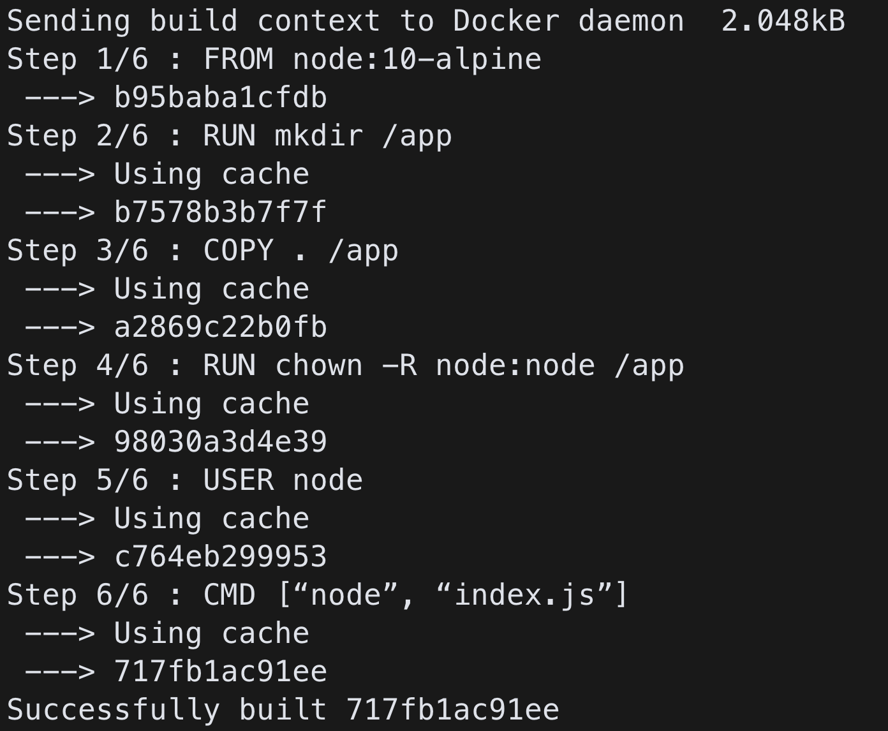
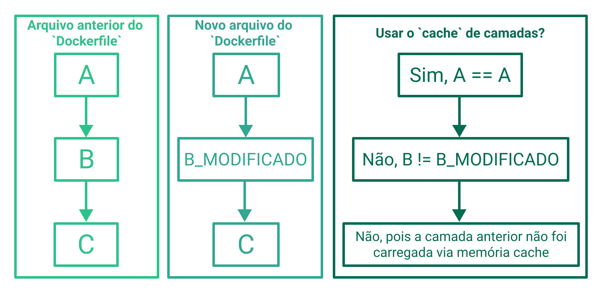

## Layers e Cache ## 

Como visto na seção Gerando uma imagem a partir do nosso Dockerfile , ao criarmos nossas imagens, cada comando é considerado uma "camada" (layer), podemos ver detalhadamente ao gerarmos uma build ( buildarmos ) de nossas imagens, por exemplo:

Importante entendermos essa arquitetura para explorarmos uma de suas principais funções, o uso de cache *.

  * Esse termo remete ao uso de uma "memória cache", que na prática é uma armazenamento rápido e temporário, que pode ser utilizado junto a algum recurso.

Nesse o contexto, o nosso cache , mantém armazenados, camadas de uma imagens após seu processo de build .

Caso o Docker identifique que não houve mudança naquele Step (passo, em português) , ele irá utilizar o cache do último build . Observe o seguinte Dockerfile , como exemplo:

  # Step 1
  FROM node:10-alpine
  # Step 2
  WORKDIR /usr/src/app
  # Step 3
  COPY [".", "./"]
  # Step 4
  RUN ["npm", "install"]
  # Step 5
  ENTRYPOINT [ "npm", "start" ]

Para tirarmos melhor proveito dessa estrutura, é recomendado dividirmos em partes cada etapa do processo e sempre deixando as etapas mais propensas a alterações para baixo do nosso "pipeline" (Nossa segmentação de instruções) .

Vamos à uma nova versão do nosso Dockerfile de exemplo:

  # Step 1
  FROM node:10-alpine
  # Step 2
  WORKDIR /usr/src/app
  # Step 3
  COPY ["./package.json", "./package-lock.json", "./"]
  # Step 4
  RUN ["npm", "install"]
  # Step 5
  COPY ["./src", "./"]
  # Step 6
  ENTRYPOINT [ "npm", "start" ]

  Nessa nova versão temos mais "steps", porém, caso haja alteração somente em nosso código fonte (contido em src ), apenas os passos a partir do "Step 5" serão repetidos, evitando a reinstalação das dependências, por exemplo. Esse é um exemplo simples mas já podemos perceber grande ganho em nosso Dockerfile , em arquivos mais complexos esse ganho é ainda maior.
