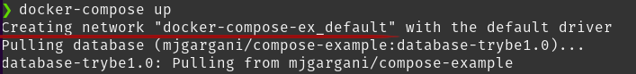

## Compose File - Parte II ## 

# Volumes

Assim como aprendemos a utilizar volumes executando nossos containers de maneira individual, conseguimos também utilizar volumes por meio do nosso arquivo compose .

Podemos definir nossos volumes da mesma maneira que fazemos com o comando docker container run , tanto como bind como da forma nomeada.

Podemos utilizar a forma mais extensa dele também, por exemplo:

version: "3.8"
services:
  web:
    image: nginx:alpine
    volumes:
      - type: volume
        source: mydata
        target: /data
        volume:
          nocopy: true
      - type: bind
        source: ./static
        target: /opt/app/static

  db:
    image: postgres:latest
    volumes:
      - "/var/run/postgres/postgres.sock:/var/run/postgres/postgres.sock"
      - "dbdata:/var/lib/postgresql/data"

volumes:
  mydata:
  dbdata:

## Networks ##

Conforme vimos na seção Networks , nossos containers precisam estar na mesma rede para conseguir se comunicar utilizando o name .

Utilizando o Docker Compose , isso já é realizado de maneira padrão. Ao iniciar um novo arquivo, será criada uma rede padrão (bridge) para comunicação de todos os serviços especificados nele, dessa forma conseguimos facilmente comunicar todos os services de nosso ambiente. Quando executamos nosso arquivo de exemplo, você pode ter notado que o início do log é justamente a criação de uma rede padrão, algo similar a imagem a seguir:

⚠️ Lembre-se que se apontarmos para o localhost:3000 simplesmente, nosso container irá acessar a sua própria porta 3000 e não irá encontrar nada, pois o banco está em outro serviço. Por isso, devemos sempre utilizar, caso o serviço esteja em outro container , o nome dele.

Porém, ainda podemos criar nossas próprias redes customizadas, caso faça sentido para nossa arquitetura, por exemplo, quando queremos isolar os serviços.

Para isso, basta utilizar a opção networks em nossos serviços, definindo uma rede para um serviço específico e, ao final do arquivo, de forma semelhante ao volume, definimos as redes a serem criadas. A sintaxe básica é a seguinte:

version: "<VERSÃO-DO-COMPOSE>"
services:
  <MEU-CONTAINER-1>:
    image: <MINHA-IMAGEM:VERSÃO>
    networks:
      - <NETWORK-1>
    # ... outras configurações
  <MEU-CONTAINER-2>:
    build: <CAMINHO-DO-DOCKERFILE>
    networks:
      - <NETWORK-1>
      - <NETWORK-1>
    # ... outras configurações
  <MEU-CONTAINER-N>:
    image: <MINHA-IMAGEM:VERSÃO>
    # ... outras configurações

networks:
  <NETWORK-1>:

Agora, vamos a um exemplo! Imagine que temos um ambiente com 3 services , sendo um front-end e dois back-ends, mais um banco de dados. Nessa arquitetura, apenas os back-ends acessam o banco de dados e o front-end acessa os back-ends. Para criarmos esses isolamentos, nosso YAML ficaria semelhante ao exemplo abaixo:

version: '3'

services:
  frontend-a:
    build: ./frontend_a
    networks:
      - frontend

  backend-a:
    build: ./backend_a
    networks:
      - backend
      - frontend

  backend-b:
    build: ./backend_b
    networks:
      - backend
      - frontend

  db:
    image: mysql
    networks:
      - backend

networks:
  frontend:
  backend:

