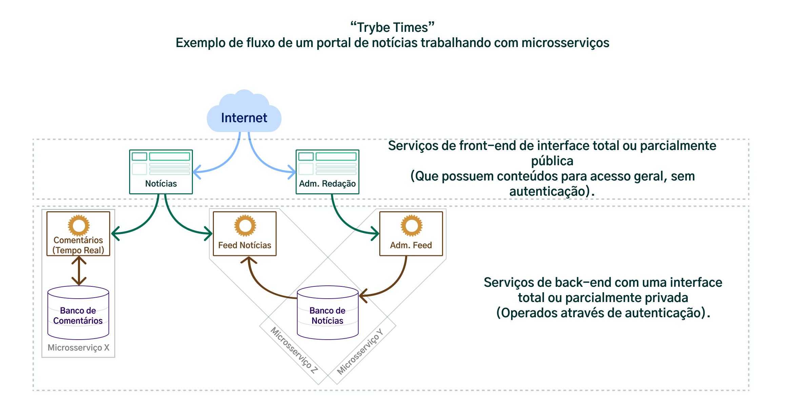
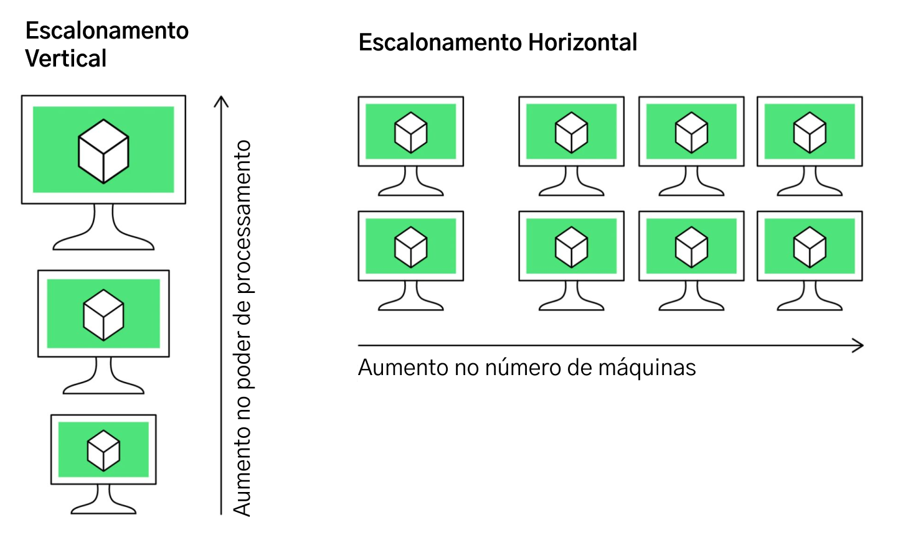
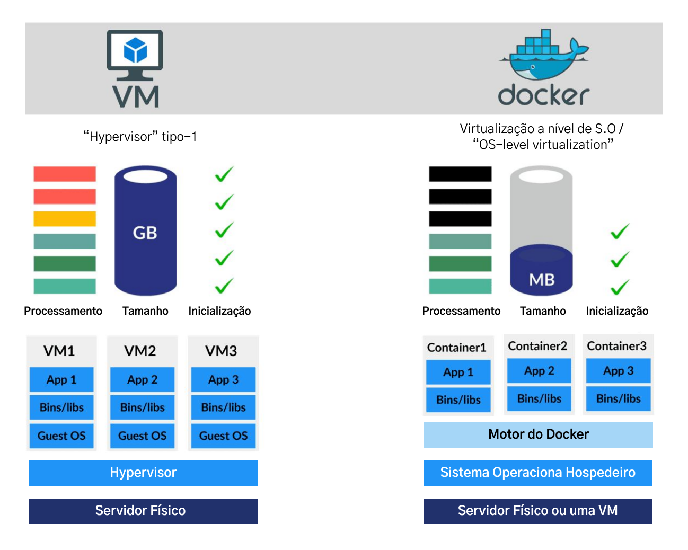
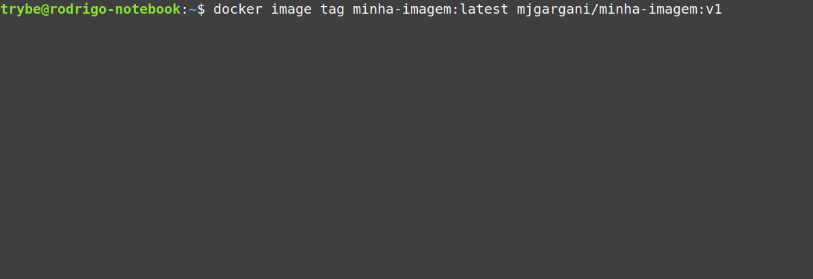
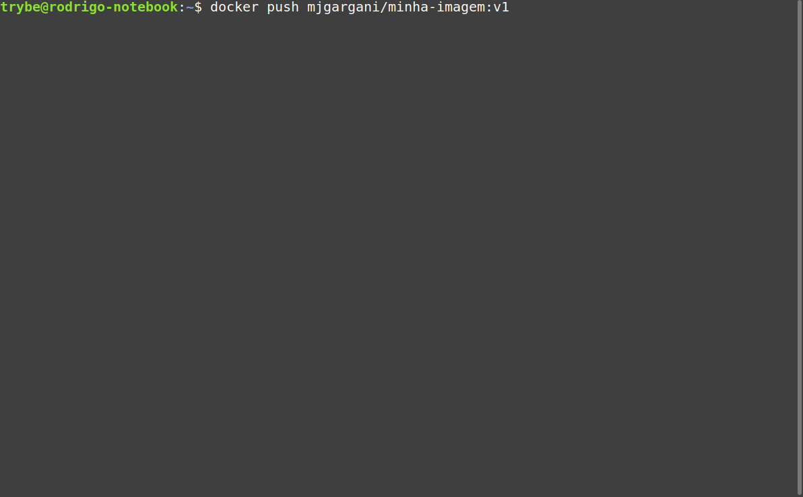

## Tópicos extras sobre Docker ##

Por que isso é importante?

Atualmente, o Docker se tornou uma tecnologia fundamental no ciclo de desenvolvimento de várias empresas, de forma que as aplicações já "nascem" dentro de containers . Ou seja, desde do começo, todo o código já é feito e adaptado para rodar dessa forma.
Isso é ainda mais vantajoso quando mais de uma pessoa desenvolvedora trabalha em um mesmo código, pois essa estratégia permite que os times ganhem agilidade tanto na fase de desenvolvimento, quanto na fase de entrega e deploy , vez que os projetos já se iniciam prontos para rodar nos diversos ambientes, ou seja, prontos para serem publicados.

Dado que a utilização de aplicativos conteinerizados acelera o ciclo de entregas e a escala das operações (pensando aqui as crescentes demandas do mercado atual), grande parte das empresas utiliza infraestruturas baseadas em containers .
Nessas infraestruturas, para se publicar qualquer aplicação, ela deverá ser encapsulada num container (Ou como dizemos no uso com Docker: "Dockerizada") .

É essa demanda que coloca sobre a mesa a importância de sabermos como criar e gerenciar imagens Docker de nossos apps e como trabalhar com seus containers .
Quando e por que precisamos do Docker?
Como dito anteriormente, uma das principais vantagens de usar o Docker é a potencial escalabilidade que ele proporciona para execução das nossas aplicações , e quando falamos em escala, podemos pensar numa relação de quantidade vs. qualidade.

Tudo começa com a finalização e entrega do produto : Como fazemos para manter a qualidade da nossa aplicação se escalarmos sua utilização para dezenas, centenas, milhares, ou até mesmo milhões de usuários ao mesmo tempo!? Para responder a essa pergunta, a seguir vamos analisar dois cenários.

## Distribuição de um software autossuficiente ( Standalone )

Considere, por exemplo, a distribuição de um software para um Sistema Operacional. Para que a distribuição do software seja popular, o ideal é que ela possua o mínimo de etapas para sua utilização, ou seja, quanto mais autossuficiente for seu instalador, mais prático e mais fácil vai ser para executar seu software.
Quando temos uma aplicação que requer muitos recursos (bibliotecas adicionais, banco de dados ou até mesmo outros softwares) , temos que garantir que essas dependências serão atendidas antes que a pessoa usuária possa executar nossa aplicação.
Além disso, nem sempre mandar somente o código fonte vai resolver o problema: precisamos preparar o ambiente para que aquele código funcione corretamente. É daí que vem a ideia de Empacotamento !

A ideia de um pacote é que ele possui informações e itens fundamentais para que sua aplicação funcione corretamente* . No Sistema Operacional(OS), um pacote precisa de um desempacotador que também é responsável por organizar e disponibilizar aquele conjunto de itens para que possamos executar aquela aplicação.

* No caso do Linux (e sistemas Unix em geral), pacotes podem possuir arquivos executáveis, mídias, outras bibliotecas e informações sobre bibliotecas adicionais que devem ser instaladas antes, caso esse software precise.

No Docker , trabalhamos com a ideia de Containers (contêineres em português) , que na prática funcionam como se fossem pacotes , porém numa dinâmica um pouco diferente , já que neles temos não só os arquivos fundamentais da aplicação (scripts, executáveis, mídias, etc), como também todo o sistema operacional e suas bibliotecas*, além de instruções de como preparar e rodar sua aplicação naquele ambiente.

Um modelo que lembra - mas não é o mesmo - o de uma Máquina Virtual (VM) . Falaremos mais adiante das diferenças entre os dois.

Dessa forma conseguimos, com o Docker , preparar (como em um processo de desempacotamento e instalação) e rodar esses containers na nossa máquina. Isso reduz - e muito, principalmente em um ambiente de desenvolvimento - a quantidade de etapas que precisamos seguir para rodar nossa aplicação de maneira ideal.

Esse recurso também permite que consigamos rodar várias instâncias ( containers ) de aplicações ao mesmo tempo . Isso é especialmente importante quando falamos em arquiteturas baseadas em microsserviços .

## Microsserviços

Ao falar de Microsserviços estamos falando, antes de tudo, de uma decisão de arquitetura geral para aplicações .

Essa arquitetura promove o desmembramento da aplicação toda em partes menores, que funcionam como serviços desse aplicativo.

Isso pode contribuir para a agilidade de times de desenvolvimento, dado que uma parte não é necessariamente dependente da outra . Por exemplo, em uma rede social, o serviço de atualizações de feed não é dependente do serviço de chat, mas ambos fazem parte do mesmo aplicativo .

Nesse sentido, a arquitetura mais popular para produção de sistemas em larga escala é a de microsserviços , e essa ilustração mostra como é um ambiente simples desse tipo:

Aqui, nosso sistema possui dois front-ends (dois níveis de acesso diferentes), e essas duas frentes possuem acesso ao total de 3 serviços (sendo que um deles, compartilha do mesmo banco de dados). No entanto, toda essa estrutura diz respeito a mesma aplicação: "TrybeTimes".
Esse tipo de estrutura é amplamente escalável, ao ponto que, podemos ter uma mega estrutura, como no exemplo abaixo:

Não precisam focar em entender exatamente como é o fluxo desse sistema, basta entender, que cada uma das caixas verdes simboliza uma pequena API, um microsserviço .

De forma bem básica, APIs são softwares dos quais consumimos alguma informação, algo no mesmo modelo do Star Wars API (SWAPI) ou o The Meal DB API , utilizadas em projetos durante o curso.

Aqui esses pequenos softwares representam partes específicas e isoladas de um software maior.
Por exemplo: Imaginem que esse fluxo todo representasse uma rede social, você poderia pensar cada um dos microsserviços como um aspecto dessa rede social, então você poderia ter um serviço de feed de notícias, um chat, um serviço de perfis, etc.

Esse tipo de arquitetura é oposta a aquela que chamados de monolítica , que por sua vez, contém todos os aspectos de um software contidos em apenas uma aplicação . Se ocorrer um problema nesse tipo de aplicação, todos os seus aspectos param de funcionar.

Imagine como seria pra uma pessoa desenvolvedora júnior ter que configurar cada um desses pequenos serviços que incluiriam desde sistema operacional a bibliotecas, softwares adicionais, banco de dados, etc , para só a partir daí conseguir rodar a aplicação e fazer alterações?

Para resolver esse problema, uma ferramenta como o Docker para empacotar e entregar nosso software , da maneira mais simples e prática possível, é perfeita.

Com ele, podemos colocar, num mesmo "pacote", tudo que é necessário para nossa aplicação funcionar!
Isso torna mais simples que possamos reproduzir o aplicativo de alguém sem a necessidade de fazer a configuração do ambiente toda vez. Isso em qualquer ambiente!

O Docker se encarrega de aproveitar tudo aquilo que ele tem em comum com o sistema em que ele está instalado - o que chamamos também de sistema hospedeiro - criando aquilo que chamamos de container - o que seria nosso sistema convidado .

Capacidade de gestão e processamento de dados de um software na nuvem
Se estamos trabalhando com um sistema na nuvem , ou seja, um software que não é instalado no seu computador, mas que podemos ter acesso via navegador de internet, muito provavelmente estamos falando da relação entre uma quantidade expressiva de clientes (pessoas usuárias) consumindo um servidor (computador que hospeda sua aplicação) , ao mesmo tempo, ainda que por um momento específico no dia.

Nesse contexto, voltemos a atenção para o servidor , já que ele é o responsável por rodar sua aplicação e processar essa demanda de requisições e manipulação de dados.

Se nossa aplicação tiver muito tráfego, ou seja, for um software muito utilizado, muito consumido, talvez esse servidor não dê conta da quantidade de requisições e, portanto, exigirá mais recursos para conseguir continuar trabalhando.

Esse problema ocorre muito com quem possui seus próprios servidores físicos. Nesses casos, uma primeira opção pode ser trabalhar no melhoramento do hardware daquele servidor: colocar mais memória ou processamento, por exemplo, aumentando fisicamente a escala de processamento daquela unidade - o que chamamos de escalonamento vertical .

A princípio, esse processo pode parecer vantajoso, mas à medida que sua aplicação consome cada vez mais recursos, essa opção se torna a mais cara de todas . É aí que empresas optam por serviços na nuvem, já que é possível consumir recursos por demanda, o que reduz muito o custo pra manter o software , já que você só paga o que consome.

Nesses serviços, podemos automatizar o alocação de mais processos Docker referentes a aplicação, em mais de um computador - o que chamamos de escala horizontal .

Lembra que falamos que o docker é capaz de rodar mais de uma instância ao mesmo tempo? Isso torna ele o candidato ideal para utilização em escala horizontal !

Isso é possível, já que podemos configurar esses serviços na nuvem, para que eles estejam preparados para lidar com picos de demanda (em qualquer tempo), ou até mesmo para garantir a disponibilidade do serviço ( uptime ), prevenindo quedas do mesmo, dado que podem haver vários processos da nossa aplicação ativos ao mesmo tempo!

Dessa forma, aumentamos o número de máquinas com processamento limitado (que vão processar nossa aplicação ao mesmo tempo) ao invés de aumentar a capacidade de apenas uma máquina.

Escalabilidade horizontal x vertical

Antigamente (e até hoje em alguns lugares) , para conseguirmos lidar com uma demanda muito grande de processamento, era praticado o chamado Escalonamento Vertical !

O processo consiste, basicamente, em aumentar os recursos de hardware do computador, (processador, Memória RAM, etc) .

Isso é algo que faz sentido somente até o ponto em que cada peça de hardware começa a custar mais do que adquirir um computador novo!

Ou seja, quanto mais processamento, mais caro fica de trabalhar nessa escala , algo que se prova uma prática inviável em larga escala!

A Escala Horizontal , por outro lado, é feita criando aquilo que chamamos de Cluster , que na computação, é a aglomeração/combinação de vários computadores trabalhando com uma mesma finalidade.

Nesse caso, quando há mais demanda por processamento, mais computadores são alocados naquele Cluster para lidar com essa demanda. Da mesma forma, quando há menos demanda, são retirados computadores do Cluster .

Esse processo pode não parecer, mas quando trabalhamos com softwares que são consumidos por dezenas de milhares de pessoas, é a saída mais barata ,já que uma série de computadores mais baratos, podem trabalhar juntos como um supercomputador .

A escala horizontal também é a candidata perfeita pra quando estamos trabalhando em ambientes complexos/ de alta dinâmica .

Diferenças entre um processo Docker e uma VM tradicional

Comentamos anteriormente que o Docker "trabalha em um modelo que lembra - mas não é o mesmo - de uma Máquina Virtual (VM) ". Isso porque temos uma 
característica específica encontrada numa instancia de Docker : ela funciona como um processo, que compartilha da mesma estrutura de baixo nível do sistema operacional!

Isso garante que a aplicação "convidada" consuma somente os recursos de hardware necessários na máquina "hospedeira" , e que, entre a ponta do software (sua aplicação) e os recursos base necessários para que ela funcione*, haja o menor intermédio possível . Tal qual um processo normal do sistema.

* Entende-se aqui como recursos base de um Sistema Operacional Hospedeiro: Seu núcleo ( Kernel ), suas bibliotecas e seus arquivos fundamentais.

Em uma Máquina Virtual , por outro lado, existe um intermediário complexo , uma espécie de emulador (chamado de Hypervisor ), que faz a tradução dos recursos do hardware e sistema operacional hospedeiro, para esses mesmos recursos - só que *virtualizados - no lado do convidado.

* Exemplos populares de VMs incluem o Virtual Box e o VMware . São utilizados por quem precisa utilizar sistemas operacionais completos dentro de um sistema base (como se fossem aplicativos, numa espécie de "inception" ).

O processo de instalação de uma máquina virtual é praticamente idêntico ao de instalação numa máquina real, porém com opções como a limitação e definição de recursos utilizados por aquele S.O.

Assim, o computador que está hospedando a máquina virtual tem que alocar uma quantidade definida de recursos (que não são poucos) para aquele sistema convidado. Isso consome muito mais processamento do que utilizar um processo Docker que trabalha nativamente, além de não ser nada prático!

A imagem a seguir ajuda a ilustrar a diferença entre os dois:

Um detalhe interessante é que um processo Docker pode rodar dentro de uma VM!

Dessa forma, é possível entender que, quando precisamos de uma solução rápida pra rodar nossos aplicativos, o Docker ainda é a melhor alternativa, já que em comparação a um servidor rodando VMs , o custo de processamento, memória e tempo de inicialização é bem menor!

## Multi-stage

Uma imagem Docker é um arquivo imutável a partir do qual um ou mais containers podem ser gerados e sua criação pode ocorrer por meio do processo de build de um arquivo chamado Dockerfile .

Já um container Docker , é como se fosse um contexto (ativo ou inativo) de uma aplicação e é baseado em uma imagem .

Para criarmos esses containers para nossas aplicações, precisamos iniciar criando sua imagem, o que nos leva outra vez ao Dockerfile .

O Dockerfile é um arquivo de configuração usado pelo Docker com a descrição passo a passo do que desejamos fazer. Ele contém as instruções necessárias, uma espécie de "script" , para que rodemos uma aplicação: Sistema Operacional utilizado, bibliotecas que devem ser instaladas, arquivos que devem ser inicializados, etc.

Nesse contexto do Dockerfile , uma estratégia para tirarmos melhor proveito dos recursos disponíveis, é a de utilizar "multi-stage" (multi-estágios em português) . Com essa estratégia, como o nome diz, podemos dividir nosso "pipeline" (fluxo do processo) em vários estágios. Vamos a alguns exemplos.

Imagine que temos um aplicação React , para criar sua imagem, precisamos:

Instalar suas dependências ( npm install );

Fazer o build ( npm build );

Servir seu conteúdo estático.

Perceba que nos passos 1 e 2 precisaremos de uma imagem com NodeJS , que já possui, internamente, aplicações essenciais para instalação e execução de suas aplicações, como npm .

Já no terceiro item, precisamos de algum server para servir esse conteúdo gerado, como o Nginx , e não precisaremos mais do NodeJS .

Vamos então criar esse Dockerfile !

Primeiro, criaremos a imagem para o build :

#### Estágio 1 - O processo de build
FROM node:10 as build-stage
WORKDIR /usr/src/app
COPY ["package.json", "package-lock.json", "./"]
RUN npm install
COPY ["./src", "./src"]
COPY ["./public", "./public"]
RUN npm build

Perceba que só há uma coisa diferente aqui, o parâmetro as no FROM , ele irá "nomear" nosso "step" como uma imagem separada.
Ao final dessa execução, teremos o diretório build , com o conteúdo que iremos servir. Vamos ao próximo "stage" para entender como utilizá-lo:

#### ... Estágio 1 - O processo de build
#### Estágio 2 - O ambiente de produção
FROM nginx:1.12-alpine
COPY --from=build-stage /usr/src/app/build /usr/share/nginx/html
EXPOSE 80
CMD ["nginx", "-g", "daemon off;"]

Perceba que no comando COPY , utilizamos o parâmetro --from para indicar que queremos copiar esse diretório da imagem anterior, ou seja, do "estágio 1". A partir daí, podemos servi-lo utilizando o Nginx .
Lembre-se que ambos estágios, ficam contidos em um único Dockerfile , separamos apenas para facilitar a compreensão, o arquivo completo ficaria assim:

#### Estágio 1 - O processo de build
FROM node:10 as build-stage
WORKDIR /usr/src/app
COPY ["package.json", "package-lock.json", "./"]
RUN npm
COPY ["./src", "./src"]
COPY ["./public", "./public"]
RUN npm build

#### Estágio 2 - O ambiente de produção
FROM nginx:1.12-alpine
COPY --from=build-stage /usr/src/app/build /usr/share/nginx/html
EXPOSE 80
CMD ["nginx", "-g", "daemon off;"]

Além de separar as partes do projeto e podermos utilizar uma imagem específica para cada estágio, perceba que no final temos uma imagem muito mais leve!

Isso porque além da imagem base ter somente o que é necessário para servir nosso conteúdo, as dependências e todo o código fonte não são levados para a imagem final, apenas o conteúdo já buildado .

Dessa forma, sempre que tivermos lidando com aplicações que possuem um processo de "build", seja em uma aplicação TypeScript ou GoLang , podemos utilizar desses recursos para criar imagens mais leves.

## Docker Hub

O Docker Hub é o principal repositório de imagens Docker atualmente. Nele, essas imagens são compartilhadas e possuímos o que é chamado de Registro (Registry) 

*, pelo qual requisitamos as imagens que queremos.

* O Registry é um sistema de armazenamento e entrega, no qual podemos ter um usuário com nossas próprias imagens. Algo que lembra muito o GitHub, já que podemos dar pull nessas imagens para uso posterior.

A criação de uma nova conta no Docker Hub , não pode ser feita via terminal ainda, portanto, você deve ir até a página oficial do Docker Hub , selecionar a seção sign up e inserir seus dados. O docker id é o correspondente ao seu user .

Assim como no GitHub , você pode ter repositórios públicos ou privados no Docker Hub , mas há uma limitação da quantidade de repositórios privados de acordo com o plano optado.

Ao rodarmos o comando docker images , iremos ver listadas todas as nossas imagens, mas nosso Docker id (ou user ) ainda não aparece em lugar nenhum.

Para subir a imagem minha-imagem para sua conta, ela precisa estar taggeada (campo TAG ) de modo que seu Docker id esteja no início de seu nome. Fazemos isso utilizando o comando tag , da seguinte maneira:

  docker image tag <id-da-imagem> <user>/<image>:<tag>

  

O próximo passo para subir nossa imagem para o Docker Hub é fazer login na conta que criamos, utilizando o terminal. Para isso, basta digitar o comando:

## docker login

Seu Docker id e senha serão solicitados e, se tudo ocorrer conforme o esperado, uma mensagem de " Login Succeeded " aparecerá no seu terminal.
A seguir, é só fazer o push , como quando mandamos algo pro GitHub com o git . A sintaxe para isso é:

docker push <docker-id>/<image>:<tag>

Agora, você pode ir na sua página do Docker Hub e ver sua imagem listada.

De forma análoga, você também pode fazer o processo contrário e baixar uma imagem do seu repositório remoto para a sua máquina com o docker pull *.
* Caso você já tenha a imagem que está querendo dar pull em sua máquina, nada acontecerá, portanto, se você gostaria de testar o comando, remova a imagem local com o comando docker rmi -f <IMAGE-ID> .

O comando para baixar a imagem é:

docker pull <docker-id>/<image>:<tag>

Agora, você pode listar todas as imagens com o docker images ps e ver que a imagem baixada já está junto com as demais em sua máquina.

Prontinho, agora além de usar imagens oficiais do Docker Hub , agora você também pode criar, enviar e baixar suas próprias imagens de lá!
