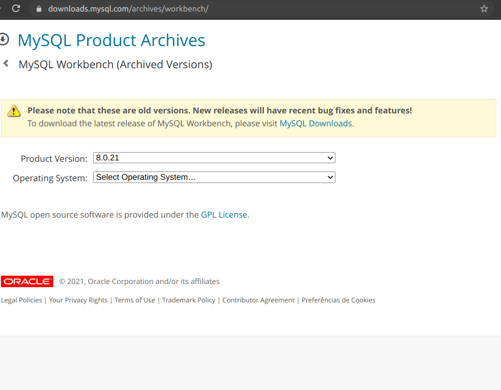

## Instalando uma interface gráfica (MySQL Workbench)

Ainda que haja uma grande adesão de ferramentas não gráficas no mundo back-end, é possível "visualizar" as nossas queries com o auxílio de alguns softwares. Aqui, vamos fazer a instalação do MySQL Workbench , a interface gráfica mais utilizada para o MySQL .

Linux
Observação: Em função das diversas distribuições do Linux, é recomendado pesquisar as instruções de instalação específicas para sua distribuição. Exemplo: "Install MySQL Workbench on {Nome da sua distribuição}". Nosso curso dá preferência para utilização das últimas versões LTS (Long-term Support, Suporte de longo prazo) do Ubuntu (Assim como das variantes descritas no manual da pessoa estudante) ainda suportadas. Verifique o suporte do seu S.O. na pagina oficial .

Por exemplo, para fazer essa instalação no Ubuntu 20.04 LTS , basta ir até este link https://dev.mysql.com/downloads/workbench/ e selecionar a opção "Ubuntu Linux".

Em seguida, selecionando a versão correspondente da distribuição , no caso, a 20.04 e, na lista a seguir, clicar em "Download".

Caso em algum momento surja uma página pedindo por login, não é necessário criar uma conta. Procure pelo link "No thanks, just start my download" e faça o download.

Navegue até a pasta onde foi feito o download, rode o comando a seguir e aceite a instalação:

sudo apt install ./nome-do-arquivo
#ex no Ubuntu 20.04: sudo apt install ./mysql-workbench-community_8.0.21-1ubuntu20.04_amd64.deb