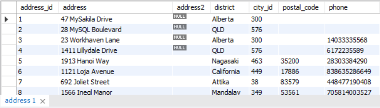

## Constraints (restrições), chaves primárias e chaves estrangeiras

Uma das grandes vantagens de armazenar seus dados em um banco de dados é de possibilitar a criação de regras e restrições ( constraints , em inglês), que ditam exatamente como os dados podem ou não ser manipulados em suas tabelas. Vamos ver um resumo de como isso funciona:

Como as constraints são aplicadas às colunas das tabelas, é possível assegurar que os dados inseridos nelas serão consistentes conforme as regras definidas . São constraints :

NOT NULL - Garante que aquele campo não pode conter valores nulos , ou seja, se não houver um valor padrão ( DEFAULT ) definido, será sempre necessário passar um valor para esse campo durante um INSERT , por exemplo.

UNIQUE - Garante que o valor inserido na coluna da tabela é único , isto é, não pode haver outro valor igual para esta coluna registrado nesta tabela.

PRIMARY KEY - A chave primária de uma tabela garante que a coluna em que essa constraint está sendo aplicada é o identificador único da tabela . Ela também é, por definição, não nula (mesmo efeito da constraint NOT NULL ) e única (mesmo efeito da constraint UNIQUE ).

FOREIGN KEY - A chave estrangeira de uma tabela faz referência a uma chave primária (valor em uma coluna com a constraint PRIMARY KEY ) de outra tabela , permitindo um relacionamento entre as duas.

DEFAULT - Garante que, caso nenhum valor seja inserido na coluna (ou caso a pessoa usuária insira um valor nulo), a constraint colocará o valor padrão que for passado para ela .

Assim, durante a criação de uma tabela, ao se pensar em suas colunas, podemos avaliar quais constraints podemos aplicar àquela informação. Por exemplo, imagine uma tabela que liste os sabores de sorvete de uma sorveteria. Nessa tabela, temos três colunas: um código identificador, o nome do sabor do sorvete e o código identificador de quem fornece. Vamos ver cada coluna e pensar em quais constraints podemos adicionar a elas:

Código identificador (id) - Para o id do sorvete, precisamos que ele identifique e represente o sabor do sorvete na tabela, então podemos adicionar como constraint a PRIMARY KEY .

Nome - Aqui, queremos que os valores sejam únicos, afinal, não temos a necessidade de cadastrar um novo sabor de sorvete que já conste na tabela. Além disso, queremos que, ao cadastrar, o valor não seja nulo. Então, como constraints , podemos adicionar UNIQUE e NOT NULL .

Código identificador de quem fornece (id) - Suponha que já possuímos uma tabela onde listamos todas as empresas fornecedoras, e que nessa tabela, os valores estão sendo representados por uma primary key . Então, podemos atribuir como constraint a FOREIGN KEY .

## Exercícios de fixação

Então, depois de ter visto o conteúdo acima, vamos tentar chegar a algumas conclusões utilizando como exemplo a tabela a seguir:

Sem ter acesso à estrutura interna de como essa tabela foi criada, tente responder ao seguinte:

Quais constraints a coluna address_id poderia ter? Por quê?
R: A coluna address_id possui a constraint Primary Key para que exista um número identificador único. Além disso, a Primary Key não permite que ela seja nula.

A coluna city_id é um número. Consegue identificar que tipo de constraint foi aplicado a ela?
R: FOREIGN KEY - A chave estrangeira de uma tabela faz referência a uma chave primária (valor em uma coluna com a constraint PRIMARY KEY ) de outra tabela , permitindo um relacionamento entre as duas.

A coluna address (endereço) possui uma constraint . Qual tipo de constraint seria interessante ser aplicado a ela para que sempre exista um valor na coluna quando uma nova linha for criada?
R: A restrição aplicada na coluna address é a restrição NOT NULL . Dessa maneira, é interessante que a coluna address sempre esteja preenchida em função de ser uma informação crucial para essa tabela, além de a tabela não fazer sentido sem essa informação preenchida.

Temos aqui uma outra tabela:

Que tipo de constraint a coluna city_id possui?
R: Primary Key

Qual é o motivo de a coluna country_id não possuir nomes de country (país)? Ela é algum tipo de chave primária ou estrangeira?
Na tabela a seguir:

R: Isso acontece porque a coluna country_id é apenas uma referência para a sua tabela original, e o número que é exibido nessa tabela representa uma Foreign Key . 

Na tabela a seguir:

Qual coluna possui uma Primary Key ? Resposta: A coluna film_id possui uma Primary Key .

Qual coluna possui uma Foreign Key ? Resposta: A coluna category_id possui uma Foreign Key .