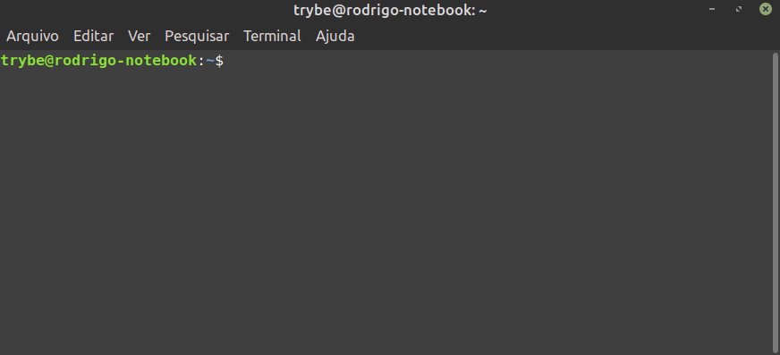

## MySQL na linha de comando

Após seguir os passos anteriores, você poderá agora acessar seu servidor pela linha de comando. Para visualizar quais bancos de dados estão disponíveis, você deve usar o comando:

mysql -u root -p

É possível ver todos os bancos de dados que estão instalados atualmente digitando o seguinte comando. Não se esqueça do ponto e vírgula :)

SHOW DATABASES;

## Comandos mais comuns

Por convenção, utilizamos as palavras chave do SQL em caixa alta para diferenciar das indicações de tabelas e colunas. Ah, é fundamental utilizar o ; (ponto e vírgula) ao final de cada comando SQL, caso contrário ele não irá funcionar.

O comando USE serve pra definir a referência do banco de dados que será utilizado na query :

USE nome_do_banco_de_dados_que_quero_conectar;
-- EX: USE trybe;

1.1 Uma outra forma de fazer referência ao banco, sem ter que rodar o USE é no formato banco_de_dados.tabela :

SELECT * FROM banco_de_dados.tabela;
-- EX: SELECT * FROM trybe.students;

Para retornar todas as tabelas inicializadas no seu server:

SHOW TABLES;

Visualizar estrutura de uma tabela:

DESCRIBE nome_da_tabela;
-- EX: DESCRIBE students;

Criar um banco de dados:

CREATE DATABASE nome_do_banco_de_dados;
-- EX: CREATE DATABASE trybe;

Vamos treinar!

Usando os comandos que você acabou de ver, resolva os seguintes desafios:

Entre no banco de dados mysql .
R: USE mysql;

Visualize todas as tabelas desse banco.
R: SHOW TABLES;

Visualize a estrutura de pelo menos 10 tabelas diferentes e tente entender o tipo de estrutura que costuma ser utilizada.
R: DESCRIBE ...

Crie um novo banco de dados com o seu nome e depois entre nele!
R: CREATE DATABASE meu_banco_de_dados
USE meu_banco_de_dados

Pronto!
Agora você pode executar comandos SQL dentro do seu banco de dados sem usar a interface gráfica, o que pode ser útil em alguns cenários em que você não tem acesso ao MySQL Workbench .