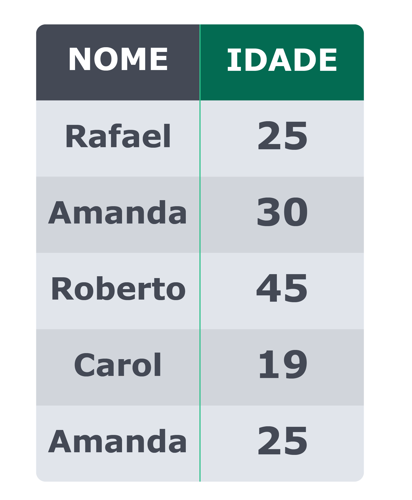

## Dados repetidos? Aqui Não! Como usar o DISTINCT

Perfeito! Então, depois de ter assistido ao vídeo sobre DISTINCT , dê uma olhada nesta tabela:

Para criá-la no seu banco de dados, abra uma nova janela de query no MySQL Workbench e execute o seguinte código:

CREATE DATABASE `Escola`;
CREATE TABLE IF NOT EXISTS Escola.Alunos (
    `Nome` VARCHAR(7) CHARACTER SET utf8,
    `Idade` INT
);
INSERT INTO Escola.Alunos VALUES
    ('Rafael', 25),
    ('Amanda', 30),
    ('Roberto', 45),
    ('Carol', 19),
    ('Amanda', 25);
Feito isso, você terá acesso à tabela Alunos do banco de dados Escola . Levando em conta a explicação que você acabou de ver, como você montaria uma query para encontrar os seguintes dados?
Monte uma query para encontrar pares únicos de nomes e idades .
Quantas linhas você encontraria na query anterior?
Monte uma query para encontrar somente os nomes únicos.
Quantas linhas você encontraria na query anterior?
Monte uma query para encontrar somente as idades únicas.
Quantas linhas você encontraria na query anterior?
