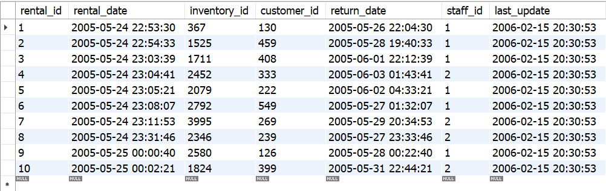

## Pesquisas gigantes? LIMIT isso ae!

Se você abrir agora o nosso banco de dados de prática sakila e executar a query a seguir, verá que o resultado é 16044, ou seja, existem 16044 linhas na tabela rental .

SELECT COUNT(*) FROM sakila.rental;
Uma curiosidade é que, usando o MySQL Workbench , caso você faça uma consulta que inclui todas as linhas da tabela e rolar a listagem até o fim, verá que o resultado da consulta são 16044 linhas (desde que o Workbench não limite os resultados da sua consulta, como você verá na próxima seção).

SELECT * FROM sakila.rental;

Isso não é sempre necessário e pode até ser um problema em bancos de dados gigantes, em que as tabelas podem conter milhares ou milhões de linhas. Resolver isso é bem simples: tudo que você precisa fazer é limitar o resultado usando o LIMIT :

Query + LIMIT quantidade_de_resultados
SELECT * FROM sakila.rental LIMIT 10;

