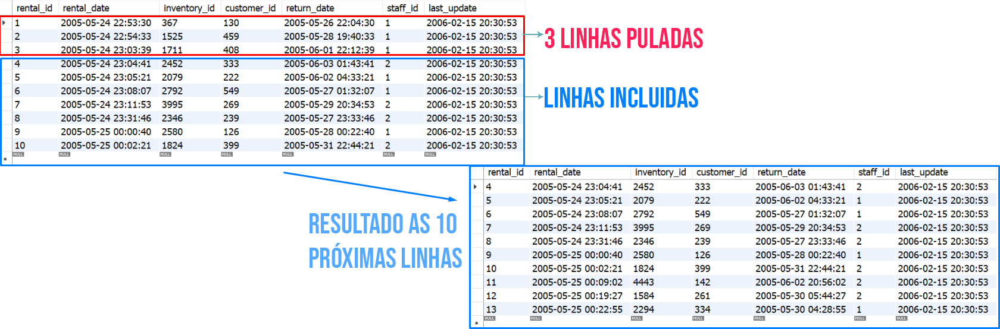
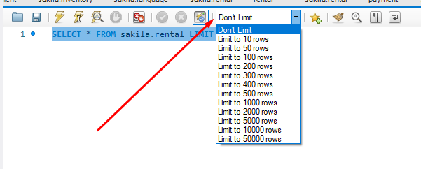

## LIMIT OFFSET - Pulando linhas desnecessárias

Para pular uma certa quantidade de linhas do seu resultado, você pode usar o comando OFFSET .

Query + LIMIT quantidade_de_linhas OFFSET quantidade_de_linhas
SELECT * FROM sakila.rental LIMIT 10 OFFSET 3;

Você poderia também limitar os resultados de forma gráfica, usando as opções do Workbench , que, por padrão, não impõe limites aos resultados de suas pesquisas.

Tranquilo, não é? Agora, olhando o resultado a seguir, qual query eu teria que montar para trazer os 10 primeiros resultados, a partir de JOHNNY?

Ótimo, tomara que tenha conseguido achar o resultado do último desafio. Você está quase lá! Vamos fechar este dia de aprendizado descobrindo como gerar resultados do tipo que todo chefe gosta de ter: "Tudo bem organizado", usando o ORDER BY .
