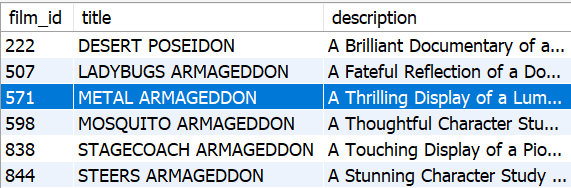

## Como criar pesquisas mais dinâmicas e maleáveis usando o LIKE

Você está tentando se lembrar do nome de um filme a que já assistiu, mas só se lembra de que ele terminava com don no nome. Como seria possível usar o 

LIKE para te ajudar a encontrá-lo?

SELECT * FROM sakila.film
WHERE title LIKE '%don';

O LIKE é usado para buscar por meio de uma sequência específica de caracteres, como no exemplo acima. Além disso, dois "curingas", ou modificadores, são normalmente usados com o LIKE :

% - O sinal de percentual, que pode representar zero, um ou múltiplos caracteres

_ - O underscore (às vezes chamado de underline, no Brasil), que representa um único caractere

Vamos ver abaixo como usá-los (todos podem ser verificados no banco sakila )

-- Encontra qualquer resultado finalizando com "don"
SELECT * FROM sakila.film
WHERE title LIKE '%don';

-- Encontra qualquer resultado iniciando com "plu"
SELECT * FROM sakila.film
WHERE title LIKE 'plu%';

-- Encontra qualquer resultado que contém "plu"
SELECT * FROM sakila.film
WHERE title LIKE '%plu%';

-- Encontra qualquer resultado que inicia com "p" e finaliza com "r"
SELECT * FROM sakila.film
WHERE title LIKE 'p%r';

-- Encontra qualquer resultado em que o segundo caractere da frase é "C"
SELECT * FROM sakila.film
WHERE title LIKE '_C%';

-- Encontra qualquer resultado em que o título possui exatamente 8 caracteres
SELECT * FROM sakila.film
WHERE title LIKE '________';

-- Encontra todas as palavras com no mínimo 3 caracteres e que iniciam com E
SELECT * FROM sakila.film
WHERE title LIKE 'E__%';

## Para Fixar

Para consolidar esse conhecimento, brinque com os resultados que serão encontrados usando os comandos acima e tente criar suas próprias condições. Depois de ter praticado um pouco com eles, tente encontrar as seguintes informações:

Mostre todos os detalhes dos filmes que contêm a palavra ace no nome.
R: 
use sakila;
select * from film
where title like'%ace%';

Mostre todos os detalhes dos filmes cujas descrições finalizam com china .
R:
use sakila;
select * from film
where description like '%china';

Mostre todos os detalhes dos dois filmes cujas descrições contêm a palavra girl e o título finaliza com a palavra lord .
R: 
use sakila;
select * from film
where description like '%girl%' and title like'%lord';

Mostre os dois casos em que, a partir do 4° caractere no título do filme, tem-se a palavra gon .
R: 
use sakila;
select * from film
where title like '___gon%';

Mostre o único caso em que, a partir do 4° caractere no título do filme, tem-se a palavra gon e a descrição contém a palavra Documentary .
R:
use sakila;
select * from film
where title like '___gon%' and description like'%Documentary%';

Mostre os dois filmes cujos títulos ou finalizam com academy ou iniciam com mosquito .
R:
use sakila;
select * from film
where title like '%academy' or title like 'mosquito%';

Mostre os seis filmes que contêm as palavras monkey e sumo em suas descrições.
R: 
use sakila;
select * from film
where description like '%monkey%' and description like '%sumo%';

A seguir, vamos entender como trazer resultados que englobam uma faixa de valores usando os operadores IN e BETWEEN .