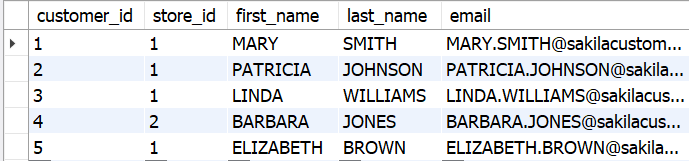

## Englobando uma faixa de resultados com IN e BETWEEN

### Operador IN
Como você viu no início do dia hoje, é possível juntar várias condições nas suas queries usando os operadores AND e OR . No entanto, você ainda terá que digitar cada condição separadamente, como no exemplo a seguir:

SELECT * FROM sakila.actor
WHERE first_name = 'PENELOPE'
OR first_name = 'NICK'
OR first_name = 'ED'
OR first_name = 'JENNIFER';

Uma forma melhor de fazer essa mesma pesquisa seria usando o IN :

SELECT * FROM sakila.actor
WHERE first_name IN ('PENELOPE','NICK','ED','JENNIFER');

Você poderia fazer esse mesmo processo para números também:

SELECT * FROM sakila.customer
WHERE customer_id in (1, 2, 3, 4, 5);

Então, para que você faça pesquisas utilizando o IN , a sintaxe que deve ser usada é a seguinte:

SELECT * FROM banco_de_dados
WHERE coluna IN (valor1, valor2, valor3, valor4, ..., valorN);

-- ou também
SELECT * FROM banco_de_dados
WHERE coluna IN (expressão);

Como você faria, então, para encontrar, usando o IN , todos os detalhes sobre o aluguel dos clientes com os seguintes ids: 269, 239, 126, 399, 142? As informações podem ser encontradas na tabela payment .
use sakila;
select * from payment
where rental_id in (269,239,126,399,142)
order by rental_id;

Como encontraria todas as informações sobre os endereços que estão registrados nos distritos de QLD, Nagasaki, California, Attika, Mandalay, Nantou e Texas? As informações podem ser encontradas na tabela address .
use sakila;
select * from address
where district in ('QLD', 'Nagasaki', 'California', 'Attika', 'Mandalay', 'Nantou', 'Texas');

### Operador BETWEEN

Uma outra opção quando queremos trabalhar com faixas de resultados é o BETWEEN , que torna possível fazer pesquisas dentro de uma faixa inicial e final.

expressão BETWEEN valor1 AND valor2;
-- a expressão é a sua query
-- e valor1 e valor2 delimitam o resultado

Então, quando você faz uma query como essa, você terá o resultado da imagem a seguir:

-- Note que o MySQL inclui o valor inicial e o final nos resultados
SELECT title, length FROM sakila.film
WHERE length BETWEEN 50 AND 120;

### Usando o BETWEEN com strings

Para encontrar uma faixa de valores em que os valores são strings, podemos digitar a palavra por completo para encontrar os valores. Exemplo:

SELECT * FROM sakila.language
WHERE name BETWEEN 'Italian' AND 'Mandarin'
ORDER BY name;

### Usando o BETWEEN com datas

Para usar o BETWEEN com datas, basta que você digite o valor no formato padrão da data, que é YYYY-MM-DD HH:MM:SS , sendo os valores de horas, minutos e segundos opcionais. No exemplo abaixo, estamos filtrando os resultados para exibir o rental_id e rental_date apenas entre o mês 05 e o mês 07:

SELECT rental_id, rental_date FROM sakila.rental
WHERE rental_date
BETWEEN '2005-05-27' AND '2005-07-17';

### Como decidir qual usar?

Lembre-se de que, no caso do IN , você precisa especificar os valores que devem ser incluídos no resultado e, no caso do BETWEEN , você não precisa incluir os valores que estão entre o valor inicial e final. Então, vale a pena analisar essa diferença e ver qual te atenderá melhor.

### Qual tem a melhor performance?

A melhor forma de responder a essa pergunta é: depende .

Não é o que você esperava? Então vai aqui uma resposta melhor: isso vai depender do tipo e quantidade de dados com os quais você está trabalhando. A melhor forma de você não chutar é clicar no botão Execution Plan no MySQL Workbench e verificar o tempo de execução para tomar a decisão de qual tem o menor custo de execução - o que significa que a query finalizará mais rápido.
Há outras ferramentas inteiras só para mensurar performance. Considere o Execution Plan apenas uma introdução ao tema.
Fazendo um pequeno teste, temos os seguintes resultados (que podem sofrer alterações, dependendo da quantidade de dados com os quais se está trabalhando):
