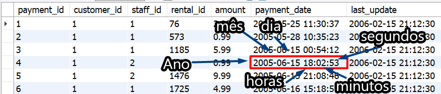

## Encontrando e separando resultados que incluem datas

No MySQL, o tipo DATE faz parte dos tipos de dados temporais , os quais vamos ver com mais detalhes no decorrer do curso. O MySQL , por padrão, usa o formato YYYY-MM-DD (ano/mês/dia) ao armazenar os valores de uma data. Você é obrigado, pelo banco de dados, a salvar nesse formato, e não é possível alterá-lo. Temos também o tipo DATETIME , que inclui informações de tempo. Vamos ver dois tipos comuns a seguir:

DATE - Possui apenas data, no formato YYYY-MM-DD na faixa de 1001-01-01 até 9999-12-31

DATETIME - Possui data e tempo, no formato YYYY-MM-DD HH:MM:SS com a faixa de 1000-01-01 00:00:00 até 9999-12-31 23:59:59 .
Se você pesquisar agora no banco sakila usando a seguinte query :

SELECT * FROM sakila.payment;

 

## Maneiras de encontrar dados por data

Vamos dizer que queremos encontrar pagamentos realizados na data 2005-07-31 na tabela sakila.payment . Há várias formas de fazer isso.

Usando a função DATE(coluna_do_tipo_date) :

-- Encontra todos os pagamentos deste dia, ignorando horas, minutos e segundos
SELECT * FROM sakila.payment
WHERE DATE(payment_date) = '2005-07-31';
Usando LIKE para valores aproximados:

-- Encontra todos pagamentos deste dia, ignorando horas, minutos e segundos
SELECT * FROM sakila.payment
WHERE payment_date LIKE '2005-07-31%';

-- Encontra um pagamento com dia e hora exatos
SELECT * FROM sakila.payment
WHERE payment_date LIKE '2005-08-20 00:30:52';
Usando BETWEEN :

-- Encontra pagamentos especificando um valor mínimo e um valor máximo para a data
SELECT *
FROM sakila.payment
WHERE payment_date BETWEEN '2005-05-26 00:00:00' AND '2005-05-27 23:59:59';

Qual é mais performática ? Use o Execution Plan para determinar isso.

## Selecionando apenas partes de uma data

Às vezes você está interessado em apenas uma parte de uma data, como o ano ou as horas. MySQL possui funções que retornam partes específicas de uma data ou hora.

-- Teste cada um dos comandos a seguir:
SELECT DATE(payment_date) FROM sakila.payment; -- YYYY-MM-DD
SELECT YEAR(payment_date) FROM sakila.payment; -- Ano
SELECT MONTH(payment_date) FROM sakila.payment; -- Mês
SELECT DAY(payment_date) FROM sakila.payment; -- Dia
SELECT HOUR(payment_date) FROM sakila.payment; -- Hora
SELECT MINUTE(payment_date) FROM sakila.payment; -- Minuto
SELECT SECOND(payment_date) FROM sakila.payment; -- Segundo

## Para Fixar
Você já tem as ferramentas em mãos, então quero ver os dedos se mexendo. Let's GO!!!

Aquele momento quando você entra no fluxo
Quantos pagamentos temos com a data de retorno 2005-05-25 ? Há múltiplas maneiras possíveis de encontrar a resposta.
R: 
USE sakila;
SELECT COUNT(*) Pagamentos FROM payment
WHERE DATE(payment_date) = '2005-05-25';

Quantos pagamentos foram feitos entre 01/07/2005 e 22/08/2005 ?
R: 
USE sakila;
SELECT COUNT(*) Pagamentos FROM payment
WHERE payment_date between '2005-07-01' and '2005-08-22';

Usando a tabela rental , extraia data, ano, mês, dia, hora, minuto e segundo dos registros com rental_id = 10330. Utilize a coluna rental_date para extrair as informações.
R: 
use sakila;
select date(rental_date) as data,
 year(rental_date) as ano,
 month(rental_date) as mes, 
 day(rental_date) as mes,
 hour(rental_date) as hora,
 minute(rental_date) as minutos,
 second (rental_date) as segundos
from rental 
where rental_id = 10330;

Monte uma query que retorne todos os dados do pagamento feito no dia 28/07/2005 a partir das 22 horas .
R: 
use sakila;
select * from payment
where date(payment_date) = '2005-07-28' and hour(payment_date)=22;
