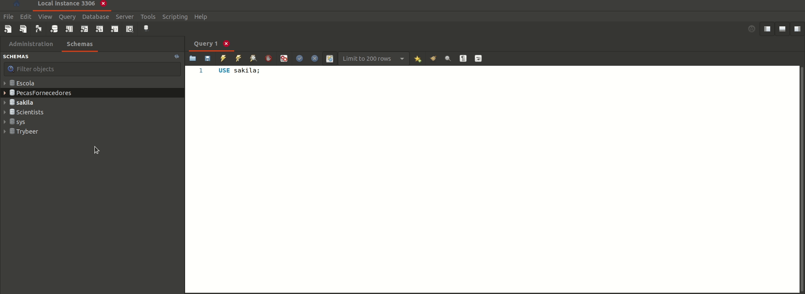

## Apagou informação que não devia ou terminou todos exercícios do dia?

Como agora você começará a mexer na estrutura do banco de dados sakila , você deve saber recriar o banco de dados quantas vezes for necessário, em caso de alterações acidentais ou por alguma outra necessidade. Os passos para recriar o banco podem ser lidos a seguir.

Como apagar ( dropar ) o banco sakila e recriá-lo do zero:

Abra o MySQL Workbench e se conecte a ele.
Selecione o banco sakila na lista de bancos de dados com o botão direito e clique em " Drop Schema ".
Selecione "Drop Now" .

Clique com o botão direito neste link https://s3.us-east-2.amazonaws.com/assets.app.betrybe.com/back-end/sakila-1ae15ae82697888c35bf1f1c8acbf755.sql e salve como arquivo .sql .

Selecione todo o conteúdo do arquivo (CTRL + A) e cole-o dentro de uma janela de nova query no MySQL Workbench .

Clique em executar para restaurar o banco de dados.
That's IT! Está pronto para quebrar brincar com ele de novo!
