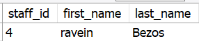

## Digitou algo errado? De boa, vamos dar um UPDATE

Você avisou na recepção que seu nome é Rannveig , mas, quando foi ver em seu documento, foi registrado como Ravein ! "Poxa, será que meu nome é tão difícil assim de se escrever?" Sua sorte é que o UPDATE te permite alterar valores de uma tabela com base em alguma condição. Vamos resolver isso!

UPDATE sakila.staff
SET first_name = 'Rannveig'
WHERE first_name = 'Ravein';

Como foi exibido no código acima, a sintaxe geral para fazer um update é:

UPDATE nome_da_tabela
SET propriedade_a_ser_alterada = 'novo valor para coluna'
WHERE alguma_condicao; -- importantíssimo aplicar o WHERE para não alterar a tabela inteira!

Uma curiosidade sobre o UPDATE e o DELETE no MySQL Server é que, por padrão, existe uma configuração chamada safe updates mode que só vai te permitir executá-los caso eles incluam quais IDs devem ser modificados. Então, caso você tente fazer a query abaixo, ela não funcionaria por não incluir o ID.

UPDATE sakila.staff
SET first_name = 'Rannveig'
WHERE first_name = 'Ravein';

Para evitar essa restrição, rode o seguinte comando em uma janela de query dentro do MySQL Workbench sempre que abri-lo para desabilitar essa funcionalidade, antes de executar seus comandos de UPDATE ou DELETE :

SET SQL_SAFE_UPDATES = 0;

## Alterando mais de uma coluna ao mesmo tempo

UPDATE sakila.staff
SET first_name = 'Rannveig', last_name = 'Jordan'
WHERE staff_id = 4;

## UPDATE em massa

Por questões de performance, para que apenas uma solicitação de query seja enviada ao servidor, podemos fazer uma atualização em massa.

-- Opção 1 - Incluindo a lista de condições fixas
UPDATE sakila.actor
SET first_name = 'JOE'
WHERE actor_id IN (1,2,3);

-- Opção 2 - Especificando como cada entrada será alterada individualmente
UPDATE sakila.actor
SET first_name = (
CASE actor_id WHEN 1 THEN 'JOE' -- se actor_id = 1, alterar first_name para 'JOE'
              WHEN 2 THEN 'DAVIS' -- se actor_id = 2, alterar first_name para 'DAVIS'
              WHEN 3 THEN 'CAROLINE' -- se actor_id = 3, alterar first_name para 'CAROLINE'
          ELSE first_name -- em todos os outros casos, mantém-se o first_name
END);

Você pode ver mais informações sobre como usar o CASE neste link . https://www.w3schools.com/sql/func_mysql_case.asp

## Fazendo um UPDATE de forma sequencial

Se o comando ORDER BY for usado juntamente com o UPDATE , os resultados serão alterados na ordem em que forem encontrados.

Se o comando LIMIT for usado em conjunto com o UPDATE , um limite será imposto na quantidade de resultados que podem ser alterados. Caso contrário, todos os resultados que satisfizerem a condição serão atualizados.

Veja a sintaxe abaixo. Lembre-se de que os valores entre colchetes ( [] ) são opcionais:

UPDATE nome_da_tabela
SET coluna1 = valor1, coluna2 = valor2
[WHERE condições]
[ORDER BY expressao [ ASC | DESC ]]
[LIMIT quantidade_resultados];

-- Exemplo:
UPDATE sakila.staff
SET password = 'FavorResetarSuaSenha123'
WHERE active = 1
ORDER BY last_update
LIMIT 2;
Essas são as maneiras mais comuns de utilizar o UPDATE no dia a dia.

## Um pouco mais sobre o modo --safe-updates

Para quem está ainda está se familiarizando com o MySQL, o --safe-updates (ou - -i-am-a-dummy , sim, é uma propriedade real do MySQL) pode ser uma configuração segura para utlizar operadores de alteração de dados. Ele é útil para casos em que você tenha emitido um comando UPDATE ou DELETE , mas esquecido de incluir WHERE para indicar quais linhas devem ser modificadas, evitanto que a query atualize ou exclua todas as linhas da tabela.

O --safe-updates exige que você inclua um valor chave (key value), por exemplo os ids (lembrando que os valores da coluna id de uma tabela são do tipo KEY ) dos itens selecionados para executar o UPDATE ou o DELETE . Essa camada de segurança é importante em bancos reais executando em ambientes de produção e ajuda a prevenir acidentes. Este modo também restringe querys SELECT que produzem resultados muito grandes, com uma quantidade excessiva de linhas.

A opção --safe-updates exige que o mysql execute a seguinte instrução ao se conectar ao servidor:

SET sql_safe_updates=1, sql_select_limit=1000, max_join_size=1000000;
sql_select_limit =1000 limita o conjunto de resultados SELECT a 1.000 linhas, a menos que a instrução inclua LIMIT .
max_join_size =1.000.000 faz com que as instruções SELECT de várias tabelas produzam um erro se o servidor estimar que deve examinar mais de 1.000.000 combinações de linhas.

Você pode desabilitar o --safe-updates utilizando o comando SET :

SET SQL_SAFE_UPDATES = 0;
Ou configurar para um modo mais conveniente para você, alterando os valores das variáveis:

SET sql_safe_updates=1, sql_select_limit=500, max_join_size=10000;

Quando ocorre um erro de --safe-updates , a mensagem de erro inclui o primeiro diagnóstico que foi produzido, para fornecer informações sobre o motivo da falha. Por exemplo, a mensagem pode indicar que o UPDATE esta sendo executado com um operador WHERE que não se refere a uma coluna do tipo KEY (veja a imagem abaixo), nesse caso voce pode desabilitar o --safe-updates , ou utilizar uma coluna KEY como referência do seu operador WHERE . 
Lembre-se que ler e interpretar os erros pode ajudar na sua solução!

-- Mensagem de erro retornada pelo workbench.

-- Error Code: 1175. You are using safe update mode and you tried to update a table without WHERE that uses a KEY column.
-- To disable safe mode, toogle the option in Preferences -> SQL Editor an reconnect.

Este erro ocorreu devido ao Safe Update Mode estar habilitado.

## Agora está na hora de praticar!

Dê um UPDATE em seus conhecimentos com estes desafios

Como o banco pode ser deletado e recriado infinitamente, vamos desabilitar o --safe-updates nos exercícios. Além disso, esse modo pode ser habilitado novamente quando necessário. Rode o seguinte comando em uma janela de query dentro do MySQL Workbench sempre que abri-lo para desabilitar essa funcionalidade, antes de executar seus comandos UPDATE ou DELETE :

SET SQL_SAFE_UPDATES = 0;

Atualize o primeiro nome de todas as pessoas da tabela sakila.actor que possuem o primeiro nome "JULIA" para "JULES".
R:
set sql_safe_updates=0;
use sakila;
select * from actor;

update actor set first_name='JULES' where first_name='JULIA';
select * from actor;

Foi exigido que a categoria "Sci-Fi" seja alterada para "Science Fiction".
R:
use sakila;
select * from category;
update category set name='ficção científica' where name='Sci-Fi';
select name from category

Atualize o valor do aluguel para $25 de todos os filmes com duração maior que 100 minutos e que possuem a classificações "G" , "PG" ou "PG-13" e um custo de substituição maior que $20.
R: 
use sakila;
select * from film;
update film 
set rental_rate = 25 
where length > 100 
and ( rating = 'G' or rating = 'PG' or rating = 'PG-13') 
and replacement_cost > 20;
select * from film;

Foi determinado pelo setor financeiro que haverá um reajuste em todos os preços dos filmes, com base em sua duração. Para todos os filmes com duração entre 0 e 100, o valor do aluguel passará a ser $10,00, e o aluguel dos filmes com duração acima de 100 passará a ser de $20,00.
R: 
use sakila;
select * from film;
update film
set rental_rate = (
	case 
		when length between 1 and 100 then 10
        when length > 100 then 20
	end
    );
    select * from film;