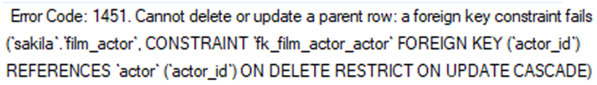

## Como assim, alguém te cadastrou sem você deixar ? Vamos dar um DELETE nisso!

Antes de aprender a excluir dados de uma tabela, é importante entender que nem sempre que você clicar em excluir, em um sistema ou em um site, a informação terá sido de fato excluída do banco de dados. Em muitos casos, a funcionalidade de "excluir" apenas marcará a informação como inativa ou excluída, ou algum campo equivalente.

Isso ocorre pela necessidade de seguir normas ou regulamentos sobre disponibilidade e segurança de dados. 

Relatórios podem necessitar de informações que já foram "excluídas" ou pode ser necessário manter logs de uso (históricos de acontecimentos no sistema) de seu software.

## Excluindo dados de uma tabela

Para excluir dados de forma básica, temos a seguinte sintaxe:

DELETE FROM banco_de_dados.tabela
WHERE coluna = 'valor';
-- O WHERE é opcional. Porém, sem ele, todas as linhas da tabela seriam excluídas.

Exemplo no banco sakila :

DELETE FROM sakila.film_text
WHERE title = 'ACADEMY DINOSAUR';

P.S. Novamente, caso o modo --safe-updates esteja habilitado, o comando DELETE só funcionaria se os IDs fossem incluídos em suas queries . Para fins de prática, vamos desabilitá-lo.

Rode o seguinte comando em uma janela de query , dentro do MySQL Workbench, sempre que abri-lo, para desabilitar essa funcionalidade antes de executar seus comandos DELETE :

SET SQL_SAFE_UPDATES = 0;

## Meu DELETE não foi permitido...

Caso haja relações entre as tabelas ( primary key e foreign keys ) e existam restrições aplicadas a elas, ao executar o DELETE ocorrerá uma ação de acordo com a restrição que tiver sido imposta na criação da foreign key . Essas restrições podem ser as seguintes:

-- Rejeita o comando DELETE.
ON DELETE NO ACTION;

-- Rejeita o comando DELETE.
ON DELETE RESTRICT;

-- Permite a exclusão dos registros da tabela pai, e seta para NULL os registros da tabela filho.
ON DELETE SET NULL;

-- Exclui a informação da tabela pai e registros relacionados.
ON DELETE CASCADE;

Vamos analisar um exemplo prático:

DELETE FROM sakila.actor
WHERE first_name = 'GRACE';

Se tentar rodar essa query , você vai se deparar com o erro exibido na imagem abaixo:

O banco de dados não vai permitir que você delete o ator chamado "GRACE". Isso acontece porque a coluna actor_id da tabela film_actor é uma chave estrangeira ( foreign key ) que aponta para a coluna actor_id na tabela actor , e essa chave estrangeira possui a restrição ON DELETE RESTRICT . Se essa restrição não existisse, o ator seria deletado, deixando nosso banco de dados em um estado inconsistente, pois haveria linhas na tabela film_actor com um actor_id que não mais existiria!

Para conseguir excluir este ator em actors , precisamos primeiro excluir todas as referências a ele na tabela sakila.film_actor :

DELETE FROM sakila.film_actor
WHERE actor_id = 7; -- actor_id = 7 é o Id de GRACE

Após excluir as referências, podemos excluir o ator com o nome "GRACE":

DELETE FROM sakila.actor
WHERE first_name = 'GRACE';

Antes de excluir dados que possuem restrições de chave estrangeira, como o exemplo que acabamos de ver, analise se você realmente deve excluir essa informação do banco de dados e depois, caso precise, faça de acordo com as restrições que foram impostas durante a criação da tabela.

As regras e restrições que acompanham querys de alteração do banco (como o UPDATE e o DELETE ) são importantes para manter a Integridade dos Dados , pois evitam mudanças involuntárias e garatem que as taxas de erro sejam menores, resultando em economia de tempo na solução de problemas. Um banco de dados que possui um sistema de integridade de dados bem controlado e bem definido aumenta a estabilidade das informações, desempenho das operações e manutenção das tabelas. Se existem restrições, normalmente não faria sentido simplesmente ignorá-las.

## DELETE VS TRUNCATE

Se tem certeza absoluta de que quer excluir os registros de uma tabela de uma maneira mais rápida, para efeitos de testes ou necessidade, o TRUNCATE é mais rápido que o DELETE . A função principal e única do TRUNCATE é de limpar (excluir todos os registros) de uma tabela, não sendo possível especificar o WHERE . Por isso, o TRUNCATE só pode ser usado nesse cenário.

TRUNCATE banco_de_dados.tabela;

Caso precise excluir condicionalmente, usando regras e especificações, use sempre o comando DELETE juntamente com o WHERE .

## Vamos praticar o DELETE
Exclua do banco de dados o ator com o nome de "KARL".
Exclua do banco de dados os atores com o nome de "MATTHEW".
Exclua da tabela film_text todos os registros que possuem a palavra "saga" em suas descrições.
Apague da maneira mais performática possível todos os registros das tabelas film_actor e film_category .
Inspecione todas as tabelas do banco de dados sakila e analise quais restrições ON DELETE foram impostas em cada uma. Use o Table Inspector para fazer isso (aba DDL).
Exclua o banco de dados e o recrie (use as instruções no início desta aula).
