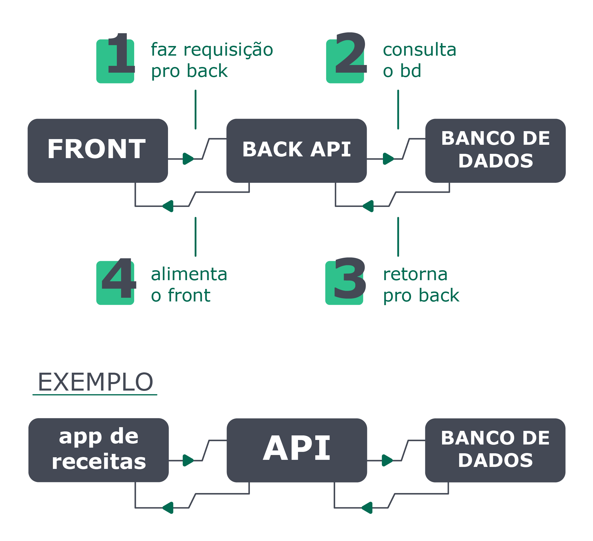

## O que vamos aprender?

He who controls information controls the world - Stephen Franklin

O mundo hoje gira em torno de dados e informações. Quem os controla, controla o mundo.

Neste módulo, você vai aprender como o SQL pode ser usado dentro de um banco de dados para criar, extrair, manipular e transformar dados em conteúdo útil , o que pode mudar o mundo!

O conteúdo será abordado da seguinte forma:

Primeiro, você vai aprender a instalar um banco de dados e também seus conceitos mais importantes;

Banco de dados SQL

Em seguida, você verá os comandos SQL mais usados no dia a dia para selecionar e criar dados;

Encontrando dados em um banco de dados

Em terceiro lugar, vamos aprender a fazer consultas mais refinadas, complexas e precisas ao banco de 
dados;

Filtrando dados de forma específica

Na sequência, você irá aprender como manipular tabelas, fazendo inserções, alterações e exclusões;

Manipulando tabelas

Vamos começar!

## O que vamos aprender?

Hoje você vai aprender os conceitos fundamentais sobre um banco de dados  e sobre como o SQL é usado na criação de tabelas. Além disso, aprenderá a usar a ferramenta MySQL Workbench para praticar os comandos SQL .

## Você será capaz de:

Entender o que são bancos de dados ;
Entender como a linguagem de consulta estruturada ( SQL ) é usada;
Compreender como as tabelas se encaixam no conceito de banco de dados ;
Montar um ambiente de desenvolvimento local para praticar SQL ;
Entender como usar o MySQL Workbench .

## Por que isso é importante?

Atualmente, a análise de dados é indispensável para as empresas e pessoas em seu processo de tomada de decisão. Essa é uma das maneiras mais eficientes de gerar conhecimento, tanto utilizando dados passados quanto fazendo projeções futuras.

Feita uma análise inicial dos dados, seus resultados serão transformados em informações que, depois de estudadas, podem vir a gerar conhecimentos que, por sua vez, se tornam uma vantagem competitiva para as empresas, além de um norte para as decisões individuais das pessoas.

Uma das formas como nós, profissionais da tecnologia da informação, podemos contribuir para isso é gerando e disponibilizando os dados necessários através de tabelas e consultas criadas dentro de um banco de dados utilizando SQL .

Quando trabalhamos com backend e banco de dados, de maneira geral, o fluxo funciona assim: O front faz a requisição para o back, o back faz a conexão e consulta o banco de dados. Então o banco retorna alguma informação para o back, e é aqui que a API (Application Programming Interface) trabalha, sendo responsável por processar essas informações, recebendo requisições, enviando respostas e, por sua vez, alimentando o front.
