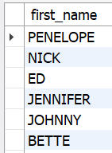
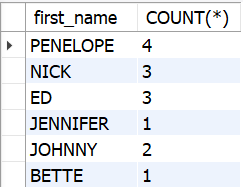
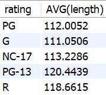

## Exibindo e filtrando dados de forma agrupada com GROUP BY e HAVING

Os resultados de uma query podem ser agrupados por uma ou mais colunas usando o GROUP BY , o que faz com que todos os registros que têm o mesmo valor para tais colunas sejam exibidos juntos. O GROUP BY também pode ser usado em conjunto com as funções de agregação que vimos anteriormente.

O GROUP BY pode ser construído da seguinte forma:

SELECT coluna(s) FROM tabela
GROUP BY coluna(s);

Uma das formas como podemos utilizar o GROUP BY é agrupar os registros pelo valor de uma coluna, exibindo apenas um registro de cada valor, como é feito com a coluna first_name a seguir.

SELECT first_name FROM sakila.actor
GROUP BY first_name;

Se você executar a query anterior no seu banco de dados sakila , verá que são retornados 128 resultados. Porém, se retirar o GROUP BY , como na query abaixo, notará que existem 200 registros na tabela actor , isso acontece, pelo fato de ele agrupar todos os registros que possuem o mesmo first_name , evitando duplicações na hora de retornar os dados.

SELECT first_name FROM sakila.actor;

Como dito, o GROUP BY removerá duplicações, retornando apenas um valor da coluna usada no agrupamento.

Porém é mais comum utilizar o GROUP BY em conjunto com o AVG , MIN , MAX , SUM ou COUNT . Por exemplo, caso queiramos saber quantos registros existem na tabela de cada nome registrado, podemos usar o COUNT() . Assim, teremos uma informação mais fácil de ser compreendida.

SELECT first_name, COUNT(*) FROM sakila.actor
GROUP BY first_name;

Tendo visto isso, agora vamos explorar como utilizar o GROUP BY em conjunto com as diversas funções de agregação que foram estudadas até aqui, através alguns exemplos feitos com o nosso banco de dados sakila .

-- Média de duração de filmes agrupados por classificação indicativa
SELECT rating, AVG(length)
FROM sakila.film
GROUP BY rating;

-- Valor mínimo de substituição dos filmes agrupados por classificação indicativa
SELECT rating, MIN(replacement_cost)
FROM sakila.film
GROUP BY rating;

-- Valor máximo de substituição dos filmes agrupados por classificação indicativa
SELECT rating, MAX(replacement_cost)
FROM sakila.film
GROUP BY rating;

-- Custo total de substituição de filmes agrupados por classificação indicativa
SELECT rating, SUM(replacement_cost)
FROM sakila.film
GROUP by rating;

## Praticando GROUP BY

Monte uma query que exiba a quantidade de clientes cadastrados na tabela sakila.customer que estão ativos e a quantidade que estão inativos.
R: select count(active) as 'ativos' 
from customer
group by active ;

Monte uma query para a tabela sakila.customer que exiba a quantidade de clientes ativos e inativos por loja. Os resultados devem conter o ID da loja , o status dos clientes (ativos ou inativos) e a quantidade de clientes por status .
R;
select store_id, active, count(*) 
from customer
group by active, store_id ;

Monte uma query que exiba a média de duração de locação por classificação indicativa ( rating ) dos filmes cadastrados na tabela sakila.film . Os resultados devem ser agrupados pela classificação indicativa e ordenados da maior média para a menor.
R:
select rating, avg(length) as média
from film
group by rating 
order by média desc;

Monte uma query para a tabela sakila.address que exiba o nome do distrito e a quantidade de endereços registrados nele. Os resultados devem ser ordenados da maior quantidade para a menor.
R:
select district , count(address) as endereço
from address
group by district 
order by endereço desc;