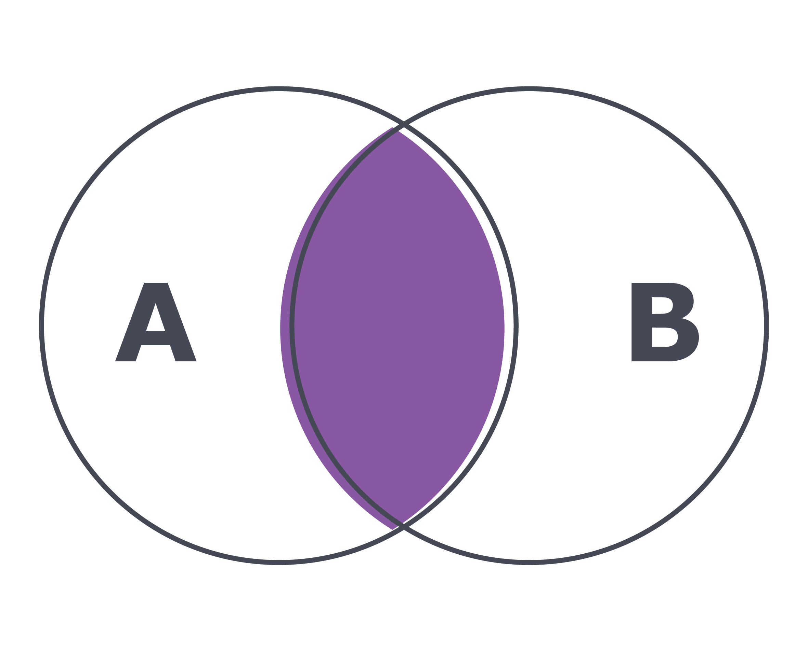

## Como utilizar o INNER JOIN

Como foi visto no vídeo, o INNER JOIN permite retornar todos os resultados em que a condição da cláusula ON for satisfeita. A sintaxe de um INNER JOIN é a seguinte:

SELECT t1.coluna, t2.coluna
FROM tabela1 AS t1
INNER JOIN tabela2 AS t2
ON t1.coluna_em_comum = t2.coluna_em_comum;

Veja uma representação visual do INNER JOIN abaixo:

## Por que usamos o alias ( AS )?

O alias AS é usado para apelidar qualquer parte da sua query. Isso ajuda o sistema de banco de dados a identificar a qual coluna estamos nos referindo, evitando erros de ambiguidade de nome de colunas, além de tornar suas queries mais concisas e legíveis.

Por exemplo, observe as queries a seguir:
Código sem alias

SELECT sakila.actor.first_name, actor_id, sakila.film_actor.actor_id
FROM sakila.actor
INNER join film_actor
ON sakila.actor.actor_id = sakila.film_actor.actor_id;

O código acima, além de ser muito extenso, não permite que o banco de dados descubra de qual tabela deve trazer o actor_id , uma vez que ambas as tabelas, actor e filme_actor , possuem uma coluna actor_id . O seguinte erro será gerado ao tentar executar essa query:

## Código com alias

Podemos tornar a query mais legível com um alias , além de evitar o erro de ambiguidade de coluna:

SELECT a.first_name, a.actor_id, f.actor_id
FROM sakila.actor AS a
INNER JOIN film_actor AS f
ON a.actor_id = f.actor_id;

OBS.: A palavra-chave AS pode ser omitida. Nesse caso, o alias é passado diretamente, após o nome da tabela:

SELECT a.first_name, a.actor_id, f.actor_id
FROM sakila.actor a
INNER JOIN film_actor f
ON a.actor_id = f.actor_id;

## Dicas sobre como escolher o tamanho do alias

Sua query é composta de poucas linhas? Então use apenas letras ou a primeira sílaba para representar a coluna. Por exemplo, "actor" se tornaria "A" ou "act" .

Caso esteja montando JOINS com muitas linhas, é recomendado usar um alias mais descritivo para tornar a leitura e interpretação da query mais simples.

Vamos ver agora alguns desafios para consolidar esse conhecimento sobre o INNER JOIN , utilizando o banco de dados sakila . Antes de começar a escrever suas queries , identifique quais tabelas contêm as informações de que você precisa e como elas estão relacionadas.

Monte uma query que exiba o id do ator , nome do ator e id do filme em que ele já atuou usando as tabelas actor e film_actor .
R: 
select 
a.actor_id, a.first_name, a.last_name, f.film_id
from actor a
inner join film_actor f
on a.actor_id = f.actor_id

Use o JOIN para exibir o nome , sobrenome e endereço de cada um dos funcionários do banco. Use as tabelas staff e address .
R:
select s.first_name, s.last_name, a.address
from staff s
inner join address a
on s.address_id = a.address_id

Exiba o id do cliente , nome e email dos primeiros 100 clientes, ordenados pelo nome em ordem decrescente, juntamente com o id do endereço e o nome da rua onde o cliente mora. Essas informações podem ser encontradas nas tabelas customer e address .
R:
select c.customer_id, c.first_name, c.last_name, c.email, a.address_id, a.address
from customer c
inner join address a
on c.address_id = a.address_id
ORDER BY C.first_name DESC
LIMIT 100;

Exiba o nome , email , id do endereço , endereço e distrito dos clientes que moram no distrito da California e que contêm "rene" em seus nomes. As informações podem ser encontradas nas tabelas address e customer .
R:
select c.first_name, c.email, a.address_id, a.address, a.district
from customer c
inner join address a
on c.address_id = a.address_id
where a.district = 'California'
and c.first_name like '%rene%' ;

Exiba o nome e a quantidade de endereços dos clientes cadastrados. Ordene seus resultados por nomes de forma decrescente. Exiba somente os clientes ativos. As informações podem ser encontradas na tabela address e customer .
R:
select c.first_name, c.active, count(a.address)
from customer c
inner join address a 
on c.address_id = a.address_id
where c.active = 1
group by c.customer_id
ORDER BY 
    first_name DESC;

Monte uma query que exiba o nome , sobrenome e a média de valor ( amount ) paga aos funcionários no ano de 2006. Use as tabelas payment e staff . Os resultados devem estar agrupados pelo nome e sobrenome do funcionário.
R:
select s.first_name, s.last_name, p.amount
from staff s
inner join payment p 
on s.staff_id = p.staff_id
where year(payment_date) = 2006
group by s.staff_id;

Monte uma query que exiba o id do ator , nome , id do filme e título do filme , usando as tabelas actor , film_actor e film . Dica: você precisará fazer mais de um JOIN na mesma query .
R:
SELECT
    A.actor_id, 
    A.first_name, 
    F.film_id, 
    F.title
FROM
    sakila.actor AS A
INNER JOIN
    sakila.film_actor AS FA ON A.actor_id = FA.actor_id
INNER JOIN
    sakila.film AS F ON F.film_id = FA.film_id;
    
Até o momento, temos produzido resultados apenas quando temos valores correspondentes em ambas as colunas de referência. Porém, o que devemos fazer quando possivelmente apenas uma das tabelas possui um valor correspondente existente? É possível que você tenha que usar o LEFT JOIN ou RIGHT JOIN nessas situações.
