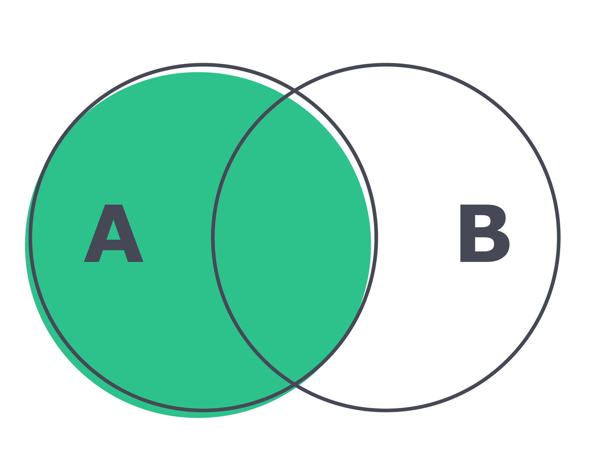
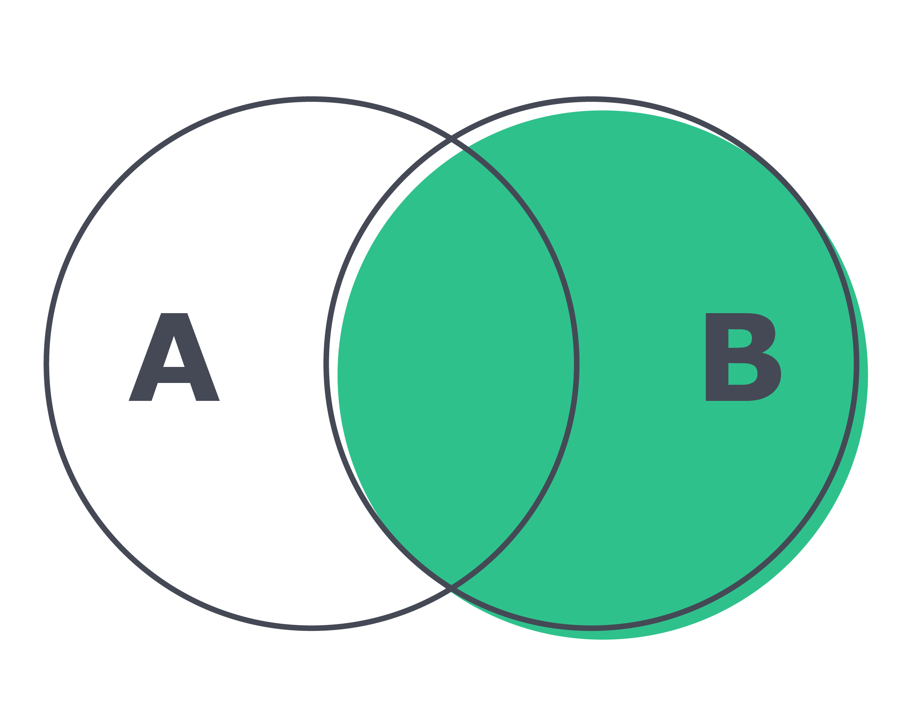
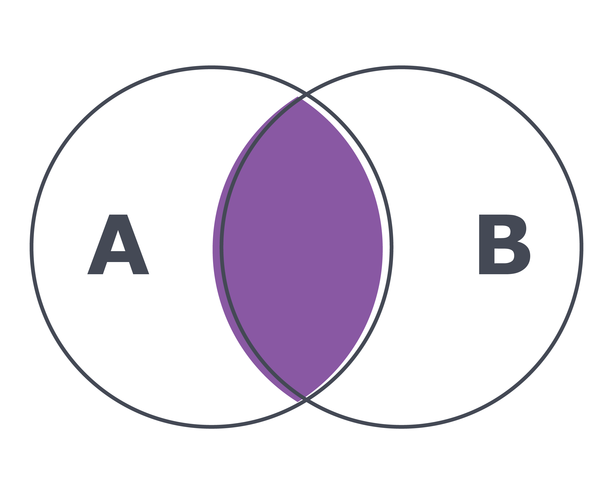

## Como utilizar o LEFT JOIN e o RIGHT JOIN

Você precisa encontrar um conjunto de registros, mas não tem certeza se uma das colunas de referência envolvidas possui ou não essa informação. Para que você encontre registros nessa situação, podemos usar o LEFT JOIN ou RIGHT JOIN . Vamos entender melhor com o vídeo a seguir:

O conceito de JOIN pode levar um certo tempo para ser compreendido. Sendo assim, vá no seu ritmo, reveja o conteúdo deste dia quantas vezes forem necessárias para compreender bem esse conceito. Pense em perguntas que você gostaria de responder sobre algum de seus bancos de dados que utilizem dados de mais de uma tabela. Abra o Workbench e tente fazer uma query que responda a elas.

## Três queries e uma pergunta
Vamos visualizar a diferença entre os três joins já vistos até o momento. Rode e analise cada uma das três queries a seguir. Busque notar a diferença entre as colunas da direita e da esquerda e a quantidade de dados retornados em cada query , como foi mostrado no vídeo. Gaste de 2 a 5 minutos aqui e depois continue.

## LEFT JOIN

SELECT
    c.customer_id,
    c.first_name,
    c.last_name,
    a.actor_id,
    a.first_name,
    a.last_name
FROM customer AS c
LEFT JOIN actor AS a
ON c.last_name = a.last_name
ORDER BY c.last_name;

## RIGHT JOIN

SELECT
    c.customer_id,
    c.first_name,
    c.last_name,
    a.actor_id,
    a.first_name,
    a.last_name
FROM customer AS c
RIGHT JOIN actor AS a
ON c.last_name = a.last_name
ORDER BY c.last_name;

## INNER JOIN

SELECT
    c.customer_id,
    c.first_name,
    c.last_name,
    a.actor_id,
    a.first_name,
    a.last_name
FROM customer AS c
INNER JOIN actor AS a
ON c.last_name = a.last_name
ORDER BY c.last_name;

## Notando as diferenças

Depois de ter analisado as queries acima, note que, de fato, a única diferença entre os três joins é a questão do foco. Vamos explorar essa ideia abaixo.
LEFT JOIN : quando utilizamos o LEFT JOIN , focamos a tabela da esquerda. São retornados todos os registros da tabela esquerda e valores correspondentes da tabela da direita, caso existam . Valores que não possuem correspondentes são exibidos como nulos.

Veja uma representação visual do LEFT JOIN abaixo:

RIGHT JOIN : quando utilizamos o RIGHT JOIN , focamos a tabela da direita. São retornados todos os registros da tabela da direita e valores correspondentes da tabela da esquerda, caso existam . Valores que não possuem correspondentes são exibidos como nulos.
Veja uma representação visual do RIGHT JOIN abaixo:

INNER JOIN : finalmente, temos o INNER JOIN , que foca em trazer somente os registros que possuem valores correspondentes em ambas as tabelas .
Novamente, você pode ver uma representação visual do INNER JOIN abaixo:

Até o momento, temos usado mais de uma tabela para analisar dados e gerar informação. No entanto, a informação a ser analisada pode estar concentrada em apenas uma tabela. Nesse cenário, o SELF JOIN pode ser usado para criar resultados relevantes.
