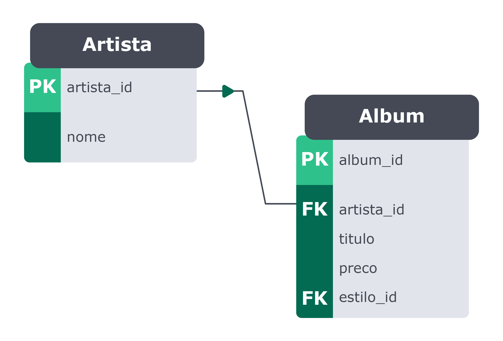
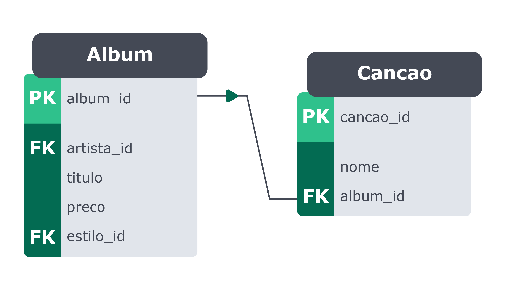
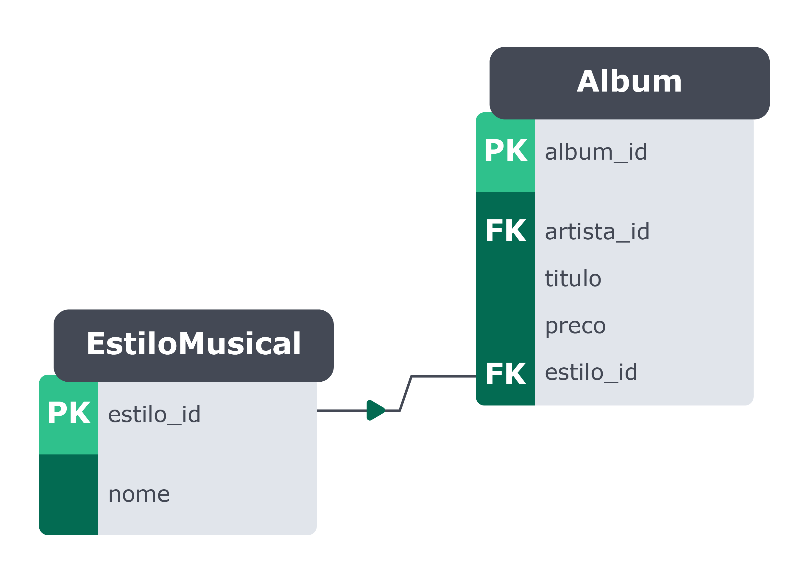

## Database Design - Como modelar um banco de dados

Existem alguns passos a serem seguidos durante a modelagem e criação de um banco de dados. Um fluxo bastante comum nesse processo consiste em:

Identificar as entidades , atributos e relacionamentos com base na descrição do problema;
Construir um diagrama entidade-relacionamento para representar as entidades encontradas no passo 1;
Criar um banco de dados para conter suas tabelas;
Criar e modelar tabelas tendo o diagrama do passo 2 como base.

A seguir você verá como realizar cada um desses passos.

### 1) Identificando entidades, atributos e relacionamentos

Primeiramente você deve identificar as entidades , atributos e relacionamentos com base na descrição do problema. Porém, antes disso é necessário entender o significado de cada um deles.

### Entidades:

São uma representação de algo do mundo real dentro do banco de dados. Elas normalmente englobam toda uma ideia e são armazenadas em formato de tabelas em um banco de dados.

Antes de expandir o código a seguir: Volte à descrição do problema acima e busque identificar quais objetos devem se tornar entidades. Depois expanda o código abaixo para verificar.

Se sua interpretação foi diferente, não se preocupe. A maneira como você modelará o banco de dados varia de acordo com a sua escala.
Entidade 1: `Álbum`;
Entidade 2: `Artista`;
Entidade 3: `Estilo Musical`;
Entidade 4: `Canção`.

### Atributos:

Os atributos são tudo aquilo que pode ser usado para descrever algo. Por exemplo, uma entidade pessoa pode ter nome, altura, peso e idade.

Antes de expandir o código a seguir: Considerando a história anterior sobre um catálogo de álbuns musicais, tente deduzir quais propriedades descrevem cada uma das entidades encontradas anteriormente.

Se sua interpretação foi diferente, não se preocupe, você praticará mais hoje para que melhore essa percepção.
Álbum: `album_id`, `titulo`, `preco`, `estilo_id` e `artista_id`;
Artista: `artista_id` e `nome`;
Estilo Musical: `estilo_id` e `nome`;
Canção: `cancao_id`, `nome` e `album_id`.

Algo a ser notado aqui é que algumas informações precisam ser deduzidas, como, por exemplo, a coluna que armazena o identificador único dos registros (aqui chamado de id), que todas tabelas precisam ter.

## Relacionamentos:
Os relacionamentos servem para representar como uma entidade deve estar ligada com outra(s) no banco de dados. Há três tipos de relacionamentos possíveis em um banco de dados, que são:

### Relacionamento Um para Um (1..1):

Nesse tipo de relacionamento, uma linha da Tabela A deve possuir apenas uma linha correspondente na Tabela B e vice-versa. Veja o exemplo abaixo:

Apesar de ser possível inserir essas informações em apenas uma tabela, esse tipo de relacionamento é usado normalmente quando se quer dividir as informações de uma tabela maior em tabelas menores, evitando que as tabelas tenham dezenas de colunas.

### Relacionamento Um para Muitos ou Muitos para Um (1..N):

Esse é um dos tipos mais comuns de relacionamento. Em cenários assim, uma linha na Tabela A pode ter várias linhas correspondentes na Tabela B , mas uma linha da Tabela B só pode possuir uma linha correspondente na Tabela A . Veja o exemplo abaixo:

Nesse exemplo, uma categoria pode estar ligada a vários livros, embora um livro deva possuir apenas uma categoria.

### Relacionamento Muitos para Muitos (N..N):

O relacionamento muitos para muitos acontece quando uma linha na Tabela A pode possuir muitas linhas correspondentes na Tabela B e vice-versa. Veja o exemplo abaixo:

Esse tipo de relacionamento pode ser visto também como dois relacionamentos um para muitos ligados por uma tabela intermediária, como é o caso da tabela filme_ator . Pode-se chamar essa tabela intermediária de tabela de junção . Ela é usada para guardar informações de como as tabelas se relacionam entre si. Desta maneira, quando se quer demonstrar que um filme pode contar com vários atores e também que os atores podem atuar em vários filmes, surge a necessidade de um relacionamento muitos para muitos.

Antes de expandir o código a seguir: Volte à estrutura de tabelas do Catálogo de Álbuns e tente identificar quais tipos de relacionamentos existem entre as tabelas. Escreva-os em algum lugar e depois expanda abaixo para ver os relacionamentos. Praticar essa habilidade é crucial.
Ver Relacionamentos
Os relacionamentos identificados foram:
Um artista pode possuir um ou mais álbuns;
Um estilo musical pode estar contido em um ou mais álbuns;
Um álbum pode possuir uma ou mais canções.

## 2) Construindo um diagrama entidade-relacionamento

No segundo passo, será construído um diagrama entidade-relacionamento para representar as entidades encontradas no passo 1.

Existem diversas ferramentas para modelar os relacionamentos em um banco de dados. Hoje será usada a draw.io https://draw.io/ para criar os modelos. Você pode aprender como utilizar essa ferramenta assistindo a este vídeo. https://www.youtube.com/watch?v=VgTRNqn2fn0

Agora é preciso montar um diagrama de relacionamento básico que demonstra como uma entidade é relacionada com a outra, usando o modelo EntidadeA + verbo + EntidadeB .

Considerando as entidades Álbum , Artista , Estilo Musical e Canção , foi construído o seguinte diagrama:

O que você deve fazer quando estiver construindo seu próprio banco de dados é entender quantas vezes uma entidade pode se relacionar com uma outra, para, a partir disso, você poder criar esse primeiro diagrama, como o do exemplo acima, que mostra como as entidades estão relacionadas entre si.

### Montando um diagrama mais detalhado

Para diagramas ER mais detalhados, deve-se incluir o nome das tabelas, suas chaves primárias e estrangeiras, suas colunas e seus relacionamentos.

Curiosidade: Por questão de convenções e boas práticas na criação de tabelas, não serão usados acentos ou espaços entre os nomes das tabelas.

Lembre-se: Existem várias maneiras de se modelar um banco de dados. Então, caso pense diferente do modelo abaixo, entenda que existem diversas formas de se resolver um mesmo problema.

### Relacionamentos presentes entre as tabelas acima:

Tabelas Artista e Album :

As tabelas Artista e Album possuem um relacionamento de um para muitos (1..N), em que um artista pode possuir um ou mais álbuns.

Tabelas Album e Cancao :

A tabela Album possui um relacionamento de um para muitos com a tabela Cancao , uma vez que um álbum pode conter várias canções.

Tabelas Album e EstiloMusical :

A tabela EstiloMusical também possui um relacionamento de um para muitos com a tabela Album , uma vez que um estilo musical pode estar contido em vários álbuns.

## Ponto importante sobre diagramas ER

A ideia de um diagrama ER é prover uma representação gráfica para a estrutura de seu banco de dados, descrevendo suas entidades com seus atributos e como elas se relacionam. Essa visualização pode te ajudar tanto a criar e modelar seu banco de dados quanto a entender se sua modelagem precisa ser alterada ou se houve algum erro ao pensar na organização de suas entidades. Com esse diagrama você consegue pensar um pouco mais antes de começar a escrever as queries para criar as tabelas.
Hora de voltar ao MySQL Workbench e criar um banco de dados!

## 3) Criando um banco de dados para conter suas tabelas

Agora que você já tem um diagrama que representa as tabelas que precisam ser criadas, já pode botar a mão no código.

Ao lidar com a criação e gerenciamento de um banco de dados, você precisará conhecer os seguintes comandos:

-- Cria um banco de dados com o nome especificado.
CREATE DATABASE nome_do_banco_de_dados;

-- Sinônimo de CREATE DATABASE, também cria um banco de dados.
CREATE SCHEMA nome_do_banco_de_dados;

-- Verifica se o banco de dados ainda não existe.
-- Essa verificação é comumente utilizada junto ao CREATE DATABASE para evitar
-- a tentativa de criar um banco de dados duplicado, o que ocasionaria um erro.
IF NOT EXISTS nome_do_banco_de_dados;

-- Lista todos os bancos de dados existentes.
SHOW DATABASES;

-- Define o banco de dados ativo para uso no momento.
USE nome_do_banco_de_dados;

Os comandos CREATE DATABASE ou CREATE SCHEMA fazem a mesma coisa, no entanto eles normalmente são utilizados em conjunto com o comando IF NOT EXISTS . Essa verificação é feita para evitar a tentativa de criar um banco de dados duplicado, o que ocasionaria um erro.

Considerando o problema que precisa ser resolvido, hora de criar um banco de dados chamado albuns .

CREATE DATABASE IF NOT EXISTS albuns;

### Como utilizar um banco de dados

Talvez você já tenha notado que, até agora, todas as queries têm sido prefixadas ou precedidas do nome do banco de dados, como, por exemplo:

SELECT * FROM sakila.actor;

No entanto, pode-se usar também o comando USE nome_do_do_banco_de_dados , que define um banco de dados como ativo. Com ele, é eliminada a necessidade de utilizar nome do banco de dados como prefixo nas queries. Veja o exemplo a seguir:

USE sakila;
SELECT * FROM actor;

Com o banco de dados albuns criado, resta apenas o quarto passo, pelo qual serão criadas as tabelas.

## 4) Criando e modelando tabelas de acordo com um diagrama ER

O objetivo para essa seção é criar as seguintes tabelas:

E para isso é necessário entender:

### Quais são os principais tipos de dados no MySQL
Hora de assistir ao vídeo abaixo, para escolher melhor o tipo de dados durante a criação de uma tabela.

Tipos de dados

-booleanos
pode receber 1 ou 0 o valor padrão é nulo

-caracteres
tamanho fixo (char(5)) insere até 5 caracteres e sempre ocupa todo o espaço reservado
tamanho variavel(varchar(x)) permite inserir até x espaços, mas só ocupa o que for preenchido

-numeros
valores exatos inteiros (tinyint) vai de 0 - 255 sem sinal ou seja, todos os valores positivos;
ou -128 a 127 signed permite guardar valores negativos e positivos dentro da faixa de valores
outros valores inteiros são: smallint, mediumint, int, bigint
valores exatos com precisão decimal: decimal => permite definir a quantidade máxima de numeros e sua precisão
ex.: decimal(5,2) => 199,99
float/real => precisão de uma casa decimal
doble => tem a precisão de duas casas decimais

-temporais
date yyyy-mm-dd, 
time hh:mm:ss, 
year yyyy entre 1901 e 2155
datetime => date + time,
timestamp => igual datetime + fuso horário.

### O que é uma primary key e foreign key

No vídeo abaixo você vai entender, em menos de 8 minutos, o que são primary key e foreign key.

Primary_key é uma coluna ou grupo de colunas para identificar uma linha em uma tabela, ou seja, um identificador único no banco de dados.

Foreign_key é uma coluna ou grupo de colunas em uma tabela que identifica unicamente uma linha em outra tabela.

Chave primária composta No vídeo vimos que a chave primária é uma restrição, ou constraint que serve para identificar uma linha e garantir que não haverá dados redundantes em uma tabela. Uma chave primária pode ser formada com uma única coluna ou um grupo de colunas de uma tabela . Ou seja, por mais que só possamos ter uma única chave primária por tabela, essa chave pode ser simples (apenas uma coluna) ou composta (conjunto de colunas).

Veremos um exemplo para ilustrar a utilização de uma chave primária composta, considere a seguinte tabela:

    DROP SCHEMA IF EXISTS Brasil;
    CREATE SCHEMA Brasil;
    USE Brasil;

    CREATE TABLE cidades(
        cidade VARCHAR(100) NOT NULL,
        estado VARCHAR(10) NOT NULL,
        populacao INTEGER,
        CONSTRAINT PRIMARY KEY(cidade)
    );

Veja que foi criada uma chave primária simples utilizando o campo cidade . Agora considere o exemplo abaixo que irá inserir os dados das cidades de Rio Claro/SP e Rio Claro/RJ na tabela criada:

    INSERT INTO cidades(cidade, estado, populacao)
    VALUES('Rio Claro','SP',185421),
          ('Rio Claro','RJ',17216);

No exemplo acima teremos um erro , pois há uma violação da chave primária, já que o nome "Rio Claro" será duplicado e isto não é permitido. A solução para o problema acima é criarmos uma chave primária composta . A chave composta é aquela criada com duas ou mais colunas e, desta forma, passa a utilizar a junção desses dados para formar um valor único e assim bloquear a duplicidade. Veja sua implementação no exemplo abaixo:

    DROP SCHEMA IF EXISTS Brasil;
    CREATE SCHEMA Brasil;
    USE Brasil;

    CREATE TABLE cidades(
        cidade VARCHAR(100) NOT NULL,
        estado VARCHAR(10) NOT NULL,
        populacao INTEGER,
        CONSTRAINT PRIMARY KEY(cidade, estado)
    );

    INSERT INTO cidades(cidade, estado, populacao)
    VALUES('Rio Claro','SP',185421),
          ('Rio Claro','RJ',17216);

A escolha na utilização de chaves primárias simples ou compostas para criar sua tabela depende da situação. No exemplo acima, faz mais sentido criar um campo id e utilizá-lo como chave primária simples , assim fica mais fácil fazer os relacionamentos com outras tabelas e utilizar operadores de busca pois você usará apenas o campo id .

A criação da tabela cidades com uma chave composta foi puramente ilustrativa, para seguir o padrão de termos uma chave primária simples podemos mudar a query para fazer da seguinte forma.

     -- Apagar a versão antiga da tabela
     DROP TABLE cidades;
     CREATE TABLE cidades(
       id INT(11) NOT NULL AUTO_INCREMENT PRIMARY KEY,
       cidade VARCHAR(100) NOT NULL,
       estado VARCHAR(10) NOT NULL,
       populacao INTEGER
    );

    INSERT INTO cidades(cidade, estado, populacao)
    VALUES('Rio Claro','SP',185421),
          ('Rio Claro','RJ',17216);

De qualquer forma, a aplicação de chaves compostas pode ser vantajosa em outras situações, como na criação de tabelas N:N, também conhecidas como tabelas de junção , pois os campos que contêm as chaves estrangeiras para as outras tabelas são utilizados para formar a chave primária composta , garantindo o bloqueio de registros com associações iguais. Veja no exemplo abaixo, a tabela de junção filme_ator .

Neste caso, o recomendado é utilizar os campos AtorId e FilmeId já existentes para formar uma chave composta, desta maneira conseguimos manter a identificação única e a integridade da tabela sem precisar criar um novo campo único id para usar como chave primária.

    CREATE TABLE filme_ator(
        AtorId INTEGER,
        FilmeId INTEGER,
        CONSTRAINT PRIMARY KEY(AtorId, FilmeId),
        FOREIGN KEY (AtorId) REFERENCES Actor (Atorid),
        FOREIGN KEY (FilmeId) REFERENCES Filme (Filmeid)
    );

Como criar uma tabela no MySQL
Hora de aprender como criar tabelas. Para isso criaremos as quatro tabelas do banco de dados albuns neste vídeo.

Sintaxe:
  CREATE TABLE IF NOT EXISTS Nome_da_tabela (
    coluna1 tipo constraint,
    coluna2 tipo constraint,
    coluna3 tipo constraint,
    colunaN tipo constraint,
  ) ENGINE='nome_engine'

  engine é a forma de como o banco de dados vai funcionar

Criar bando de dados:

CREATE DATABASE IF NOT EXISTIS albuns; 

Criando tabelas de albuns:

use albuns;
create table artista(
  artista_id INT PRIMARY KEY AUTO_INCREMENT,
  NOME VARCHAR(50)
) ENGINE=INNODB; (INNODB É O MAIS UTILIZADO E PADRÃO DO MYSQL DESDE A VERSÃO 5.5)

OUTRA TABELA:

USE ALBUNS;
CREATE TABLE ALBUM(
  ALBUM_ID INT PRIMARY KEY AUTO_INCREMENT,
  ARTIST_ID INT NOT NULL,
  TITULO VARCHAR(100) NOT NULL, 
  PRECO DECIMAL(5,2) INT NOT NULL,
  ESTILO_ID INT NOT NULL,
  FOREIGN KEY (ARTIST_ID) REFERENCES ARTISTA(ARTISTA_ID),
  FOREIGN KEY (ESTILO_ID) REFERENCES ESTILOMUSICAL(ESTILO_ID)
) ENGINE=INOODB;