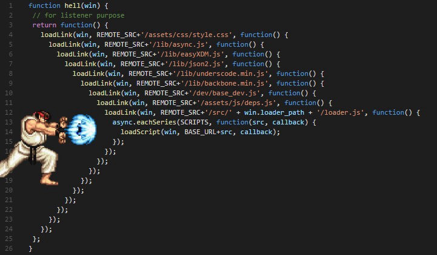

## Callbacks

Primeiro, vamos começar com o conceito de callback. Conforme o próprio nome diz, callback tem a ver com "chamar de volta". Basicamente, toda vez que precisarmos que algo seja processado em segundo plano, devemos registrar uma callback. Ela será executada quando a operação que solicitamos for concluída. Podemos pensar em callbacks como sendo uma forma de dizermos pro runtime JavaScript um "vê lá e me avisa". 😆

Vamos usar como exemplo a função readFile do módulo fs do Node.js. Ela realiza a leitura de um arquivo e, quando termina, chama uma função de callback, passando o resultado:

const fs = require('fs');

fs.readFile('./arquivo.txt', (err, content) => {
  if (err) {
    console.error(`Erro ao ler o arquivo: ${err.message}`);
    return;
  }

  console.log(`Arquivo lido com sucesso. Conteúdo: ${content.toString('utf8')}`);
});

No exemplo acima, passamos uma função para readFile , à qual damos o nome de callback . Essa função de callback recebe dois parâmetros: o primeiro, que chamamos de err , é um erro que pode ter ocorrido durante a leitura do arquivo. Caso nenhum erro tenha ocorrido, esse parâmetro será undefined . O segundo parâmetro é, nesse caso, o conteúdo do arquivo, em forma de uma sequência de bytes, que chamamos de content . Caso ocorra um erro na leitura do arquivo, esse parâmetro será undefined .

Sabendo disso, veja abaixo o que esse código faz:

1. Primeiro, pedimos que o Node.js leia o arquivo, e passamos uma função de callback;

2. Quando a leitura do arquivo é concluída ou um erro acontece, nossa função é chamada;

3. Dentro dela, a primeira coisa que fazemos é verificar se existe um erro. Caso exista, escrevemos ele no console e encerramos a execução com o return ;

4. Caso nenhum erro tenha acontecido, sabemos que nosso arquivo foi lido com sucesso e, portanto, seu conteúdo está no segundo parâmetro, que chamamos de content .

Esse formato de callback que recebe dois parâmetros, erro e resultado, não foi utilizado por acaso. Callbacks desse tipo são chamadas de node-style callbacks e são, por convenção, a melhor maneira de se estruturar uma callback. Toda API de módulos nativos do Node.js utiliza esse mesmo formato de callbacks . Guarde essa informação, pois ela vai ser importante mais tarde. 😉

### O lado ruim dos callbacks
A principal desvantagem das callbacks vem do fato de que o resultado de uma operação só existe dentro daquela callback; ou seja: se precisamos executar uma coisa depois da outra, precisamos colocar uma callback dentro da outra. À medida que vamos fazendo isso, vamos aumentando o nível de indentação necessária e, portanto, aumentamos a dificuldade de ler e até mesmo de dar manutenção no código. Vamos ver um exemplo:

Suponhamos que precisamos ler, sequencialmente, três arquivos, e que vamos fazê-lo de forma assíncrona, para não travar nosso servidor. O código para isso ficaria mais ou menos assim:

const fs = require('fs');

fs.readFile('file1.txt', (err, file1Content) => {
  if (err) return console.log(`Erro ao ler arquivo 1: ${err.message}`);

  console.log(`Lido file1.txt com ${file1Content.byteLength} bytes`);

  fs.readFile('file2.txt', (err, file2Content) => {
    if (err) return console.log(`Erro ao ler o arquivo 2: ${err.message}`);

    console.log(`Lido file2.txt com ${file2Content.byteLength} bytes`);

    fs.readFile('file3.txt', (err, file3Content) => {
      if (err) return console.log(`Erro ao ler o arquivo 3: ${err.message}`);

      console.log(`Lido file3.txt com ${file3Content.byteLength} bytes`);
    });
  });
});

Com três níveis de indentação, já dá pra perceber que o código começa a ficar menos legível. Imagina como seria se tivéssemos ainda mais níveis de callbacks aninhadas?

A isso damos o nome de callback hell , que é quando temos uma callback dentro de outra, dentro de outra, dentro da outra etc., de forma que o código fica horrível de ler. Uma imagem que ilustra muito bem a callback hell é essa:

Uma forma de tentar resolver o problema é quebrar o código em infinitas funções menores, que não fazem nada além de chamar a próxima callback, mas isso também não é tão simples, organizado, ou mesmo bonito, e acaba por não funcionar. Veja um exemplo:

const fs = require('fs');

const file3Callback = (err, file3Content) => {
  if (err) return console.log(`Erro ao ler o arquivo 3: ${err.message}`);

  console.log(`Lido file3.txt com ${file3Content.byteLength} bytes`);
};

const file2Callback = (err, file2Content) => {
  if (err) return console.log(`Erro ao ler o arquivo 2: ${err.message}`);

  console.log(`Lido file2.txt com ${file2Content.byteLength} bytes`);

  fs.readFile('file3.txt', file3Callback);
};

const file1Callback = (err, file1Content) => {
  if (err) return console.log(`Erro ao ler arquivo 1: ${err.message}`);

  console.log(`Lido file1.txt com ${file1Content.byteLength} bytes`);

  fs.readFile('file2.txt', file2Callback);
};

fs.readFile('file1.txt', file1Callback);

Depois de uma ou duas funções "aninhadas", fica fácil perder a linha de raciocínio, além de que é complicado entender logo de cara o fluxo em que o código acontece.
Mas então como resolvemos isso?