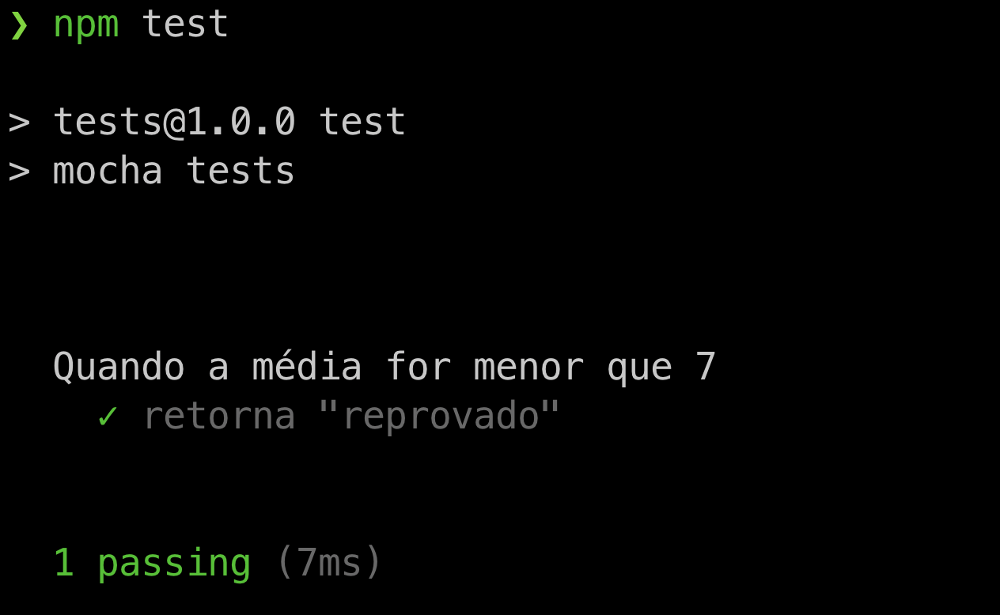

## Executando o teste

Antes de começarmos, precisamos criar nosso pacote node para incluirmos os scripts necessários em package.json :

npm init # Iniciando o npm

Teste escrito, vamos ver como executá-lo. Como dito antes, o mocha é o responsável por executar nossos testes. Ele entenderá as palavras reservadas describe e it , assim como a estrutura do nosso teste.
Poderíamos tê-lo instalado de maneira global ( npm install -g mocha ) em nossa máquina, e bastaria chamá-lo diretamente em nosso terminal passando o arquivo do teste ( mocha tests/calculaSituacao.js ).
Entretanto, faremos da maneira mais recomendada e elegante: utilizaremos o pacote que já temos instalado. Para isso, vamos adicionar um novo script ao nosso package.json , que chama o mocha e informa um arquivo ou diretório de testes:
package.json

{
// ...
  "scripts": {
    "start": "node index.js",
    "test": "mocha tests"
  },
// ...
}

Dessa forma, não precisamos instalar nada globalmente, e para executar nosso teste basta rodar em nosso terminal o script test , que irá executar =o comando mocha tests utilizando o módulo instalado:

npm run test

ou simplesmente 

npm test

E teremos um output parecido com:

