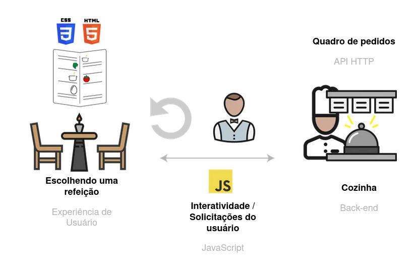

## Contextualizando

A partir de agora, você irá criar APIs, que vão receber requisições e devolver dados , passando por validações , regras de negócio , acesso ao banco de dados , etc.
Se compararmos uma aplicação web a um restaurante, o Front-End é a área das mesas , garçons e garçonetes: é onde a comunicação direta com clientes acontece, onde os pedidos são anotados, e também a parte que leva as receitas da cozinha até a mesa das pessoas.
O Back-End, por sua vez, é cozinha . É onde uma pessoa cozinheira, mediante o recebimento de um pedido, vai preparar os ingredientes , montar a receita e devolvê-lo para que uma pessoa atendente apresente esse prato a quem o pediu . É no Back-End que os dados serão filtrados , manipulados e preparados para envio ao Front-end. Esse, por sua vez, se encarrega de apresentá-los a quem fez o pedido.
Ainda na analogia da cozinha, uma API seria o quadro de pedidos que os setores de "Cozinha" e "Atendimento" usam para se comunicar:
Quando o client envia uma requisição para o Back-End , é como se uma pessoa atendente anotasse o pedido em um papel e o colocasse no balcão para ser preparado pela cozinha .
Quando o servidor envia a resposta para a requisição do client , ele mostra essas informações ao usuário via Front-End. É como se a cozinha entregasse o prato que foi pedido para que o atendente o leve para a mesa da pessoa cliente.
Pra ilustrar, a coisa toda funciona como a imagem abaixo:

Daqui pra frente, vamos focar nos conceitos e na construção das APIs, visto que uma API bem feita, assim como um quadro de pedidos bem organizado, pode ser a chave para uma aplicação (ou um restaurante) bem sucedida. 🧑‍🍳💻
