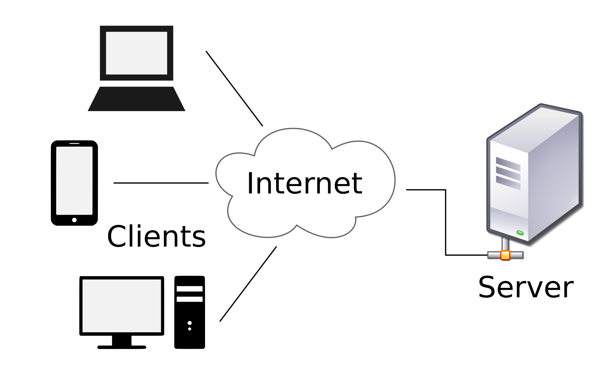

## As 6 restrições para ser RESTful

A arquitetura REST define seis restrições, chamadas constraints , que devem ser respeitadas para que sua API seja RESTful .

### *1 - Interface uniforme ( Uniform Interface )*

A interface de comunicação entre seu servidor e seu cliente deve ser definida e seguida à risca, através de um padrão, para que ela se mantenha consistente. Dessa forma, essa "constraint", se seguida à risca, simplifica e desacopla a sua arquitetura.

Essa interface inclui o *endpoint* , o *tipo de retorno* e o uso dos *verbos HTTP* .

### Recursos e coleções

O recurso a ser acessado/alterado deve ser identificado pelo endpoint da requisição. Exemplo: https://swapi.dev/api/planets/:id . Nessa URL, vemos que o recurso que queremos acessar, planet , é facilmente identificado.

Usar plural ou singular? Não importa. O importante é manter o padrão.

### Tipo do retorno
Talvez você já tenha visto um header chamado Content-type nas respostas de requisições. Ele serve para dizer, para o nosso cliente, que tipo de conteúdo estamos retornando.

Se estamos retornando um JSON, enviamos o header como 

Content-type: application/json . Se fosse HTML, seria Content-type: text/html , e por aí vai.

Alguns formatos comuns são JSON , XML e JavaScript .

Esse tópico é, literalmente, sobre manter esses retornos consistentes. Se o cliente pede ou envia informação no formato JSON, você deve processar e retornar mantendo o formato JSON. Se um erro em um endpoint retorna os campos code , error e message , todos os erros devem retornar, pelo menos, esses campos. Se uma requisição ao endpoint de uma coleção ( GET /posts , por exemplo), retorna um Array, todos os endpoints de coleção devem retornar Arrays. Se, por exemplo, quando realizamos uma requisição GET /products , recebemos um array de produtos, ao realizar a requisição GET /sales , não devemos receber um JSON no formato { "sales": [{ ... }] } , já que esse comportamento é inconsistente com o do endpoint GET /products .

Dessa forma, ao consumir um endpoint da sua API, é possível até mesmo deduzir o comportamento dos demais endpoints, dispensando "tentativa e erro".

### Ações/Verbos

A ação que vamos realizar no recurso deve ser identificada pelo *verbo HTTP* da requisição. Para o REST, os principais verbos HTTP são POST , GET , PUT e DELETE , e cada um realiza uma ação, dependendo se for enviado para o endpoint de um recurso ou de uma coleção .

As tabelas abaixo relacionam cada verbo com sua ação em caso de coleções ou recursos:

### Respostas

Respostas são sempre obrigatórias. Nunca deixe seu cliente sem resposta, mesmo que ela não tenha um corpo.

Existem boas práticas em relação aos status code que nosso servidor envia como resposta. Temos uma variedade de códigos que devemos utilizar em situações específicas:
  1xx: Informação;
  2xx: Sucesso;
  3xx: Redirecionamento;
  4xx: Erro do cliente;
  5xx: Erro no servidor.

Existe uma lista completa https://developer.mozilla.org/pt-BR/docs/Web/HTTP/Status e detalhada sobre códigos de status HTTP disponibilizada pela Mozilla.

### *2 - Arquitetura cliente-servidor*

Você já ouviu falar muito de arquitetura cliente-servidor, não é? De termos uma API e um cliente desacoplados? É exatamente o que o REST prega.

Não importa quem é nosso cliente, as nossas APIs têm que conseguir retornar dados para ele. O cliente pode ser um app mobile, web, tv, arduíno etc.

Lembra-se dos projetos que você fez no módulo de front-end, em que você consumia APIs externas, como a SWAPI ? Então, você poderia facilmente mudar as APIs com que esses projetos se comunicam para outras, desde que os contratos (os endpoints, os formatos das requisições, o que é retornado etc.) sejam mantidos.

Imagine como seria se o Mercado Livre não tivesse um padrão na API deles. Seria um caos para conseguir integrar no front-end que estávamos construindo.

O princípio básico aqui é a separação de responsabilidades em duas partes. O cliente se preocupa com a exibição dos dados, experiência da pessoa usuária, etc. O servidor se preocupa com armazenamento e acesso dos dados, cache, log e por aí vai.

Isso permite que as duas partes se desenvolvam de forma independente. Você pode trocar o cliente ou adicionar um novo sem mudar nada no servidor. Você pode mover o servidor para uma outra plataforma, escalá-lo etc. Pode até mesmo mudar completamente sua arquitetura interna, desde que a API que você fornece para seus clientes não mude (endpoint, resposta etc.).

### *Sem estado (Stateless)*

Essa constraint é um pouco mais complicada, mas nós temos um bom exemplo no React! Lembra-se quando criamos componentes que não tinham estado, e apenas recebiam props?

Esse é um dos conceitos mais importantes do REST. Ele que vai tornar possível nossa API responder a múltiplos clientes.

Não manter estado significa que toda requisição deve conter todas as informações necessárias (ser autossuficiente) para nossa API realizar uma ação . Desse jeito, não podemos reutilizar nenhum contexto que está armazenado no servidor (uma variável, por exemplo).

Exemplo :

Em um app em que você faz uma requisição para se logar, o servidor inicia sua sessão e te retorna um token.
Na próxima requisição, você precisa enviar o token novamente, pois o servidor "não se lembra" de você.

Esse ponto é importante, pois nos dá alguns benefícios:

  Transparência : facilita o trabalho do lado do servidor, pois todas as informações necessárias já estão na requisição;

  Escalabilidade : sem precisar manter estado, nosso servidor pode desalocar recursos que foram alocados para realizar uma ação específica e alocá-los apenas quando necessário.

Obs: No próximo bloco, vamos aprender sobre JWT, um padrão de autenticação sem estado, e veremos como o conceito Stateless funciona na prática.
