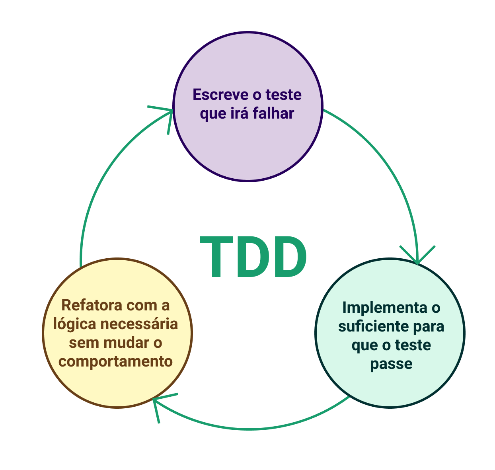

## Desenvolvimento guiado por testes

Agora que vamos começar a desenvolver API's e sistemas robustos, seguindo padrões amplamente difundidos, precisamos ter a preocupação em garantir que todas as partes do nosso código estão realizando seu papel de maneira correta.

Dessa forma, iremos seguir o modelo conhecido como TDD que vimos em aulas anteriores.

O TDD, conforme vimos anteriormente, é um processo de desenvolvimento de software que visa o feedback rápido e a garantia do funcionamento da aplicação de acordo com o que foi definido.

Relembrando o processo, podemos pensar que ele funciona como pequenos ciclos onde:

- Partimos da escrita de testes a partir dos requisitos;
- Em seguida, implementamos a funcionalidade;
- E, por último, fazemos os ajustes necessários para que testes e implementação estejam alinhados.

Concluindo o ciclo, iniciamos um novo para uma nova funcionalidade.
Podemos ver esse ciclo representado na figura abaixo

Ciclo do TDD

