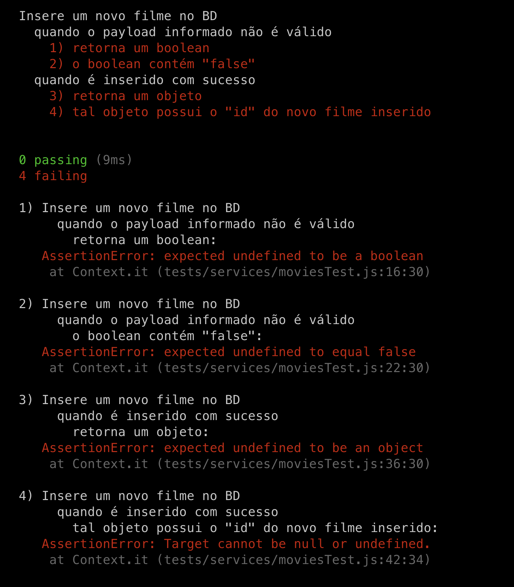

## Service e testes

Seguindo nossa sequência iremos testar a camada de services.

Relembrando o papel dessa camada, podemos definí-la como responsável pela lógica de negócio, sendo acessada pelo controller e acessando o model , ou seja, ficando situada entre as duas camadas.

Relembrando nossos requisitos vamos identificar quais comportamentos precisaremos garantir:

A API deverá permitir a inserção de filmes no banco de dados:

  Ela deve receber e registrar as seguintes informações do filme: Nome , Direção e Ano de lançamento ;

  Ao realizar a inserção de um novo filme, o endpoint deverá responder com o respectivo ID ;

Com base no requisito podemos descrever um Service com as seguintes asserções / regras:

  tests/services/movieService.test.js

const { expect } = require('chai');

const MoviesService = {
  create: () => {},
};

/*
  Precisamos validar se estamos recebendo todos os campos
  necessários para a operação. Como trata-se de uma regra
  de negócio, validaremos na camada de serviços.
*/
describe('Insere um novo filme no BD', () => {
  describe('quando o payload informado não é válido', () => {
    const payloadMovie = {};

    it('retorna um boolean', async () => {
      const response = await MoviesService.create(payloadMovie);

      expect(response).to.be.a('boolean');
    });

    it('o boolean contém "false"', async () => {
      const response = await MoviesService.create(payloadMovie);

      expect(response).to.be.equal(false);
    });

  });

  describe('quando é inserido com sucesso', () => {
    const payloadMovie = {
      title: 'Example Movie',
      directedBy: 'Jane Dow',
      releaseYear: 1999,
    };

    it('retorna um objeto', async () => {
      const response = await MoviesService.create(payloadMovie);

      expect(response).to.be.a('object');
    });

    it('tal objeto possui o "id" do novo filme inserido', async () => {
      const response = await MoviesService.create(payloadMovie);

      expect(response).to.have.a.property('id');
    });

  });
});

Rodando o teste específico com NAME=movieService npm test , teremos um retorno semelhante a:

Agora vamos implementar a camada conforme os requisitos:
  
  services/movieService.js

Vamos então adaptar nosso teste para chamar nossa implementação:

  tests/services/movieService.test.js

// const { expect } = require('chai');

const MoviesService = require('../../services/movieService');

// describe('Insere um novo filme no BD', () => {
//   describe('quando o payload informado não é válido', () => {
//     const payloadMovie = {};

//     it('retorna um boolean', async () => {
//       const response = await MoviesService.create(payloadMovie);

//       expect(response).to.be.a('boolean');
//     });

//     it('o boolean contém "false"', async () => {
//       const response = await MoviesService.create(payloadMovie);

//       expect(response).to.be.equal(false);
//     });

//   });

//   describe('quando é inserido com sucesso', () => {
//     const payloadMovie = {
//       title: 'Example Movie',
//       directedBy: 'Jane Dow',
//       releaseYear: 1999,
//     };

//     it('retorna um objeto', async () => {
//       const response = await MoviesService.create(payloadMovie);

//       expect(response).to.be.a('object');
//     });

//     it('tal objeto possui o "id" do novo filme inserido', async () => {
//       const response = await MoviesService.create(payloadMovie);

//       expect(response).to.have.a.property('id');
//     });

//   });
// });

Podemos rodar o teste novamente e teremos o seguinte resultado:

  

Perceba que o primeiro teste rodou com sucesso, a validação é realizada totalmente na camada de service. Porém, o segundo teste, como depende da camada de Model para funcionar, conforme esperado, o teste não concluiu com sucesso.

Vamos então isolar nosso service, removendo a dependência dele do Model. Para isso, podemos fazer um stub :

  tests/services/movieService.test.js

const sinon = require('sinon');
// const { expect } = require('chai');

const MoviesModel = require('../../models/movieModel');
// const MoviesService = require('../../services/movieService');

// describe('Insere um novo filme no BD', () => {
//   describe('quando o payload informado não é válido', () => {
//     const payloadMovie = {};

//     it('retorna um boolean', async () => {
//       const response = await MoviesService.create(payloadMovie);

//       expect(response).to.be.a('boolean');
//     });

//     it('o boolean contém "false"', async () => {
//       const response = await MoviesService.create(payloadMovie);

//       expect(response).to.be.equal(false);
//     });

//   });

//   describe('quando é inserido com sucesso', () => {
//     const payloadMovie = {
//       title: 'Example Movie',
//       directedBy: 'Jane Dow',
//       releaseYear: 1999,
//     };

    before(() => {
      const ID_EXAMPLE = 1;

      sinon.stub(MoviesModel, 'create')
        .resolves({ id: ID_EXAMPLE });
    });

    // Restauraremos a função `create` original após os testes.
    after(() => {
      MoviesModel.create.restore();
    });

//     it('retorna um objeto', async () => {
//       const response = await MoviesService.create(payloadMovie);

//       expect(response).to.be.a('object');
//     });

//     it('tal objeto possui o "id" do novo filme inserido', async () => {
//       const response = await MoviesService.create(payloadMovie);

//       expect(response).to.have.a.property('id');
//     });

//   });
// });

Agora vamos executar nosso teste novamente:

