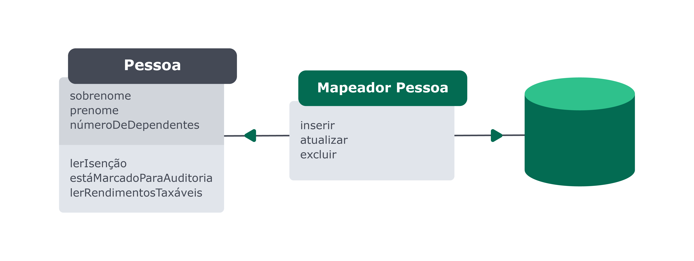
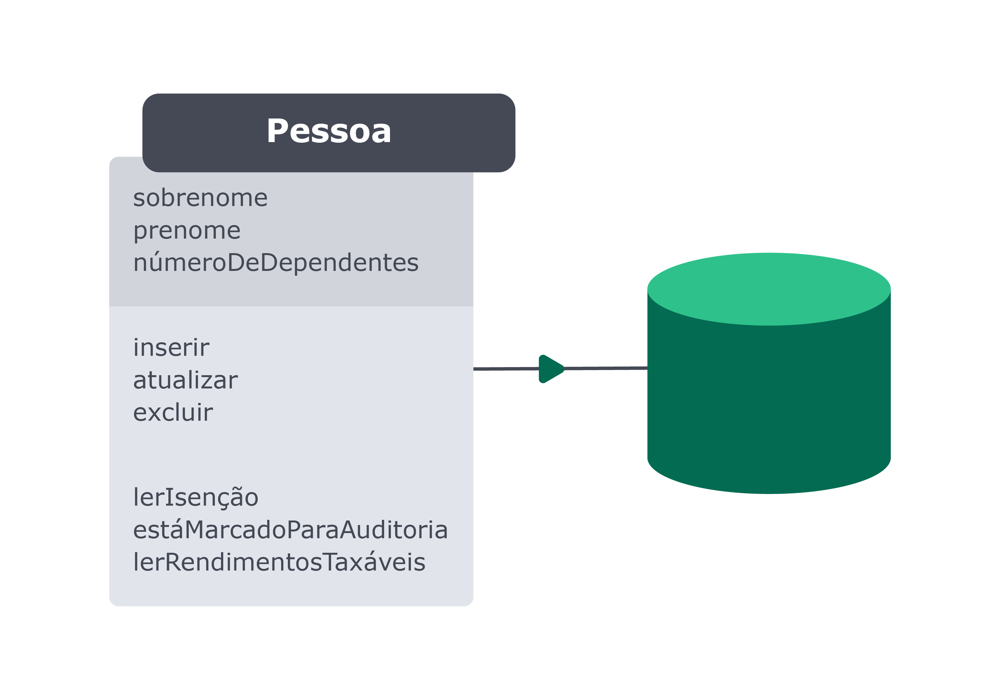

## Mapeamentos

No mercado, existem dois padrões que são mais utilizados para realizar os mapeamentos. Esses padrões são o Data Mapper e o Active Record . Ambos os padrões foram definidos por Martin Fowler em seu livro Padrões de Arquitetura de Aplicações Corporativas . Vamos ver um pouco sobre ambos abaixo.

### Data Mapper

Nesse padrão, a classe que representa a tabela do banco de dados não deve conhecer os recursos necessários para realizar as transações com o banco de dados:

No Data Mapper , como podemos ver acima, a entidade Pessoa está desacoplada do banco de dados. As informações e os comportamentos relacionados à Pessoa no contexto específico do nosso negócio ficam em um lugar, e em um outro, o Mapeador Pessoa , temos a camada responsável por criar as transações das informações com o banco de dados.
Isso significa que, enquanto o Mapeador Pessoa está fortemente acoplado ao banco de dados e deve ser refatorado ou refeito sempre que houver mudança na estrutura do banco de dados, a entidade Pessoa está completamente independente - a ela não interessa como o banco de dados está. Essa complexidade é absorvida pelo mapeador.

### Active Record

Diferentemente do anterior, a classe que representa a tabela conhece os recursos necessários para realizar as transações no banco de dados:

No Active Record o model está diretamente acoplado ao banco de dados. Dessa forma, o nosso próprio model descreve as operações do banco de dados e tem conhecimento de como salvar os dados, atualizá-los, deletá-los etc.

### Qual devo usar?

A resposta, como sempre, é "depende". O estilo Active Record é mais simples de se implementar, mas o Data Mapper facilita atualizações e mudanças na estrutura do banco de dados.
