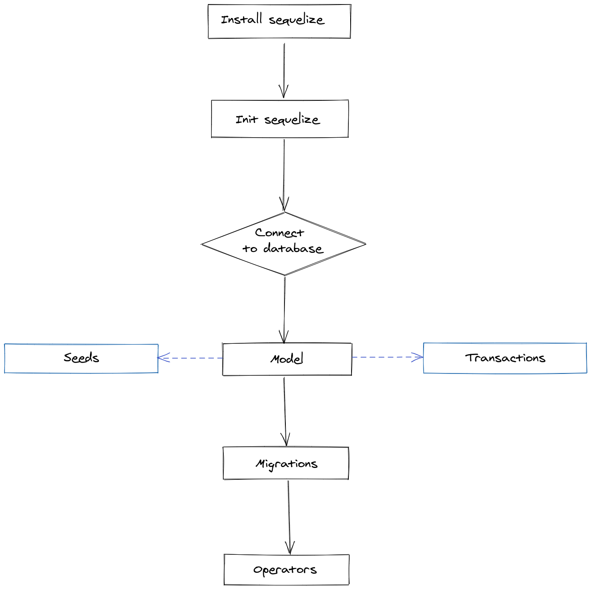

## Sequelize

Agora, vamos utilizar o Sequelize, que segue a linha Active Record, juntamente com uma aplicação simples Node.js . Para banco de dados iremos utilizar o MySQL. Vale ressaltar que a maioria dos métodos fornecidos pelo Sequelize são assíncronos e, portanto, retornam promises . Podemos usar then , catch etc. para tratar os retornos. Ou podemos utilizar, também, async e await .

O fluxograma abaixo mostra as etapas para a implementação do Sequelize no seu projeto. Pode parecer um processo complexo, mas esta biblioteca ORM possui muitas vantagens sobre a utilização de uma interface direta com o MySQL. O JavaScript sozinho não possui um suporte eficiente para o SQL, afinal, você precisa de um script SQL separado para criar seu database e tabelas, sem falar que as queries SQL precisam ser incorporados ( "embedados" ) no código do JavaScript para serem utilizadas. No final, estamos apenas incluindo boilerplates de SQL em vez de utilizar a Lógica de Negócio na nossa aplicação.

*boilerplates :* trechos de código que podem ser reutilizados em muitos lugares com pouca ou nenhuma alteração.

Usando o Sequelize, você pode evitar a criação de queries SQL para criar as tabelas em vez de um script SQL separado. Com isso, o seu código se torna mais legível , extensível e de fácil manutenção . Além disso, por meio do mapeamento por objetos relacionais ( Active Record ), é possível criar as relações e associações entre as tabelas com o próprio JavaScript. E ainda, é possível migrar seu database para outro banco de dados sem precisar reescrever todo o código (por exemplo: mudar de MySQL para o SQL server).

