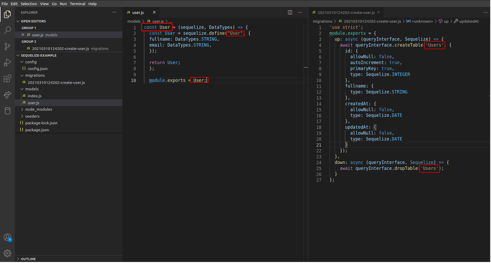

## Model

Podemos verificar que dentro da pasta models criada, existe um arquivo *index.js* . Este arquivo é gerado automaticamente pelo sequelize e possui um papel muito importante: estabelecer uma *instância de conexão* entre os arquivos presentes na pasta model e o banco de dados relacional utilizado. Não apague este arquivo, ele é necessário para a operação do sequelize.

Os models são a essência do Sequelize. Um model é uma abstração que representa uma linha na tabela em seu banco de dados e diz ao Sequelize várias coisas sobre essa entidade, como o nome da tabela no banco de dados e quais colunas ela possui (e seus tipos de dados). O model pode ser definido de duas formas:

  Chamando pela função sequelize.define(modelName, attributes, options)

  Estendendo Model como uma classe e chamando init(attributes, options)

A segunda forma é a padrão para utilização do sequelize, gerada automaticamente quando utilizado os comandos do CLI, e é específica para programação Orientada a Objetos . Como ainda não aprendemos sobre este tipo de desenvolvimento, utilizaremos a primeira forma para definição de models, chamando pela função sequelize.define() .

Para criar um model, usamos o seguinte comando no CLI ( **não execute o comando abaixo, ele é apenas um template de como criar um model** ):

npx sequelize model:generate --name NomeDoModel --attributes nomeDoAtributo:string

Além de gerar o model, ele também gera uma migration que irá criar a tabela no banco de dados. Não se preocupe, vamos aprender sobre as migrations no próximo tópico. Observe que passamos dois parâmetros para o comando:

  O parâmetro --*name* se refere ao nome da tabela, mas no singular, pois se refere a uma unidade dos dados, como uma linha no banco ou um objeto no seu código javascript;
  
  O parâmetro --*attributes* se refere ao nome das colunas e os tipos de dados que ela contém. Não é preciso definir todas as colunas neste comando, é possível adicioná-las direto no arquivo model.js gerado e na migration equivalente a este model.

Vamos dar um exemplo para ficar mais evidente. Queremos criar uma tabela Users , que contém dados de vários usuários . O que fazemos primeiro é gerar um model que irá representar uma Instância de usuário , ou uma linha na tabela Users no nosso banco (lembre-se, vamos ver a tabela sendo criada no próximo tópico).

npx sequelize model:generate --name User --attributes fullName:string

Depois de rodar este comando, perceba que foi criado um arquivo user.js na pasta model, e na pasta migration foi criado o arquivo 20210310124202-create-user.js (os números, no início do nome do arquivo, significam a data e a hora de criação dele, seguindo o formato yyyy-MM-dd:hh:mm:ss ) . Vamos focar no arquivo user.js por enquanto, perceba que o seguinte código está presente:

**models/user.js**

'use strict';
const {
  Model
} = require('sequelize');
module.exports = (sequelize, DataTypes) => {
  class User extends Model {
    /**
     * Helper method for defining associations.
     * This method is not a part of Sequelize lifecycle.
     * The `models/index` file will call this method automatically.
     */
    static associate(models) {
      // define association here
    }
  };
  User.init({
    fullName: DataTypes.STRING
  }, {
    sequelize,
    modelName: 'User',
  });
  return User;
};

Como dito anteriormente, não iremos trabalhar com classes, mas sim com a função sequelize.define() , então substitua este código pelo seguinte:

**models/user.js**

const User = (sequelize, DataTypes) => {
  const User = sequelize.define("User", {
    fullName: DataTypes.STRING,
    email: DataTypes.STRING,
  });

  return User;
};

module.exports = User;

Perceba que adicionamos uma nova coluna *email* no nosso model.

Agora, a imagem abaixo mostra o nosso model e migration criados. Perceba que o nome do arquivo model é user.js , o nome da função model definida está no singular User e na migration a tabela foi nomeada como Users .

Um ponto importante de mudança estrutural que o sequelize traz é que, da forma que aprendemos antes, sem o sequelize, nossa lógica de validações, interação com o banco de dados (get, insert etc.), entre outras, se centralizavam no model. Com o Sequelize, essa lógica se centraliza nos controllers ou services. O modelo fica responsável apenas por representar a estrutura do banco de dados, para ajudar o sequelize a realizar as operações. O mundo do back-end é cheio de diferentes formas e filosofias para a organização de um código! Essa é uma delas!
Nosso model está criado ! Agora vamos passar para o próximo passo, as *Migrations* .
