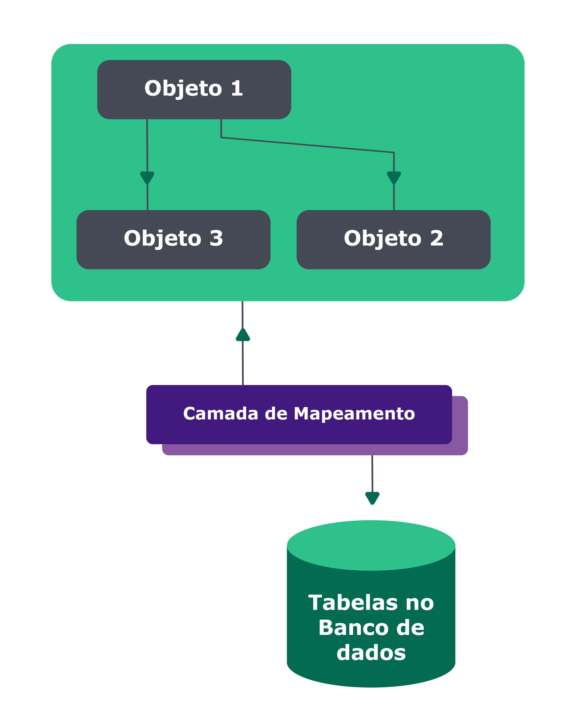
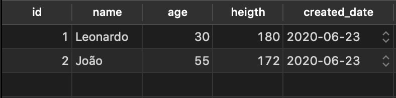

## Conteúdos

Mapeamento objeto-relacional ou ORM ( Object Relational Mapper ) é uma técnica/camada de mapeamento que permite fazer uma relação de estruturas de dados da nossa aplicação com os dados do banco de dados que as mesmas representam. O mapeamento objeto-relacional abstrai as diferenças entre os dois paradigmas, da aplicação e do banco de dados.

Vamos trazer isso pra prática! Suponha que temos uma aplicação que gerencia clientes. Nela teremos um objeto que chama Pessoas . Esta é a representação da entidade Pessoas na aplicação:

{
  "id": 1,
  "name": "Leonardo",
  "age": 30,
  "height": 180
}

Já para representar Pessoas no banco de dados relacional, nós usamos tabelas, em que cada linha vai representar uma entidade. Essa é a representação de Pessoas no nosso banco de dados:

Até aí tudo bem, certo? Agora imagine que nosso sistema recebe informações de uma nova pessoa e precisa salvar isso no banco de dados. Para isso, precisamos implementar, em algum lugar do nosso projeto, funções que "falem", entre outras coisas, que o nome que recebemos para salvar pode ser armazenado na coluna name do banco de dados. Além disso, precisaríamos escrever "na mão" o código SQL que faz a inserção dos dados no banco, de acordo com o banco de dados que estamos utilizando (MySQL, PostgreSQL etc). Agora, pense em ter 15 tabelas, cada uma com oito colunas, múltiplos relacionamentos se cruzando e por aí vai. Imagine o quão complexo pode ficar nosso projeto ao longo do tempo.
Para facilitar um pouco o nosso trabalho, existem várias bibliotecas de mapeamento objeto-relacional que podemos utilizar para abstrair essa complexidade , colocando sobre ela uma camada mais simples de código com a qual podemos interagir para lidar com banco de dados. Dessa forma, não precisamos mais escrever uma query SQL "crua" para cada vez que formos inserir um registro na tabela. A própria biblioteca fica responsável por isso, você apenas passa o objeto JavaScript para ela e ela insere os dados no banco de dados.
No Node.js , uma das bibliotecas mais famosas é o Sequelize , que tem suporte aos bancos de dados PostgreSQL, MariaDB, MySQL, SQLite e Microsoft SQL Server.

