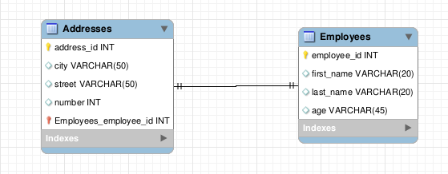

## Relacionamentos 1:1

Antes de começar, analise o diagrama abaixo. Esse será o banco de dados que utilizaremos no primeiro exemplo.

Podemos notar que existem duas tabelas nesse banco, Employees e Addresses . Cada employee possui um address , assim como cada address pertence a um employee .

Vamos criar um novo projeto para demonstrar esse exemplo. No dia anterior você viu todos os comandos que vamos utilizar, mas vamos relembrá-los.

Primeiro, abra seu terminal, depois crie um diretório, acesse-o e rode os comandos abaixo:

npm init -y

npm i express nodemon sequelize mysql2

npm i sequelize-cli

npx sequelize-cli init

Agora, realize as configurações necessárias no arquivo config/config.json , para fazer o exemplo, você utilizará a chave development , então altere os valores dessa chave caso necessário, os valores são:

  *Username* da sua instalação do MySQL.
  
  *Senha* da sua instalação do MySQL.
  
  *Database* , que é o nome do schema que será criado, em nosso exemplo, iremos utilizar associations .
  
  *Host* é o IP do seu servidor, no nosso caso, iremos manter 127.0.0.1 .
  
  *Dialect* que é o tipo de banco SQL que será utilizado (exemplos são: MySQL, MariaDB, PostgreSQL e outros). Vamos utilizar MySQL , então manteremos a opção que vem por padrão.

Após configurar o seu config.json , precisamos criar o schema que irá conter as nossas tabelas, para fazer isso, utilize o comando abaixo. O schema será criado com o nome que digitamos na chave development.database do config.json :

**npx sequelize db:create**

Agora vamos criar as migrations e para criar a migration que será responsável pela tabela Employees , basta utilizar o comando:

**npx sequelize migration:generate --name create-employees**

Abra a migration e adicione o seguinte código:

module.exports = {
  up: async (queryInterface, Sequelize) => {
    return queryInterface.createTable('Employees', {
      id: {
        allowNull: false,
        autoIncrement: true,
        primaryKey: true,
        type: Sequelize.INTEGER,
      },
      firstName: {
        allowNull: false,
        type: Sequelize.STRING,
        field: 'first_name',
      },
      lastName: {
        allowNull: false,
        type: Sequelize.STRING,
        field: 'last_name',
      },
      age: {
        allowNull: false,
        type: Sequelize.INTEGER,
      },
    });
  },

  down: async (queryInterface, _Sequelize) => {
    return queryInterface.dropTable('Employees');
  },
};

Agora vamos criar a migration responsável pela tabela Addresses utilizando o comando:

**npx sequelize migration:generate --name create-addresses**

Abra a migration e adicione o seguinte código:

module.exports = {
  up: async (queryInterface, Sequelize) => {
    return queryInterface.createTable('Addresses', {
      id: {
        allowNull: false,
        autoIncrement: true,
        primaryKey: true,
        type: Sequelize.INTEGER,
      },
      city: {
        allowNull: false,
        type: Sequelize.STRING,
      },
      street: {
        allowNull: false,
        type: Sequelize.STRING,
      },
      number: {
        allowNull: false,
        type: Sequelize.INTEGER,
      },
      employeeId: {
        type: Sequelize.INTEGER,
        allowNull: false,
        onUpdate: 'CASCADE',
        onDelete: 'CASCADE',
        field: 'employee_id',
        references: {
          model: 'Employees',
          key: 'id',
        },
      },
    });
  },

  down: async (queryInterface, _Sequelize) => {
    return queryInterface.dropTable('Addresses');
  },
};

Repare que, agora, temos algumas informações novas sendo passadas para o sequelize no momento de adicionar a coluna. Essas informações informam ao Sequelize que aquele campo deve ser uma foreign key . Vamos passar por cada um deles:

*references.model :* Indica qual tabela nossa FK está referenciando.

*references.key :* Indica qual coluna da tabela estrangeira deve ser utilizada para nossa foreign key .

*onUpdate e onDelete :* Configura o que deve acontecer ao atualizar ou excluir um usuário. Nesse caso, todos os produtos daquele usuário serão alterados ou excluídos.

Essa migration cria uma FK na tabela Addresses , que relaciona o campo employee_id dessa tabela ao campo id da tabela Employees .

Vamos executar o comando para gerar as migrations:

**npx sequelize db:migrate**
  Ok, mas como criamos essa associação no sequelize?

Com as migrations criadas, vamos para os models !
O model de Employee será da seguinte maneira:

// models/Employee.js
module.exports = (sequelize, DataTypes) => {
  const Employee = sequelize.define('Employee', {
    id: { type: DataTypes.INTEGER, primaryKey: true, autoIncrement: true },
    firstName: DataTypes.STRING,
    lastName: DataTypes.STRING,
    age: DataTypes.INTEGER,
  },
  {
    timestamps: false, // remove a obrigatoriedade de utilizar os campos `createdAt` e `updatedAt`
    tableName: 'Employees',
    underscored: true,
  });

  Employee.associate = (models) => {
    Employee.hasOne(models.Address,
      { foreignKey: 'employee_id', as: 'addresses' });
  };

  return Employee;
};

A função Employee.associate = (models) => {} , que criamos é onde iremos declarar as associações daquele model . No nosso caso, estamos dizendo que a tabela Employees possui um Address, referenciado pela foreign key employee_id , e que o model Employee deve chamar de addresses (note a letra minúscula), como definido na propriedade as .

Essa função é chamada pelo arquivo models/index.js , criado pelo comando npx sequelize-cli init que você já executou ao começar o exemplo.
Os métodos de criação de associações que o sequelize disponibiliza são:

*hasOne*
*belongsTo*
*hasMany*
*belongsToMany*

No caso de relacionamentos 1:1, utilizamos os métodos hasOne e belongsTo . A tradução literal desses métodos facilita o seu entendimento.

  hasOne = tem um
  belongsTo = pertencente a

No model Address , por sua vez, temos que fazer o caminho inverso, declarando que o address pertence a Employee .

// models/Address.js
module.exports = (sequelize, DataTypes) => {
  const Address = sequelize.define('Address', {
    id: { type: DataTypes.INTEGER, primaryKey: true, autoIncrement: true },
    city: DataTypes.STRING,
    street: DataTypes.STRING,
    number: DataTypes.INTEGER,
    employeeId: { type: DataTypes.INTEGER, foreignKey: true },
    // A declaração da Foreign Key é opcional no model
  },
  {
    timestamps: false,
    tableName: 'Addresses',
    underscored: true,
  });

  Address.associate = (models) => {
    Address.belongsTo(models.Employee,
      { foreignKey: 'employee_id', as: 'employees' });
  };

  return Address;
};