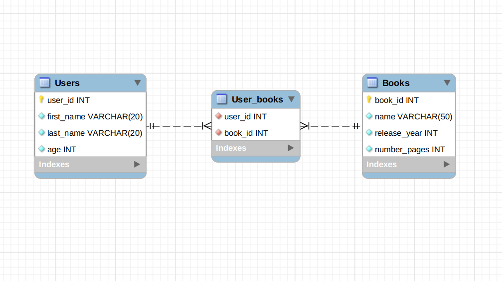

## Relacionamentos N:N

Nos relacionamentos N:N, existem algumas diferenças significativas ao se criar as associações. Esse tipo de relacionamento pode ser visto também como dois relacionamentos um para muitos (1:N) ligados por uma tabela intermediária, chamada de tabela de junção , ela guarda as informações de como as tabelas se relacionam entre si.

O diagrama abaixo será usado como exemplo:

Esse banco possui 3 tabelas: Users , Books e UserBooks . A tabela UserBooks possui um relacionamento N:N com as demais tabelas. Desta maneira, podemos inferir que:

  A tabela Users guarda as informações de cada usuário.

  A tabela Books guarda as informações de cada livro.
  
  A tabela UserBooks irá agir como uma tabela de junção , guardando a relação de quais pessoas usuárias possuem quais livros. Nessa tabela uma pessoa usuária pode possuir vários livros, enquanto um livro pode pertencer a várias pessoas usuárias. Assim cadastramos o livro uma única vez na tabela Books , assim como a pessoa usuária na tabela Users , e este livro vai poder ser associado de forma livre a várias pessoas usuárias, assim como uma única pessoa usuária poderá ser associado a vários livros, graças a essa tabela.

Como criamos uma associação que passa por 3 tabelas?

Primeiro, vamos criar o model de Users :

// models/User.js
module.exports = (sequelize, DataTypes) => {
  const User = sequelize.define('User', {
    userId: { type: DataTypes.INTEGER, primaryKey: true },
    firstName: DataTypes.STRING,
    lastName: DataTypes.STRING,
    age: DataTypes.INTEGER,
  },
  {
    timestamps: false,
    tableName: 'Users',
    underscored: true,
  });

  return User;
};

Agora vamos ao model de Books :

// models/Book.js
module.exports = (sequelize, DataTypes) => {
  const Book = sequelize.define('Book', {
    bookId: { type: DataTypes.INTEGER, primaryKey: true },
    name: DataTypes.STRING,
    releaseYear: DataTypes.INTEGER,
    numberPages: DataTypes.INTEGER,
  },
  {
    timestamps: false,
    tableName: 'Books',
    underscored: true,
  });

  return Book;
};

Certo, nada demais até o momento.
Vamos agora criar o model de UserBooks :

// models/UserBook.js
module.exports = (sequelize, _DataTypes) => {
  const UserBook = sequelize.define('UserBook',
    {},
    { timestamps: false },
  );

  UserBook.associate = (models) => {
    models.Book.belongsToMany(models.User, {
      as: 'users',
      through: UserBook,
      foreignKey: 'book_id',
      otherKey: 'user_id',
    });
    models.User.belongsToMany(models.Book, {
      as: 'books',
      through: UserBook,
      foreignKey: 'user_id',
      otherKey: 'book_id',
    });
  };

  return UserBook;
};

Primeiro de tudo, note que não temos nenhum atributo nesse model. Isso é possível porque quando estabelecemos os relacionamentos usando UserBooks como tabela de associação, o Sequelize já entende que esse model precisa ter os IDs das duas tabelas sendo associadas.

Depois, temos um novo tipo de relacionamento: o belongsToMany . Esse relacionamento cria um relacionamento do tipo N:N, utilizando o model especificado na opção through como tabela de associação. Temos também o alias daquela associação, na chave as e, por último, temos os parâmetros foreignKey e otherKey . Esses dois parâmetros dizem ao Sequelize qual campo utilizar na tabela de associação para identificar cada uma das entidades.

  Lembre-se: foreignKey sempre se refere ao model em que chamamos belongsToMany , enquanto otherKey se refere ao model com o qual estamos criando a associação.

Para testar a aplicação, você deve fazer as devidas alterações nos controllers , criar as migrations e os seeders .

Para criar as migrations, utilize os seguintes comandos:

npx sequelize migration:generate --name create-books
npx sequelize migration:generate --name create-users
npx sequelize migration:generate --name create-user-books

E copie o conteúdo abaixo para seus respectivos arquivos de migration, create-books , create-users e create-user-books :

// cole esse código dentro do arquivo da migration "books"

module.exports = {
  up: async (queryInterface, Sequelize) => {
    await queryInterface.createTable('Books', {
      bookId: {
        allowNull: false,
        autoIncrement: true,
        primaryKey: true,
        type: Sequelize.INTEGER,
        field: 'book_id',
      },
      name: {
        allowNull: false,
        type: Sequelize.STRING,
      },
      releaseYear: {
        allowNull: false,
        type: Sequelize.INTEGER,
        field: 'release_year',
      },
      numberPages: {
        allowNull: false,
        type: Sequelize.INTEGER,
        field: 'number_pages',
      },
    });
  },

  down: async (queryInterface, _Sequelize) => {
    await queryInterface.dropTable('Books');
  },
};

Cole esse código dentro do arquivo da migration "users"

// cole esse código dentro do arquivo da migration "users"

module.exports = {
  up: async (queryInterface, Sequelize) => {
    await queryInterface.createTable('Users', {
      userId: {
        allowNull: false,
        autoIncrement: true,
        primaryKey: true,
        type: Sequelize.INTEGER,
        field: 'user_id',
      },
      firstName: {
        allowNull: false,
        type: Sequelize.STRING,
        field: 'first_name',
      },
      lastName: {
        allowNull: false,
        type: Sequelize.STRING,
        field: 'last_name',
      },
      age: {
        allowNull: false,
        type: Sequelize.INTEGER,
      },
    });
  },

  down: async (queryInterface, _Sequelize) => {
    await queryInterface.dropTable('Users');
  },
};

// cole esse código dentro do arquivo da migration "user-books"

module.exports = {
  up: async (queryInterface, Sequelize) => {
    await queryInterface.createTable('UserBooks', {
      userId: {
        type: Sequelize.INTEGER,
        field: 'user_id',
        references: {
          model: 'Users',
          key: 'user_id',
        },
        onUpdate: 'CASCADE',
        onDelete: 'CASCADE',
        primaryKey: true,
      },
      bookId: {
        type: Sequelize.INTEGER,
        field: 'book_id',
        references: {
          model: 'Books',
          key: 'book_id',
        },
        onUpdate: 'CASCADE',
        onDelete: 'CASCADE',
        primaryKey: true,
      },
    });
  },

  down: async (queryInterface, _Sequelize) => {
    await queryInterface.dropTable('UserBooks');
  },
};

Depois disso, teremos que criar as seeds com informações para podermos enfim, testar nossa nova association:

**npx sequelize seed:generate --name books**
**npx sequelize seed:generate --name users**
**npx sequelize seed:generate --name user-books**

Copie os códigos abaixo para seus respectivos arquivos dentro da pasta seeders :

// cole esse código dentro do arquivo da seed "books"

module.exports = {
  up: async (queryInterface, Sequelize) => {
    return queryInterface.bulkInsert('Books',
      [
        { name: 'Livro A', release_year: 2020, number_pages: 111 },
        { name: 'Livro B', release_year: 2019, number_pages: 222 },
        { name: 'Livro C', release_year: 2018, number_pages: 333 },
        { name: 'Livro D', release_year: 2017, number_pages: 444 },
      ],
      {},
    );
  },

  down: async (queryInterface, _Sequelize) => {
    await queryInterface.bulkDelete('Books', null, {});
  },
};

// cole esse código dentro do arquivo da seed "users"

module.exports = {
  up: async (queryInterface, _Sequelize) => {
    return queryInterface.bulkInsert('Users',
      [
        {
          first_name: 'Bárbara',
          last_name: 'Silva',
          age: 16,
        },
        {
          first_name: 'Carlos',
          last_name: 'Santos',
          age: 24,
        },
        {
          first_name: 'Danilo',
          last_name: 'Henrique',
          age: 32,
        },
      ],
      {},
    );
  },

  down: async (queryInterface, _Sequelize) => {
    await queryInterface.bulkDelete('Users', null, {});
  },
};

// cole esse código dentro do arquivo da seed "user-books"

module.exports = {
  up: async (queryInterface, _Sequelize) => {
    return queryInterface.bulkInsert('UserBooks',
      [
        { user_id: 1, book_id: 1 },
        { user_id: 1, book_id: 3 },
        { user_id: 2, book_id: 1 },
        { user_id: 2, book_id: 2 },
        { user_id: 3, book_id: 1 },
        { user_id: 3, book_id: 2 },
        { user_id: 3, book_id: 3 },
      ],
      {},
    );
  },

  down: async (queryInterface, _Sequelize) => {
    await queryInterface.bulkDelete('UserBooks', null, {});
  },
};

Depois, utilize o comando abaixo para executar as migrations e as seeds:

**npx sequelize db:migrate**
**npx sequelize db:seed:all**

Para fazer a requisição, bastaria acrescentar ao index.js as seguintes linhas:

const { Book, User } = require('./models');
// ...
app.get('/usersbooks/:id', async (req, res) => {
  try {
    const { id } = req.params;
    const user = await User.findOne({
      where: { userId: id },
      include: [{ model: Book, as: 'books', through: { attributes: [] } }],
    });

    if (!user)
      return res.status(404).json({ message: 'Usuário não encontrado' });

    return res.status(200).json(user);
  } catch (e) {
    console.log(e.message);
    res.status(500).json({ message: 'Algo deu errado' });
  };
});
// ...

Agora, faça uma requisição do tipo GET para o endpoint localhost:3000/usersbooks/1 e verifique a resposta para o usuário.

Nota: a propriedade through: { attributes: [] } deve estar presente, pois sem ela, em cada book , apareceriam todos seus respectivos users . Tente fazê-lo sem e veja a diferença no resultado!
