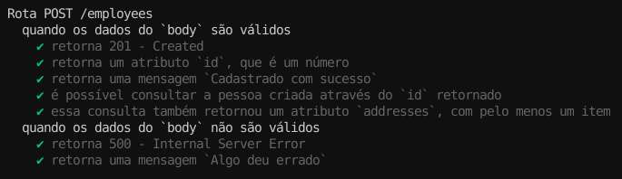

## Bônus: Testes

⚠️ Esta é uma parte extra do conteúdo, ou seja, não é necessário compreender o que esta aqui para prosseguir com os exercícios e aula ao vivo do dia.

Para não deixar de praticar, vamos testar nossa transação! É importante acentuar que, em um contexto onde não pretendemos testar isoladamente nossas camadas , ou seja, já testamos nossos models , controllers e services , então nos resta trabalhar em cima de testes de integração , aqui especificamente, pensando o contrato da requisição .

Antes de começar a realizar os testes, vamos instalar nossas dependências de desenvolvimento como nas aulas anteriores:

**npm i mocha chai chai-http sinon -D**

Vamos alterar a linha abaixo em nosso package.json para executar nossos testes com o comando npm test como nas aulas anteriores, só que nesse caso, passando uma variável de ambiente, que já explicaremos adiante:

"scripts": {
  ...
  "test": "NODE_ENV=test mocha ./tests/**/*$NAME*.test.js --exit"
},

E mais uma coisa, no index.js , faça uma alteração na linha de escolha da configuração do Sequelize e adicione a informação do id do employee criado ao retorno da requisição POST para /employees , como no exemplo (Independente de estar usando Unmanaged transactions ou Managed transactions ) :

// index.js

// ...

/*
  Essa linha será importante para que consigamos isolar nosso teste
  utilizando a configuração `test` do seu `config.{js | json}`
*/
const sequelize = new Sequelize(
  process.env.NODE_ENV === 'test' ? config.test : config.development
);

// ...

// app.post('/employees', async (req, res) => {
//   const t = await sequelize.transaction();

//   try {
//     const { firstName, lastName, age, city, street, number } = req.body;

//     const employee = await Employee.create(
//       { firstName, lastName, age },
//       { transaction: t },
//     );

//     await Address.create(
//       { city, street, number, employeeId: employee.id },
//       { transaction: t }
//     );

//     await t.commit();

    return res.status(201).json({
      id: employee.id, // esse dado será nossa referência para validar a transação
      message: 'Cadastrado com sucesso'
    });

//   } catch (e) {
//     await t.rollback();
//     console.log(e.message);
//     res.status(500).json({ message: 'Algo deu errado' });
//   }
// });

// ...

// module.exports = app;

Note, que uma vez que estaremos fazendo um teste de integração que pressupõe um comportamento no banco de dados através do consumo da API (ou seja, um teste que, após o consumo da API, espera um resultado que pode ser validado através da leitura do banco de dados via própria API), precisamos isolar uma banco de dados no mesmo modelo do anterior. Esse banco não deve gerar prejuízo ao seu ambiente de desenvolvimento e tampouco para seu ambiente de produção.

Caso você ainda não tenha configurado um, é só alterar o campo test.database do seu arquivo config.{js | json} , complementando os demais dados, caso não estejam preenchidos:

// ./config/config.js

module.exports = {
// ...
  "test": {
    "username": "root",
    "password": "", // preencha com a senha do seu banco de dados, caso tenha
    "database": "orm_assoc_test_db",
    "host": "127.0.0.1",
    "dialect": "mysql",
    // adicione essa linha a sua configuração para omitir mensagens de log no orm
    "logging": false
  }
// ...
}
Para inicializar o banco de teste, rode os seguintes comandos, passando a variável de ambiente que deseja usar (no nosso caso, NODE_ENV=test ):

NODE_ENV=test npx sequelize-cli db:create
NODE_ENV=test npx sequelize-cli db:migrate
NODE_ENV=test npx sequelize-cli db:seed:all
Caso queira remover o banco para começar novamente, utilize: NODE_ENV=test npx sequelize-cli db:drop .
Agora, crie uma pasta ./tests/integration onde testaremos a criação de Employees , por tanto crie um arquivo employeeCreation.test.js . No nosso teste, pensando o exemplo que acabamos de ver, vamos assumir o seguinte teste de mesa :

### Testando a rota POST /employees

- Acessarei meu `rest-client` favorito (PostMan, Insomnia, HTTPie, etc...)
  - Para um caso de sucesso:
    - Farei uma requisição `POST` com os dados corretos para meu
      end-point `/employee`;
    - Aguardo uma resposta com status `201 - Created`;
    - Essa resposta deve conter também um atributo `id`, no corpo;
    - Essa resposta deve conter também um atributo `message`,
      no corpo, com a mensagem `Cadastrado com sucesso`;
    - Farei uma requisição `GET` utilizando esse `id` para meu
      end-point `/employee/:id`;
    - Aguardo uma resposta com status `200 - OK`;
    - Essa resposta deve conter também um atributo `addresses`,
      no corpo, com pelo menos um item.
  - Para um caso de falha:
    - Farei uma requisição `POST` com os dados incorretos para meu
      end-point `/employee`;
    - Aguardo uma resposta com status `500 - Internal Server Error`;
    - Essa resposta deve conter também um atributo `message`,
      no corpo, com a mensagem `Algo deu errado`;
      
Dessa forma, podemos criar o seguinte teste:

// ./tests/integration/employeeCreation.test.js

const chai = require('chai');
const { stub } = require('sinon');
const chaiHttp = require('chai-http');

chai.use(chaiHttp);

const { expect } = chai;

const app = require('../../index');

// omitir os `console.log`s dos testes gerando um `stub` pra função
const consoleLogStub = stub(console, 'log');
before(()=> consoleLogStub.returns(true));
after(()=> consoleLogStub.restore());

describe('Rota POST /employees', () => {
  describe('quando os dados do `body` são válidos', () => {
    let postEmployee;
    let getEmployee;

    before(async () => {
      try {
        postEmployee = await chai.request(app)
          .post('/employees')
          .send({
            firstName: "Rodrigo",
            lastName: "Oliveira",
            age: 30,
            city: "TrybeCity",
            street: "Rua Teste",
            number: 42
          });

        const { body : { id } } = postEmployee;

        getEmployee = await chai.request(app)
          .get(`/employees/${id}`);
      } catch (error) {
        console.error(error.message);
      }
    });

    it('retorna 201 - Created', async () => {
      const { status } = postEmployee;

      expect(status).to.be.equals(201);
    });

    it('retorna um atributo `id`, que é um número', async () => {
      const { body: { id } } = postEmployee;

      expect(typeof id).to.be.equals("number");
    });

    it('retorna uma mensagem `Cadastrado com sucesso`', async () => {
      const { body: { message } } = postEmployee;

      expect(message).to.be.equals('Cadastrado com sucesso');
    });

    it('é possível consultar a pessoa criada através do `id` retornado', async () => {
      const { body: { id: postId } } = postEmployee;
      const { body: { id: getId } } = getEmployee;

      expect(postId).to.be.equals(getId);
    });

    it('essa consulta também retornou um atributo `addresses`, com pelo menos um item', async () => {
      const { body: { addresses } } = getEmployee;

      expect(addresses.length).to.be.greaterThanOrEqual(1);
    });
  });

  describe('quando os dados do `body` não são válidos', () => {
    let postEmployee;

    before(async () => {
      try{
        // removendo city
        postEmployee = await chai.request(app)
          .post('/employees')
          .send({
            firstName: "Rodrigo",
            lastName: "Oliveira",
            age: 30,
            street: "Rua Teste",
            number: 42
          });
      } catch (error) {
        console.error(error.message);
      }
    });

    it('retorna 500 - Internal Server Error', async () => {
      const { status } = postEmployee;

      expect(status).to.be.equals(500);
    });

    it('retorna uma mensagem `Algo deu errado`', async () => {
      const { body: { message } } = postEmployee;

      expect(message).to.be.equals('Algo deu errado');
    });
  });
});
Para testar, utilize npm test . Não se esqueça que a API não deve estar rodando no momento do test (o próprio chai-http , subirá sua api).
Se tudo correr bem, seus testes devem passar sem problemas!

