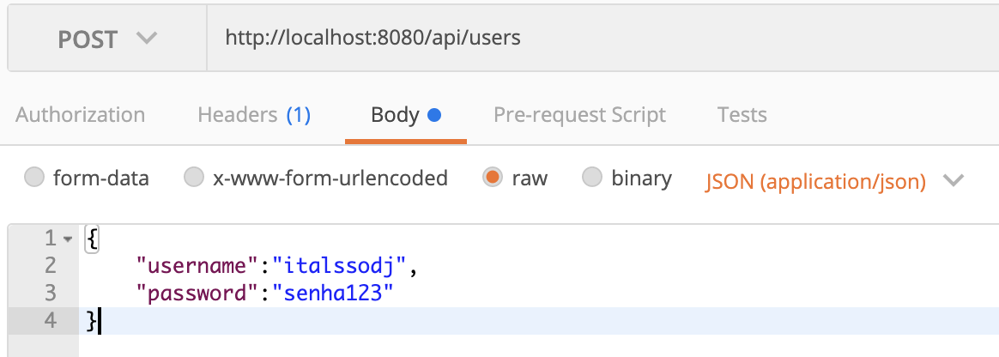
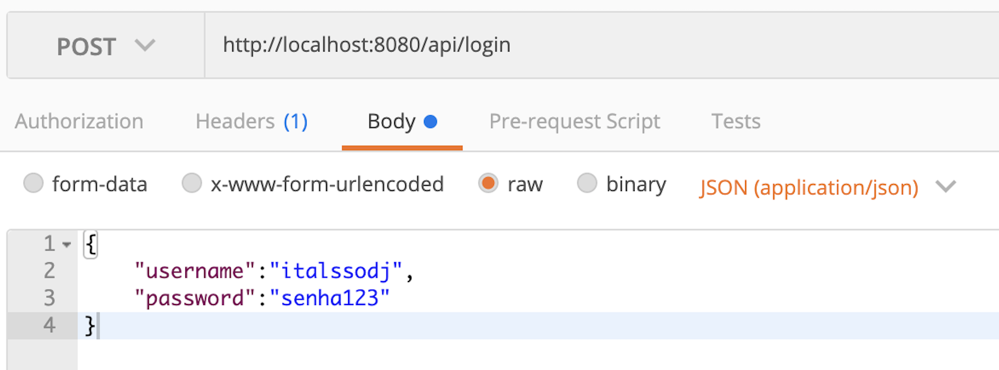

## Show me the code!

Chegou a hora tão esperada. Vamos colocar a mão na massa!

Nesse exemplo, vamos trabalhar com as seguintes tecnologias:

Nodejs;
Express;
Postman;
Sequelize;
MySQL;
JWT.

Para começar, vamos usar um projeto base. Esse projeto é, basicamente, uma API Express sem autenticação JWT. Neste link https://github.com/tryber/nodejs-jwt-base-project , você pode encontrar o código e as instruções para baixá-lo e executá-lo, além de uma explicação de como o projeto base funciona.

**Nota 1 :** Após clonar o projeto, não se esqueça de criar um arquivo .env baseado no arquivo .env.example para fazer a conexão com o seu banco de dados SQL. Esse arquivo deve conter as credenciais do seu banco de dados local.

**Nota 2 :** Após criar o arquivo .env , utilize o comando npm start , que deve, automaticamente, rodar um script auxiliar ( prestart ), para executar os comandos do Sequelize, criando o banco de dados e povoando as tabelas Users e Posts .

### **Testando nossa API**

Imagine que esse é um serviço real que você usará em produção. Tenha isso mente, pois, nesses testes, vamos pegar alguns problemas que o JWT nos ajudará a resolver!

Para testar nossa aplicação, vamos usar o Postman , um serviço fácil e simples para fazer requisições HTTP.

Caso você ainda não tenha usado o Postman, assista a este vídeo que explica o funcionamento dessa ferramenta:

http://httpbin.org/ip - retorna o numero de ip;

Aprendido o uso do Postman, vamos ao trabalho!
Para começar a usar a nossa plataforma, precisamos criar um usuário. Para isso, faremos uma requisição POST para o endpoint /api/users , passando um nome de usuário e senha:

Após enviar essa requisição, obtemos a seguinte resposta:

{
  "message": "Novo usuário criado com sucesso",
  "user": "italssodj"
}

Até aí, tudo certo. Não precisamos de autenticação para criar um usuário, mas, para consultar as nossas postagens no blog, precisamos sim! Então, vamos fazer o login. Para isso, fazemos uma requisição POST para o endpoint /api/login , passando o nome de usuário e senha usados no cadastro:

Após enviar essa requisição, recebemos a seguinte resposta:

{
  "message": "Login efetuado com sucesso"
}

Legal, estamos logados. Agora já podemos pegar as postagens do nosso blog! Fazemos uma requisição GET para o endpoint /api/posts/ :

E recebemos os posts como resposta:

{
    "mockPosts": [
        {
            "title": "título fake",
            "content": "conteúdo conteúdo conteúdo conteúdo conteúdo"
        },
        {
            "title": "título fake",
            "content": "conteúdo conteúdo conteúdo conteúdo conteúdo"
        },
        {
            "title": "título fake",
            "content": "conteúdo conteúdo conteúdo conteúdo conteúdo"
        },
        {
            "title": "título fake",
            "content": "conteúdo conteúdo conteúdo conteúdo conteúdo"
        }
    ]
}

Agora, note uma coisa: quando formos utilizar a API com nosso front-end, como é que sabemos que estamos autenticados? Podemos fazer essa verificação no front-end e, caso a requisição de login retorne "sucesso", fazemos uma requisição para obter os posts. Mas e se alguém inspecionar as requisições do browser e descobrir o endpoint /api/post ? Essa pessoa vai poder acessar dados que não deveria. Além disso, se o browser for fechado, terá que logar novamente toda vez que precisar usar a API? E se for um sistema de banco, em que só se pode ficar online por um determinado tempo, como saberemos que a sessão expirou? No back-end, ao chegar uma requisição para /api/posts , como fazemos para retornar somente os posts de quem requisitou? Se o acesso for a um recurso que requer um nível de autorização mais elevado, como fazemos para saber se a pessoa é, por exemplo, um admin?

São MUITAS dúvidas, mas calma. É aí que o JWT entra. Agora vamos alterar um pouco nossa API para adicionar autenticação via JWT. No final, vamos poder saber se a pessoa usuária está de fato autenticada, quem essa pessoa é e definir um tempo de sessão para ela. Caso essa pessoa esteja autenticada e um JWT válido seja apresentado no header Authorization, ela será autorizada a acessar diversas rotas dentro da aplicação, de acordo com suas credenciais, sem a necessidade de uma nova autenticação a cada requisição.

