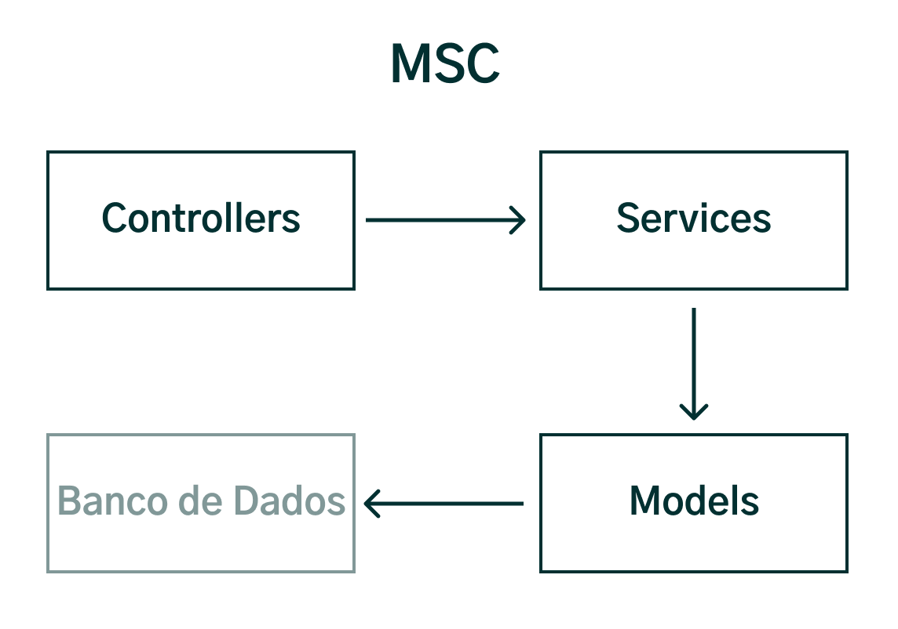
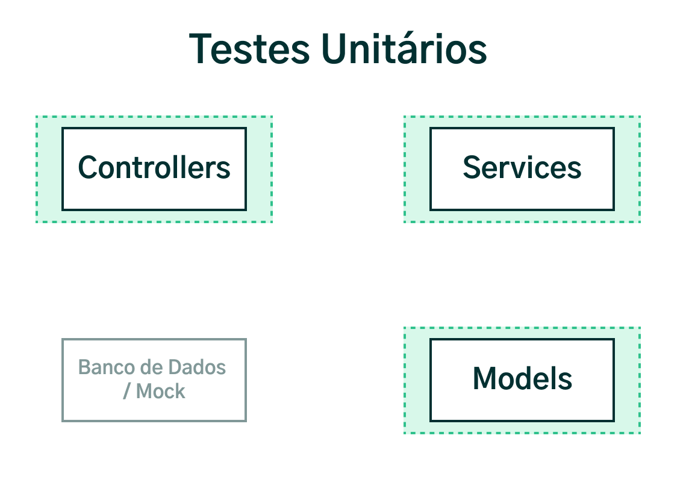
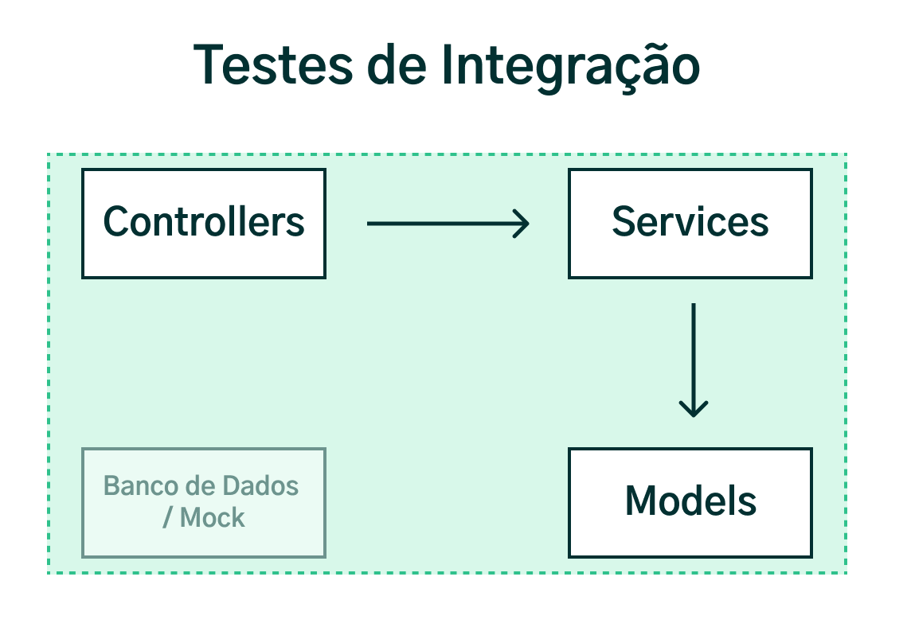

## Testes de Integração (Integration Tests)

Com testes unitários, podemos testar cada unidade do nosso código de maneira individual. Por exemplo, ao utilizarmos o padrão MSC podemos definir cada camada como sendo uma unidade:

Dessa forma, podemos testar cada camada, ou seja, cada unidade de maneira separada, isolando uma parte da outra e escrevendo testes individuais para cada uma:

Seguindo nosso aprendizado sobre tipos de testes, aprenderemos como aplicar testes de integração .

Os testes de integração, ou integration tests , servem para verificar se a comunicação entre os componentes de um sistema estão ocorrendo conforme o esperado.

Diferente dos testes unitários, onde isolamos cada unidade como fizemos com cada camada do MSC, nos testes de integração o comportamento deverá ser testado com a integração entre todas as unidades.

Ambos os tipos de testes são importantes, porém, cada um tem um objetivo diferente.

Da mesma forma como definir uma unidade é subjetivo, não existe um nível de granularidade específico de integração para ser testada, sendo possível adaptar esse conceito de acordo com os objetivos desejados.

Nossa integração partirá do recebimento do objeto da requisição ( request ), seguindo com o controlador ( controller ), o serviço ( service ) e terminando no modelo ( model ). Iremos apenas isolar a comunicação do model com o Banco de dados para evitarmos operações de IO. Podemos representar isso da seguinte maneira:

