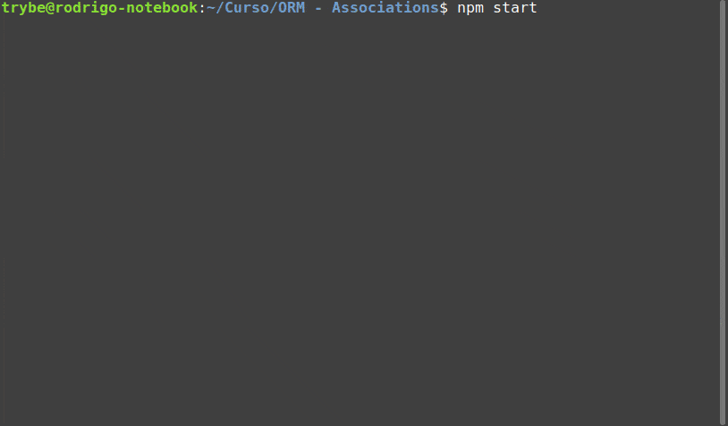

## Utilizando um Mock para o Sequelize

Como dito anteriormente, é natural que em testes de integração, evitemos ao máximo operações de IO. Então, para o nosso contexto, existem três caminhos que podemos adotar:

**Utilizar um banco temporário para realização de testes**

Nesse caso, poderíamos gerar um banco de dados qualquer (por exemplo, seu-bd-test ), onde faríamos operações de IO, mas que não afetariam seu banco de dados principal.

Inclusive, quando inicializamos o Sequelize pela primeira vez (na criação da estrutura) , por padrão, ele já prevê sua utilização em ambientes diferentes, conforme seu arquivo de configuração inicial:
  ./config/config.json

{
  "development": {
    "username": "root",
    "password": null,
    "database": "database_development",
    "host": "127.0.0.1",
    "dialect": "mysql"
  },
  "test": {
    "username": "root",
    "password": null,
    "database": "database_test",
    "host": "127.0.0.1",
    "dialect": "mysql"
  },
  "production": {
    "username": "root",
    "password": null,
    "database": "database_production",
    "host": "127.0.0.1",
    "dialect": "mysql"
  }
}

Cada um destes ambientes pode ser acessado quando rodamos nossa aplicação (ou os comandos do Sequelize) com uma variável de ambiente chamada NODE_ENV .

Por padrão, se não definirmos essa variável, o sequelize irá entender que o ambiente escolhido é o de desenvolvimento ( development ).

⚠️ O grande problema desse método, é que ele depende que você tenha a disponibilidade de um servidor MySQL funcionando (seja ele remoto ou não), e isso se torna um grande impeditivo quando queremos fazer testes que validem somente a API, sem depender de um banco de dados.

Nesse caso, seu script de teste também terá sempre que fazer o trabalho de resetar o banco de dados para garantir que o ambiente está limpo para uso.

## Utilizar bibliotecas específicas para testes

Com o Sequelize, podemos usar uma biblioteca chamada Sequelize Test Helpers https://www.npmjs.com/package/sequelize-test-helpers?activeTab=readme , que possui recursos avançados que podem te ajudar a criar mocks de modelos.
Como objetivo aqui é focar no teste e não na biblioteca, trabalharemos no terceiro cenário, que será mais simples para nosso contexto.

## Gerar stubs simples direcionando para funções falsas

Nesse cenário, produzimos de maneira mais ou menos hardcoded , aquilo que esperamos da consulta de um modelo do Sequelize , ou seja, dizemos para o Sinon , que uma certa consulta no modelo X deve, obrigatoriamente, retornar um resultado Y .

Dessa forma, podemos retornar valores estáticos ou podemos criar scripts que "simulem" o comportamento do Sequelize no nosso contexto de teste.

Para isso, vamos criar uma pasta /mock/models , dentro da pasta tests , onde armazenaremos nosso "Modelo Fake" . Dentro dessa pasta, crie os seguintes arquivos:

Nosso "banco de dados" de Users :
  ./tests/mock/models/Users.json

[
  {
    "id": 1,
    "username": "Saul Reixas",
    "password": "tocasaul"
  },
  {
    "id": 2,
    "username": "Kássia Lemmer",
    "password": "kelimmar"
  }
]

E nosso "gerenciador de modelos" em um index.js (mais ou menos como no Sequelize)

⚠️ Não se preocupe em entender a lógica das funções do Mock, basta entender que ele retorna de forma mais ou menos estática, os dados que esperamos que uma consulta em um modelo verdadeiro faria.

Em outras palavras, aqui estamos dizendo que um objeto User , por exemplo, tem um método assíncrono findAll , que retorna nosso conjunto de pessoas usuárias fake.
  
  ./tests/mock/models/index.js

const Users = require('./Users.json');

const mockCreate = (Instance, data) => {
  if(!data){
    return;
  }

  const newData = data;
  if(!!Instance[0].id) {
    newData.id = Date.now();
  }
  Instance.push(newData);
  return newData;
};

const User = {
  create: async (data) => mockCreate(Users, data),
  findAll: async () => Users,
};

module.exports = {
  User,
};

Dessa forma, podemos usar isso para interceptar a função verdadeira do Sequelize, substituindo pela nossa.
Após isso podemos começar a escrever nossos testes!
