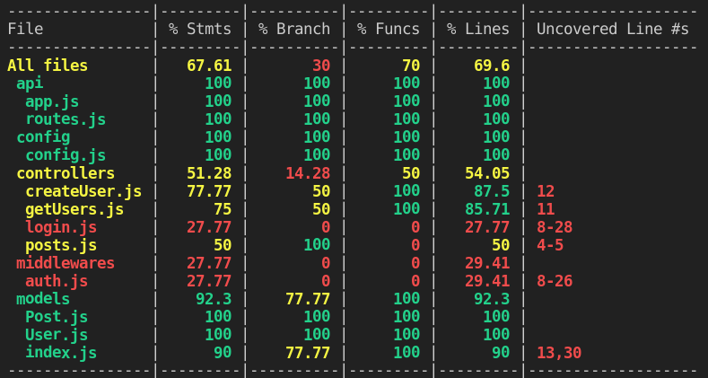

## Cobertura de testes

Uma forma de acompanhar o quão bem estamos conseguindo exercitar testes o nosso sistema pode ser feita através de relatórios de cobertura .

Boa parte das suites de teste das linguagens de programação possui uma forma de gerar um relatório desse tipo, no caso do Node.js , conseguimos gerar esses relatórios no mocha , utilizando uma ferramenta chamada nyc https://github.com/istanbuljs/nyc .

Esses relatórios checam, se para um escopo de arquivos definidos (aqui podemos pensar o conteúdo da nossa aplicação, excluindo bibliotecas e arquivos de configuração), os seus testes são capazes de rodar todas as linhas dos arquivos relacionados , o que gera uma porcentagem total de cobertura para aquele escopo.

## Critérios relevantes

De forma geral (também para outras linguagens de programação), suites de testes geram relatórios de cobertura segundo alguns critérios básicos https://en.wikipedia.org/wiki/Code_coverage#Basic_coverage_criteria , os mais relevantes para nosso contexto são:

**Cobertura de Funções / Function Coverage :** Cada função/sub-rotina do script foi acionado/chamado?

**Cobertura de Afirmações / Statement Coverage :** Cada afirmação/definição/comando do script foi executado?

**Cobertura de Ramificações / Branch Coverage :** Cada situação de ramificação do código (aqui podemos assumir um script condicional, como um if { /*situação A*/ } else { /*situação B*/ } ) foi executada?

No nosso contexto, o nyc vai utilizar relatórios do Instanbul https://istanbul.js.org/ .

Exemplo: Imagine que temos uma pequena API express , que trata textos que são mandados no corpo da requisição, e que em cada requisição ele loga esses eventos ( concat - concatena, invert - inverte textos e logger pra logar).

Agora, imagine que nesse contexto, nós tenhamos feito testes de integração que contemplem mais a parte de concatenação do que a parte de inversão da API.

Um relatório gerado a partir desses testes, deve retornar uma tabela semelhante a essa:

**File (Arquivo):** Retorna a estrutura do escopo analisado, cada linha é referente a pasta ou arquivo específico, no nosso caso, a cobertura esta analisando todos arquivos *.js contidos em ./src , que fica na raiz do projeto;

**Stmts (Statements/Afirmações):** Retorna os percentuais da cobertura de afirmações executadas que citamos anteriormente, no nosso caso, é possível assumir que o arquivo middlewares/invert.middleware.js não executou todas as suas definições/afirmações . Note ainda, que em Uncovered Line #s (Linhas não-cobertas) , o relatório identifica quais as linhas do arquivo não foram executadas, no nosso caso, as linhas de 4 a 6 não foram executadas em nenhum momento quando esse arquivo foi referenciado nos nossos testes (via require() , ou via parâmetro de configuração, o que veremos mais a frente);

**Branch (Ramo):** Retorna o percentual de situações de ramificação cobertos . Se observarmos no arquivo logger.js , existe um percentual de 50% de situações não-cobertas (ou seja, situações que não foram testadas em nenhum momento), o relatório ainda aponta a linha 13 como a linha não-coberta, aqui podemos assumir que essa linha faz parte do resultado de um script condicional (como um if{}else ). Se no arquivo não houverem situações de ramificação, o retorno é 100% .

Detalhe , o relatório vai considerar uma branch , mesmo que não haja nenhuma situação de else para ela, ex:

./src/middlewares/logger.js

const debug = true;

module.exports = (req, res, next) => {
  if(debug){
    res.on('finish', () => {
      console.log({
        method: req.method,
        endPoint: req.originalUrl,
        status: res.statusCode
      })
    });
  }
  /*
    No caso desse `if`, não existe cobertura pra uma situação onde `debug`
    é falso, então, ainda que um teste cubra 100% desse código, o retorno
    em `% Branch` para esse arquivo, será 50%;
  */

  next();
}

**Funcs (Functions/Funções):** Retorna o percentual de funções executadas nos arquivos. Em middlewares/invert.middleware.js e server.js , podemos assumir que nenhuma das funções desses arquivos foi executada nos nossos testes. Em server.js , ainda, é possível identificar que o arquivo não foi nem mesmo referenciado nos testes, já que nenhuma definição do mesmo foi executada (Coluna % Stmts );

**Lines (Linhas):** Retorna o percentual de linhas executadas nos arquivos, no caso de All files , esse valor representa o total de cobertura da sua suite de testes , que no nosso caso representa 81,08% de cobertura total, dado os problemas apresentados.

## Como gerar uma cobertura de testes no meu ambiente?

Como visto acima, no nyc , é possível gerar um relatório de cobertura padrão. E a depender da forma da utilização dessa ferramenta, é possível ainda trazer relatórios em diferentes formatos https://istanbul.js.org/docs/advanced/alternative-reporters/ (como em html , por exemplo).

A princípio, vamos passar pelos comandos básicos para execução e a descrição de cada um, após isso, passaremos pela API de exemplo que utilizamos hoje, gerando um relatório de cobertura utilizando o nyc :

### Comando básico

No mocha , antes, temos que instalar a biblioteca nyc (que é a cli - interface de linha de comando, do Instanbul ) :

**npm i -D nyc**

Após isso, a utilização também é bastante simples, utilizaremos o nyc , passando como parâmetro o comando que utilizaremos para os testes em mocha , exemplo: nyc mocha ./tests --recursive . Dessa forma, conseguimos fazer uma configuração de um script próprio para gerar esse relatório, que rodamos com npm run test:coverage .:

...
"scripts": {
    ...
    "test": "mocha ./tests --recursive",
    "test:coverage": "nyc npm test",
    ...
},
...

## Personalizando o escopo de cobertura

Por padrão, os reporters vão fazer a cobertura dos arquivos que são referenciados nos seus testes.

Para trazer a porcentagem de cobertura dentro de um escopo fixo no nyc , você pode tratar de duas formas:

Utilizando um arquivo de configuração https://github.com/istanbuljs/nyc#configuration-files nyc.config.js na raiz do projeto. Esse arquivo pode receber uma propriedade include https://github.com/istanbuljs/nyc#common-configuration-options , contendo o padrão a ser respeitado;

Utilizando o mesmo comando, via cli: --include , da seguinte forma:

...
"scripts": {
    ...
    "test": "mocha ./tests --recursive",
    "test:coverage": "nyc --include='src/**/*.js' npm run test",
    ...
},
...

É possível ainda, via cli, utilizar o parâmetro --all para coletar a cobertura de todos os arquivos (mesmo os que não tem referência nos testes).

⚠️ Notem aqui, que estamos colocando o código fonte que deve ser coberto (no nosso contexto, seriam /api , /config , /controllers , /migrations , /models e /seeders ) dentro de uma pasta ./src na raiz , para que não seja necessário criar uma lista de exclusão de cobertura (para pasta node_modules ou a própria pasta tests , por exemplo), nesse sentido, também é importante manter a pasta tests na raiz;

Pelo mesmo motivo, é importante aqui o uso do arquivo .sequelizerc , que é utilizado para mudar os caminhos padrão das pastas do Sequelize . Para isso, crie um arquivo .sequelizerc na raiz do projeto, e adicione o seguinte conteúdo:

./.sequelizerc

const path = require('path');

module.exports = {
  'config': path.resolve('src', 'config', 'config.json'),
  'models-path': path.resolve('src', 'models'),
  'seeders-path': path.resolve('src', 'seeders'),
  'migrations-path': path.resolve('src', 'migrations'),
};

Após isso, não se esqueça de ajustar os caminhos de referência, tanto no seu package.json (script start ), quanto na pasta ./tests para se adequar aos novos caminhos.

## Rodando um teste de cobertura no projeto atual

Seguindo os passos anteriores, basta adicionar um script no nosso package.json contendo o escopo de cobertura:

...
"scripts": {
    ...
    "test": "mocha ./tests/**/*$NAME*.test.js --exit",
    "test:coverage": "nyc --include='src/**/*.js' npm run test",
    ...
},
...

Após isso, basta rodar o comando npm run test:coverage ;

Pronto! Agora já é possível identificar quais pontos ainda precisam de uma cobertura de testes apropriada no seu projeto!
