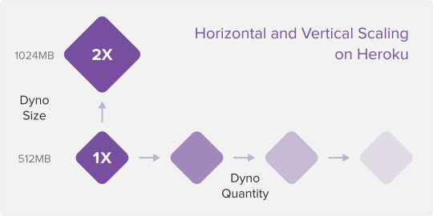

## Introdução ao Heroku

Para nosso primeiro deploy , vamos utilizar o Heroku . O Heroku é um PaaS (Platform as a Service), o que significa que ele provém de uma plataforma em nuvem para configurarmos e realizarmos nosso deploy de maneira simples e fácil.

O Heroku executa e gerencia aplicações escritas em Node.js , Ruby , Java , Python , Clojure , Scala , Go e PHP . Por ser uma plataforma "poliglota", ele vai se comportar de maneira similar, independente da linguagem.

Para o Heroku, uma aplicação é um conjunto de códigos escritos em uma dessas linguagens citadas anteriormente, provavelmente utilizando um framework , com algumas dependências e descrições que indicam como rodá-la.

Um termo importante para ter na ponta da língua é build . No contexto de deploys , o build é como chamamos todo o processo em que o código é preparado para posteriormente ser executado. Por exemplo, é durante o build que se executa o npm install para instalar as dependências do projeto.

## Como funciona?

Para fazer um deploy com o Heroku , não é necessário realizar muitas alterações no projeto. O mais importante é o Heroku saber qual linguagem está sendo utilizada na sua aplicação e, caso esteja utilizando algum, qual o framework.

A partir dessas informações, o Heroku saberá, por exemplo, que é um projeto em Node.js e que, para executá-lo, ele terá que efetuar o comando descrito no campo scripts.start dentro do package.json (mais conhecido por npm start ).

Ou seja, pelo seu código, o Heroku vai saber qual linguagem e framework você está utilizando na sua aplicação e, a partir daí, saberá como executá-la.

## Variáveis de ambiente

Uma necessidade ao desenvolver aplicações, é alterar variáveis de ambiente dinamicamente para que o projeto se adapte independente do ambiente em que esteja executando, tornando o código imutável.

Veja o exemplo a seguir:

Ao executarmos nosso servidor com node e express , normalmente definimos uma constante chamada PORT e armazenamos dentro dela o número da porta, nesse caso 3000.

const express = require('express');

const app = express();
const PORT = 3000;

app.use('/', (_req, res) => res.send('<h1>Hello World</h1>'));

app.listen(PORT);

Porém quando o servidor é executado em nossa máquina, temos maior controle de quais portas estão disponíveis para serem utilizadas, o que não necessariamente acontece quando realizamos o deploy de uma aplicação. A própria plataforma onde está sendo realizado o deploy fica responsável por realizar o gerenciamento, mas nós, pessoas desenvolvedoras, precisamos garantir que, independente da porta em que o servidor for executado, o código precisa estar pronto para funcionar sem necessariamente ser alterado.

É aqui que entra a variável de ambiente, veja o exemplo a seguir:

Essas variáveis de ambiente são definidas em um arquivo nomeado de .env que fica na raiz da aplicação e pode ser lido pela biblioteca dotenv. A estrutura do arquivo segue o seguinte padrão:

var=valor
Onde:
<var> Define o nome da variável de ambiente.
<valor> É o que será atribuído à variável.

Segue um exemplo de um .env para um servidor web em Node.js :

PORT=3000

Consumindo a variável dentro do arquivo index.js

const express = require('express');
require('dotenv').config();

const app = express();
// adiciona leitura da variável de ambiente
const PORT = process.env.PORT || 3000;

app.use('/', (_req, res) => res.send('<h1>Hello World</h1>'));

app.listen(PORT);

Perceba que não definimos uma porta padrão diretamente em nosso código, mas sim processamos uma variável de ambiente previamente definida. Essas variáveis de ambiente são definidas em um arquivo nomeado de .env que fica na raiz da aplicação e pode ser lido pela biblioteca dotenv . Mas, se por acaso o servidor não encontrar essa variável em nosso arquivo .env ou até mesmo não encontrar o arquivo .env , o servidor recebe então a porta 3000 por conta do || ( or , OU lógico) na definição da variável.

Utilizamos também as variáveis de ambiente para armazenarmos chaves de API , chaves de token , configurações do banco dados, entre outros, ou seja, informações que são sensíveis e não devem estar hard coded em nossos scripts.
Veja como as variáveis de ambiente podem ser utilizadas:
Definição das variáveis

SECRET_KEY = M1NH@S3NH4

MYSQL_HOST = 127.0.0.1
MYSQL_PORT = 3606
MYSQL_USER = root
MYSQL_PASS = secretpass

Arquivo de conexão com o banco de dados MySQL

async function connect() {
  const { MYSQL_HOST, MYSQL_PORT, MYSQL_USER, MYSQL_PASS } = process.env;

  const connection = await mysql.createConnection(
    `mysql://${MYSQL_USER}:${MYSQL_PASS}@${MYSQL_HOST}:${MYSQL_PORT}/products`
  );

  global.connection = connection;
  return connection;
}

Caso decida mudar o banco de dados de uma plataforma para outra, nesse caso, não utilize mais o localhost, basta eu alterar meu arquivo .env e ele automaticamente irá reconhecer o novo valor da variável, dessa forma não precisará realizar um novo deploy para alterar uma única linha de código (ou várias, caso esteja hard coded em diversos locais). Caso o .env seja alterado, é necessário que o servidor seja reiniciado.

Importante ressaltar que o Heroku disponibiliza uma porta "aleatória" para a aplicação deployada rodar. Por isso, ao usar essa ferramenta para deploy de uma aplicação node, é necessário usar a variável process.env.PORT como porta ouvida no método listen do app. Ou no caso do React, usar um buildpack.

Nota : Por se tratar de dados sensíveis, sempre adicionamos o arquivo .env ao .gitignore , pois ele não deve ser compartilhado com outras pessoas.

## Dynos

O Heroku utiliza o conceito de container , em que as responsabilidades de gerenciar máquinas virtuais ou físicas são abstraídas. Isso significa que, em vez de se preocupar com a máquina onde você irá rodar seu código, você pode focar em desenvolver aplicações mais poderosas.

Ao fazer o deploy no Heroku, você estará colocando sua aplicação dentro de um "container". O container é um ambiente isolado e leve que provê os recursos necessário de CPU, memória RAM, um sistema operacional (Linux, no caso do Heroku) e um sistema temporário de arquivos para rodar seu código. No Heroku, os "containers" são chamados de "dynos" .

Os containers normalmente rodam em ambientes compartilhados, porém isolados um dos outros.

O conceito de containers não é exclusivo do Heroku. Na verdade, esse conceito é utilizado por diversas soluções e possui várias vantagens. Entre elas, estão a possibilidade maior de uma abstração da infraestrutura e facilidade para escalar seus projetos.

No Heroku, por exemplo, é possível escalar sua aplicação facilmente. Para escalá-lo verticalmente, basta alterar o tipo do dyno para um que possua mais recursos. Para fazer um " scaling " horizontal, você pode aumentar o número de dynos.

O scaling pode ser feito via linha de comando ou pelo dashboard do Heroku. Esse processo possibilita a configuração do autoscaling , em que você consegue escalar seus dynos , para mais ou para menos, automaticamente, baseando-se em alguns parâmetros, como, por exemplo, tempo de resposta de sua API.