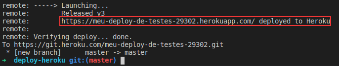

## Fazendo deploy

Para fazer deploy do seu app Heroku, basta você utilizar o comando git push de seu repositório local para a branch master do remote do Heroku;

**git push heroku-origin master**

Como renomeamos o remote que era apenas heroku com o nome heroku-origin usamos este para fazer o deploy;

Feito isso, caso seu build tenha sido feito com sucesso, no terminal será logada uma mensagem parecida com a seguinte:

[…]
remote: Released v3
remote: https://nome-do-seu-app-123.herokuapp.com/ deployed to Heroku
remote:
remote: Verifying deploy… done.
[…]

Pronto! Acesse a URL retornada pelo Heroku e você verá que sua aplicação está no ar!

Podemos fazer o push do nosso remote heroku-homolog também! Dessa forma, execute o mesmo comando acima, apenas mudando o nome do remote:

**git push heroku-homolog master**

Pronto! Acesse a URL e verá que sua aplicação do remote heroku-homolog está no ar!

Repare que a URL do remote heroku-homolog é diferente da url do remote heroku . Dessa forma, conseguimos manter duas aplicações no ar, uma sendo a master, que nossos usuários utilizarão, e outra para testes.

Sempre que você der push na branch master do Heroku ( remote heroku ), seu último commit será publicado. Caso você dê push em qualquer outro remote adicionado, ou em outra branch que não seja o master , não terá efeito nenhum no Heroku. Sendo assim, é preciso realizar esse processo a cada vez que for feita alguma alteração na aplicação.

Por exemplo, se você estiver em um branch chamado meu-branch e executar git push heroku meu-branch , o heroku vai ignorar esse push, pois ele foi realizado num branch diferente do master .

Podemos publicar uma versão que não está na branch master local. A versão que queremos publicar, na realidade, está, por exemplo, em uma branch de uma feature nova para a aplicação que você está desenvolvendo. Para isso, crie uma nova branch a partir da master:

**git checkout -b branch-teste**

Nessa branch, você vai alterar o conteúdo de App.js para:
meu-primeiro-deploy-heroku/src/App.js

import React from ‘react’;
import './App.css’;

function App() {
return (

Meu primeiro deploy no Heroku!

);
}

export default App;

Em seguida, rode os seguintes comandos do git:

**git add .**
**git commit -m ‘Meu primeiro deploy no Heroku!’**

Após ter realizado o commit das alterações, utilize o seguinte comando para realizar o deploy:

**git push heroku branch-teste:master**

Observe que foi necessário informar, ao final do comando, que o deploy deve ser realizado na branch master do remote heroku . Isto é necessário sempre que você estiver trabalhando em uma branch que não seja a sua master. No exemplo mostrado, estamos trabalhando na branch de nome branch-teste e realizamos o push com destino ao remote heroku .

Dessa forma, a versão da branch branch-teste foi publicada.

Além disso, é importante que saiba que ao setar variáveis de ambiente no front-end, essas variáveis já precisam existir no momento do build , pois a forma como elas funcionam é diferente de como funcionam no back-end.

No back-end, quando utilizamos process.env.ALGUMA_COISA , ele vai considerar o valor de ALGUMA_COISA que está definido na máquina atual. Já no front-end, quando se executa o comando npm start ou npm run build , ele vai pegar todos os process.env.* e irá trocar pelo valor daquela variável naquele momento.

Então, caso se tenha um process.env.REACT_APP_API_URL no front-end, e REACT_APP_API_URL tenha o valor "xablau" naquele momento, ele vai apagar process.env.REACT_APP_API_URL e irá substituir por "xablau" . Por esse motivo, na hora de subir o front-end no Heroku , é preciso setar as variáveis de ambiente antes de executar o comando de push , pois é no momento do push que o npm run build é executado e que os process.env.* são convertidos para os valores das variáveis.

⚠️ Atenção: Quando você executa um push para o Heroku, por mais que você pare o processo utilizando Ctrl + C , o deploy não será cancelado. Uma vez iniciado o processo no Heroku, ele continuará a ser executado até o fim em background no servidor.

## Lidando com vários deploys
É possível iniciar um novo deploy mesmo que um outro, do mesmo app , já esteja executando e ainda não tenha finalizado. Por exemplo, duas pessoas estão contribuindo para o mesmo projeto e executam push de commits diferentes quase ao mesmo tempo. Se isso ocorrer, ambos os processos serão iniciados paralelamente e, conforme os processos forem finalizando, as versões serão publicadas.

Importante: Note que as versões serão publicadas na ordem em que os processos forem concluídos, e não na ordem em que os comandos push forem realizados. Por exemplo:

Imagine um cenário em que duas pessoas estão contribuindo para o mesmo projeto. Vamos nomeá-las de A e B. Ambas realizaram um push na branch master do Heroku quase ao mesmo tempo. Nesse caso, os servidores do Heroku vão iniciar os dois processos paralelamente e vão publicá-los na sequência em que forem terminando.

Isso significa que, por mais que o processo A tenha se iniciado antes de B, se B terminar antes, ele será publicado e, posteriormente, quando o processo A finalizar, A será publicado, sobrescrevendo B.

