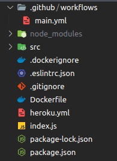

## CI/CD Pipeline
IMPORTANTE : todas as funcionalidades utilizadas no conteúdo de hoje, serão realizadas com uma conta free do Heroku , para evitar futuras cobranças em sua conta. Caso já tenha um cartão de crédito adicionado, remova-o em sua configuração de conta . https://dashboard.heroku.com/account/billing

Antes de iniciarmos, vamos entender o significado da sigla CI e CD :

## CI : Continuous integration (integração contínua)

É um processo de automação utilizado por pessoas desenvolvedoras. Uma CI é realizada com sucesso quando novas mudanças no código são desenvolvidas, testadas e consolidadas em um repositório, por exemplo, a correção de um bug ou o deploy de uma feature nova. Essa é uma solução ideal para evitar os conflitos quando diversas funcionalidades de uma aplicação são desenvolvidas de forma simultânea por um time de pessoas desenvolvedoras.

Exemplificando: se a empresa X precisa mergear vários PRs ou branches em um único dia para realizar o deploy de todas as funcionalidades ao mesmo tempo, provavelmente o trabalho será manual e demorado. Essa estratégia de deploy pode gerar vários conflitos durante a junção de códigos de pessoas desenvolvedoras que estão trabalhando de forma isolada umas das outras. Esse problema pode ser ainda pior se cada pessoa tiver a sua própria configuração da aplicação, com relação ao versionamento e tecnologias utilizadas.

Ao utilizar a integração contínua (CI) , os merges acontecem com mais frequência, as mudanças são consolidadas e testadas de forma automatizada para garantir que as novas mudanças não irão corromper a aplicação final.

Exemplos de ferramentas de integração contínua:

Actions GitHub : ESLint, testes automatizados, automações, etc.;

## Actions GitHub

Segundo o próprio GitHub , com as Actions é possível "criar e compartilhar ações para realizar qualquer trabalho que desejar, incluindo CI/CD, bem como combinar ações em um fluxo de trabalho completamente personalizado ."

E se você pensar "mas eu nunca vi isso, eu nunca utilizei" , aqui está a prova de que já viu!

As Actions são ações propriamente ditas que realizam algum tipo de evento, antes ou depois de realizar um push por exemplo, seja ele para a branch principal ou uma branch especifica, tudo irá depender do arquivo de configuração .yml , logo logo veremos onde.

No exemplo acima, são executadas três Actions , duas validações de estilização de código ( eslint e stylelint ) e uma validação dos testes da aplicação. Com isso implementado só será possível mergear esta branch caso todas as validações ( Actions ) sejam executadas com sucesso, caso haja algum conflito o merge será bloqueado.

Arquivo .yml utilizado no exemplo : Projeto TrybeWarts

on:
  pull_request:
    types: [opened, synchronize]

jobs:
  eslint:
    runs-on: ubuntu-18.04
    steps:
      - uses: actions/checkout@v2
      - uses: actions/setup-node@v1.4.4

  stylelint:
    runs-on: ubuntu-18.04
    steps:
      - uses: actions/checkout@v2
      - uses: actions/setup-node@v1.4.4

  evaluator:
    name: Evaluator Job
    runs-on: ubuntu-18.04
    needs: [eslint, stylelint]
    steps:
      - uses: actions/checkout@v2
      - name: Evaluator step
        id: evaluator
        uses: betrybe/cypress-evaluator-action@v5

## Arquivo de configuração .yml
Vamos entender um pouco mais sobre o arquivo main.yml , ele fica localizado em ".github/workflows/main.yml" .

É dentro deste arquivo que todas as Actions são descritas e configuradas. Uma action pode ser executada a partir de um pull request , push na master, push em uma branch especifica, entre outros.

on:
  [push, pull_request]

  A sintaxe on configura o fluxo de trabalho de quando a action será executada. No exemplo anterior a action será executada em todos os pushs e pull requests . É possível conferir todos os fluxos através da documentação .
https://docs.github.com/pt/actions/reference/events-that-trigger-workflows

jobs:
  eslint:
    runs-on: ubuntu-18.04
    steps:
      - uses: actions/checkout@v2
      - uses: actions/setup-node@v1.4.4

  stylelint:
    runs-on: ubuntu-18.04
    steps:
      - uses: actions/checkout@v2
      - uses: actions/setup-node@v1.4.4

  evaluator:
    name: Evaluator Job
    runs-on: ubuntu-18.04
    needs: [eslint, stylelint]
    steps:
      - uses: actions/checkout@v2
      - name: Evaluator step
        id: evaluator
        uses: betrybe/cypress-evaluator-action@v5

A sintaxe jobs descreve todas as ferramentas que serão executadas pelas actions, além de que cada ferramenta tem sua configuração própria, sendo possível atribuir a versão a ser executada com runs-on , os steps necessários com steps e as dependências utilizando o needs , criando uma ordem de execução. Saiba mais na documentação .
https://docs.github.com/pt/actions/reference/context-and-expression-syntax-for-github-actions

## CD : Continuous delivery (entrega contínua)
Está relacionado com a entrega contínua ou implantação contínua. No geral representa mudanças feitas por uma pessoa desenvolvedora, que são automaticamente testadas contra bugs e/ou falhas e carregadas a algum repositório, como o GitHub por exemplo. O objetivo final é garantir visibilidade e comunicação entre todas as equipes de desenvolvimento e garantir o mínimo de esforço na implementação de novos códigos em produção.

Um exemplo de CD é o deploy automatizado de uma aplicação, ao ser realizado alguma alteração na branch principal, um novo deploy é realizado de forma automática.

Em linhas gerais CI/CD geram monitoramentos e automações contínuas em todo o ciclo de vida da aplicação, incluindo também as etapas de testes, integração, entrega e implantação. Essas práticas muitas vezes são chamadas de "Pipeline de CI/CD" e são utilizadas juntamente das metodologias ágeis.

