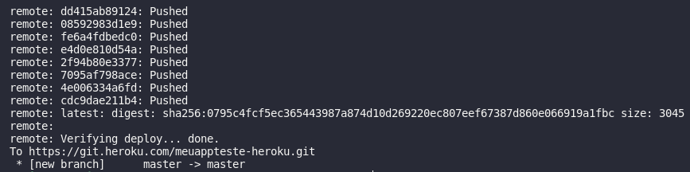

## Realizando o deploy de uma aplicação back-end

Para praticar o conteúdo do dia, vamos criar uma aplicação back-end com node e express .
Para realizar o deploy de sua aplicação back-end dentro da plataforma do Heroku , basta seguir o passo a passo do dia anterior (pode-se pular a parte do buildpack) e seu deploy será executado sem problemas. Mas e se quisermos adicionar o Docker ao nosso deploy?

Por isso vamos configurar nossa aplicação para trabalhar com Docker dentro do Heroku .

Começamos iniciando uma aplicação node e instalando todas as dependências. PS.: Copie cole cada linha por vez

mkdir app-heroku-ci-cd && cd app-heroku-ci-cd
npm init -y
npm install express dotenv
npm install eslint -D

Vamos usar o arquivo index.js para iniciar nosso servidor.

const express = require('express');
require('dotenv').config();

const app = express();
const port = process.env.PORT || 3000;

app.get('/', (req, res) => res.send(`<h1> Executando na porta: ${port} </h1>`));
app.listen(port, () => console.log(`Online: ${port}`));

O Dotenv será necessário para utilizarmos variáveis de ambiente e o ESLInt para adicionarmos CI à nossa aplicação.
Inicie a configuração do ESLint, seguindo os passos a baixo.

**npx eslint --init**

Siga as orientações abaixo
Ok to proceed? (y)
aperte enter para continuar
How would you like to use ESLint?
Selecione a opção To check syntax, find problems, and enforce code style
What type of modules does your project use? · commonjs
Selecione a opção CommonJS
Which framework does your project use?
Selecione a opção None of these
Does your project use TypeScript?
Selecione a opção No
Where does your code run? Utilize a barra de espaço para marcar/desmarcar uma opção
Selecione a opção Node
How would you like to define a style for your project?
Selecione a opção Use a popular style guide
Which style guide do you want to follow?
Selecione a opção Airbnb: https://github.com/airbnb/javascript
What format do you want your config file to be in?
Selecione a opção JSON
Would you like to install them now with npm?
Selecione a opção Yes

Confira em seu arquivo .eslintrc.json se o ecmaVersion veio com a versão 12, caso não, configure manualmente. Seu arquivo .eslintrc.json deve ficar como no exemplo abaixo:

{
    "env": {
        "commonjs": true,
        "es2021": true,
        "node": true
    },
    "extends": [
        "airbnb-base"
    ],
    "parserOptions": {
        "ecmaVersion": 12 // certifique-se de que o valor seja 12
    },
    "rules": {
    }
}
É importante removermos a pasta node_modules dos arquivos que serão enviados ao git . Para isso, crie um arquivo .gitignore e adicione a seguinte linha nesse arquivo.

node_modules/

Vamos iniciar a configuração do Docker. Crie o arquivo Dockerfile para definirmos como será nossa imagem docker usando o modelo abaixo.

FROM node:alpine

WORKDIR /app

COPY package.json .

RUN npm install

COPY . .

CMD ["node", "index.js"]

Depois criaremos o arquivo heroku.yml que será nosso orquestrador de containers, utilizado em ambientes de produção do Heroku .

O arquivo heroku.yml possui quatro níveis superiores: setup , build , release , run .

setup : Especifica os complementos e variáveis de configuração a serem criados durante o provisionamento do aplicativo - Documentação ;

build : Especifica o Dockerfile que será utiliza para construção da imagem - Documentação ;

release : Especifica as tarefas da fase de liberação a serem executadas - Documentação ;

run : Especifica os tipos de processos e os comandos a serem executados para cada um - Documentação .

Leia mais sobre o heroku.yml na documentação .

Aqui está o exemplo de utilização do heroku.yml para construir imagens Docker .

setup:
  addons:
    - plan: heroku-postgresql
      as: DATABASE
build:
  docker:
    web: Dockerfile
    worker: worker/Dockerfile
release:
  command:
    - ./deployment-tasks.sh
  image: worker
run:
  web: node index.js

Porém iremos utilizar um arquivo um pouco mais simples dessa primeira vez, crie o arquivo heroku.yml na raiz de sua aplicação.

build:
  docker:
    web: Dockerfile
run:
  web: node index.js

Se o comando run não for adicionado ao heroku.yml , por padrão ele utiliza o CMD especificado no Dockerfile

Vamos iniciar o processo de deploy criando nosso app, acesse o terminal, inicie o git e crie um app dentro do Heroku .

git init
heroku apps:create nome-do-seu-app-123 # ⚠️ Se você usar exatamente esse nome, o heroku vai exibir a mensagem `is already taken`. Use um nome diferente!

Para consultar os remotes existentes:

git remote -v
Antes de realizarmos o deploy, precisamos informar que o Heroku irá trabalhar como um container . Então será necessário alterar a stack de trabalho, ou seja, a imagem do sistema operacional que será executada, por padrão o Heroku utiliza a stack Heroku 20 , uma imagem contendo Ubuntu 20.04 . Para verificar qual Stack seu aplicativo está utilizando bastar executar

heroku stack

heroku stack -a nome-da-sua-aplicação # Para o caso de mais de um aplicativo
Vamos então alterar para utilizar a imagem de um container .

heroku stack:set container

heroku stack:set container -a nome-da-sua-aplicação # Para o caso de mais de um aplicativo

Confira a documentação das stacks para saber mais.

Adicione as alterações feitas para o git, faça os commits e realize um push para o remote do heroku.

git add .
git commit -m "meu primeiro commit na plataforma heroku com Docker"
git push heroku master

Lembrando que, caso esteja em uma branch diferente da master, e queira fazer o push a partir dela, você deverá apontar sua-branch para a master.

git push heroku sua-branch:master

Se tudo der certo, sua saída deverá se parecer com a imagem a seguir

Pronto, o Heroku já esta executando sua aplicação com as configurações que foram pré-definidas pelo Docker .
Acesse seu APP para verificar se tudo está funcionando como deveria, a URL padrão criada pelo Heroku é https://NOME-DO-APP.herokuapp.com/ ou execute direto do seu terminal o comando abaixo.

heroku open

O navegador irá exibir a mensagem Executando na porta: 30076 . A porta não vai ser exatamente essa, pois como vimos o heroku sempre cria uma porta nova a cada deploy .
