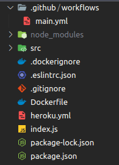

## Implementando CI em uma aplicação

Vamos começar implementando um exemplo simples de CI . Todas as vezes que um novo push, independente da branch for executado, iremos executar uma action para validar o code style , ou seja, iremos executar o ESLint para analisar todo o código.
Para criarmos uma action, crie uma pasta .github na raiz do seu projeto. Dentro desta pasta, crie uma nova pasta chamada workflows e então crie o arquivo main.yml .

Vamos utilizar este repositório https://github.com/marketplace/actions/run-eslint , disponível no marketplace https://github.com/marketplace do GitHub . Para utilizá-lo basta configurar nosso arquivo de fluxo de trabalho .yml .

on: [push, pull_request]

jobs:
  eslint:
    runs-on: ubuntu-latest
    steps:
        - name: Verifica o repositório do Git
          uses: actions/checkout@v2

        - name: Instala o node com a versão
          uses: actions/setup-node@v1
          with:
            node-version: 14

        - name: instalando as dependências
          run: npm install

        - name: executando o lint para verificar se a erros
          run: npx eslint .

on: estamos dizendo que em todo push ou pull_request uma ação será executada.

jobs : com base na regra definida acima, os jobs descritos serão executados, em nosso exemplo o ESLint (Aqui é o nome de nossa action, podemos por até 'batatinha', mas é sempre bom colocar um nome que faça sentido).

name : define o nome da ação.

runs-on : especifica qual a versão da máquina a ser utilizada na action, saiba mais https://docs.github.com/pt/actions/using-github-hosted-runners/about-github-hosted-runners .

steps : podem executar comandos, trabalhos de configurações ou executar ações no repositório.

uses:actions/checkout@v2 : Esta é uma ação que verifica seu repositório e baixa-o para o executor do github, permitindo que você execute ações em seu código (como ferramentas de teste). Você deve usar a ação de checkout sempre que seu fluxo de trabalho for executado no código do repositório ou se estiver usando uma ação definida no repositório.

uses:actions/setup-node@v1 : Esta é uma ação para configuração do node.

with:node-version: 14 : Aqui é definido qual versão do node será usada.

run : Esse comando executa comandos CLI.

Primeiro será necessário fazer um push para um repositório no GitHub para podermos testar nossas configurações. Crie um repositório em seu GitHub , aponte o remote do seu novo projeto para o repositório e adicione todas as alterações já realizadas, e então faça um commit e depois um push .

git add .
git commit -m "adicionando arquivos ao github"
git branch -M master
git remote add origin git@github.com:SEU-USUARIO/SEU-APP.git
git push -u origin master

Pronto! Somente isso é necessário para adicionarmos uma Action , e veja a mágica acontecer na aba de Actions .
https://github.com/seu-nome-de-usuario/seu-repositorio/actions

Também é interessante ver a action funcionando em um pull request . Mude de branch e faça o teste.
