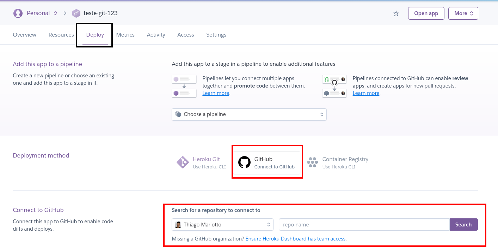
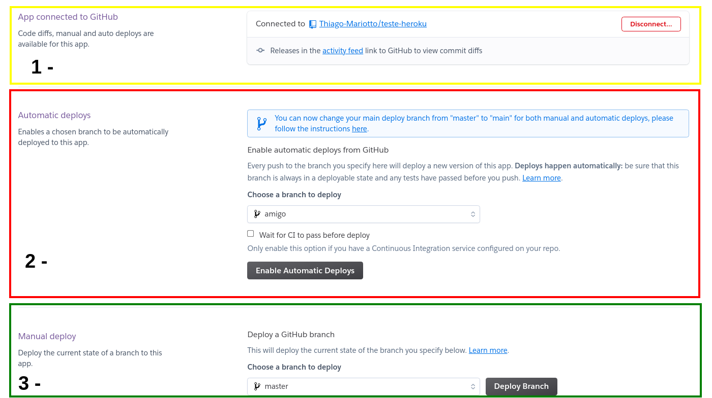

## Implementando CD em um repositório com Heroku
Acesse o aplicativo previamente criado no Heroku https://dashboard.heroku.com/apps .

Dentro do aplicativo, existe no menu o item Deploy . É possível observar que existem três formas de realizar deploy no Heroku .

Heroku Git : utilizamos no dia anterior, para realizar o deploy da aplicação front-end;

GitHub : utilizado para conectar a um repositório do GitHub ;

Container Registry : utilizado para realizar o deploy com Docker .

Como nosso deploy já foi realizado e o que queremos agora é adicionar o Continuous deployments , vamos atrelar o repositório do GitHub ao nosso aplicativo do Heroku . Caso não tenha se conectado anteriormente com o GitHub , faça a adição da sua conta. Feito isso, basta adicionar o repositório que deseja integrar com seu aplicativo. Clique em search , e todos os seus repositórios serão listados.

Selecione qual deseja utilizar, e aguarde alguns segundos até que o carregamento seja finalizado com sucesso.

É possível observar na primeira divisão (1 - em amarelo) que foi sinalizado qual repositório GitHub está conectado ao aplicativo do Heroku .

No segundo campo (2 - em vermelho) é possível configurar o deploy automático .

A primeira informação necessária é dizer de qual branch será realizado o deploy. No exemplo da imagem é possível ver uma branch com o nome "amigo", mas você pode utilizar a branch principal :)

Continuous Integration : perceba que existe um check box "Wait for CI pass before deploy" que deve ser assinalado.

Com esse check box assinalado, o deploy somente será realizado se a CI for concluída com sucesso, ou seja, em nosso exemplo somente se a action criada na seção anterior do linter for executada sem nenhum erro.

Clique no botão Enable Automatic Deploys para adicionar a configuração do Continuous Deployment , com isso, todas as vezes que um novo push for realizado para a branch escolhida em nosso repositório do GitHub , nossa Action será executada e caso seja concluída com sucesso, um novo deploy no Heroku será realizado autoMAGICAMENTE .

No terceiro campo (3 - em verde) é possível realizar o deploy de uma branch específica de forma manual, apenas clicando no botão deploy branch .
Com isso, concluímos uma integração com um CI/CD funcionando perfeitamente.
