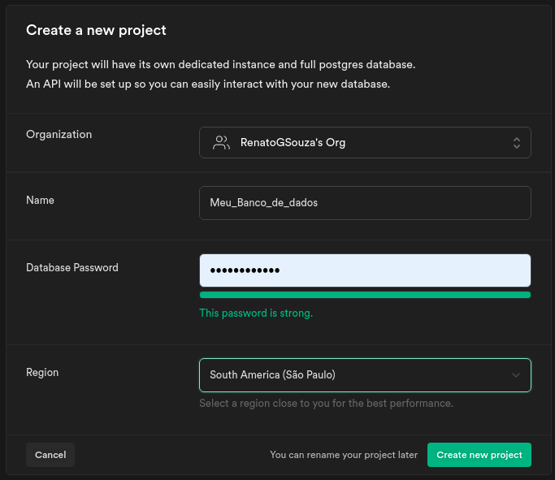
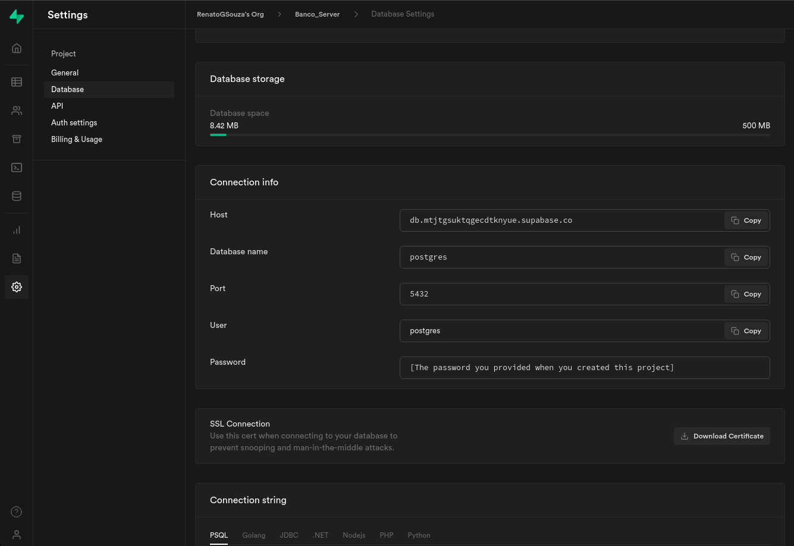
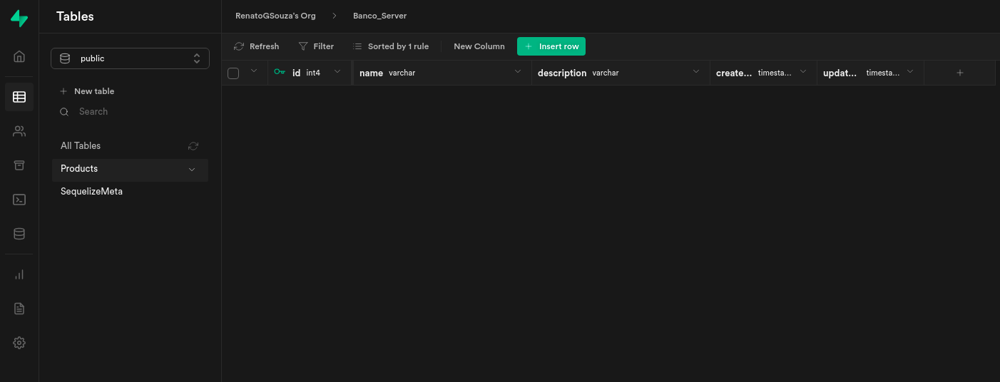
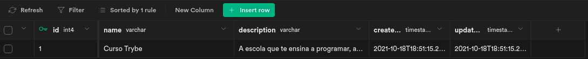

## Como hospedar um banco de dados SQL

Aqui usaremos o Postgres como nosso banco, mas usaremos comandos já vistos em mysql. Caso queira se aprofundar em Postgres veja sua documentação https://www.postgresql.org/docs/

Existem diversas formas de disponibilizarmos um banco de dados em plataformas online e deixarmos nossos dados salvos na nuvem como por exemplo:

AWS
Google Cloud
Heroku
Hostinger

Em nosso exemplo, vamos utilizar o supabase https://supabase.io/ , ele nos disponibiliza um banco de dados Postgres gratuito com um limite de 500mb de armazenamento, será mais do que necessário para praticarmos.

## Criando uma nova conta no Supabase

Para realizar o cadastro acesse o site https://supabase.io/ e clique em Start your project .

O cadastro é feito através da sua conta do github.

Acesse sua conta no github e autorize o supabase a ter o acesso.

Para criar um novo banco de dados clique no botão New project e selecione seu nome do github.

Adicione o nome, senha (crie uma senha segura, mas lembre-se de guarda-la para não esquecer) e região do seu banco de dados, a região para ter um ping melhor você pode colocar South America(São Paulo) .

Após criar o banco, pode demorar poucos minutos até que ele esteja online, normalmente não leva mais que 2 minutos, enquanto isso, vamos construindo nosso projeto.
Para começar, vamos iniciar uma aplicação Node.js, instalar o Sequelize, Postgres e mais alguns recursos que vamos usar:

  mkdir supabase-with-sequelize && cd supabase-with-sequelize
  npm init -y
  npm install sequelize sequelize-cli express dotenv
  npm install pg pg-hstore
vamos iniciar a configuração do Sequelize

 npx sequelize-cli init
Vamos as configurações do nosso config.json , vamos muda-lo para config.js e adicionar nossas configurações.
Nosso config.js vai ficar assim.

// config/config.js
require('dotenv/config');

const { HOST, PASSWORD_POSTGRES, DATABASE, DB_USERNAME, DB_PORT } = process.env;

module.exports = {
  "development": {
    "username": DB_USERNAME,
    "password": PASSWORD_POSTGRES,
    "database": DATABASE,
    "host": HOST,
    "port": DB_PORT,
    "dialect": "postgres"
  },
  "test": {
    "username": DB_USERNAME,
    "password": PASSWORD_POSTGRES,
    "database": DATABASE,
    "host": HOST,
    "port": DB_PORT,
    "dialect": "postgres"
  },
  "production": {
    "username": DB_USERNAME,
    "password": PASSWORD_POSTGRES,
    "database": DATABASE,
    "host": HOST,
    "port": DB_PORT,
    "dialect": "postgres"
  }
}
Agora adicionaremos ao nosso arquivo .env nossas variaveis.

PASSWORD_POSTGRES= # aqui vai ser a senha que você criou
HOST= # o link para onde o banco está hospedado
DATABASE=postgres
DB_USERNAME=postgres
DB_PORT= # porta que o Supabase fornece
HOST === servidor onde o banco esta sendo hospedado.

# EXEMPLO
PASSWORD_POSTGRES=13244
HOST=db.minhaurldeconexao.supabase.co
DATABASE=meubanco
DB_USERNAME=userhost
DB_PORT=6543
Para encontrarmos o link do nosso banco, vamos nas configurações no supabase e depois em Database .

Em Connection info temos as informações de configuração do nosso banco, vamos  o host do nosso connection info e colar em nosso host na variável de ambiente.
OBS: Links de conexão com o banco e senhas, são dados sensiveis que não podem estar expostos em nosso código, por isso vamos deixá-los em nossas variaveis de ambiente.
Lembre-se que temos que alterar o index do model para ele procurar o arquivo config.js

// models/index.js

const config = require(__dirname + '/../config/config.js')[env];
Vamos criar uma tabela de Products em nosso banco.

npx sequelize model:generate --name Product --attributes name:string,description:string
Execute a migration para criar a tabela

 npx sequelize db:migrate
Criamos nossa tabela de Products , podemos ver nossa tabela no supabase em Table editor

Agora vamos criar um arquivo index.js com a rota /product e método post para adicionarmos produtos a nossa tabela.

// arquivo/index.js

const express = require('express')

const { Product } = require('./models')

const app = express()
const port = process.env.PORT || 3000

app.use(express.json());

app.post('/product', async (req, res) => {

  const { name, description } = req.body;

  const product = await Product.create({ name, description });

  return res.status(201).json(product);
});

app.listen(port, () => console.log(`Servidor online na porta ${port}`));
Execute o node para fazer a requisição.

node index
Faça uma requisição no Postman ou Insomnia , passe os valores de name e description no body e confira no supabase seu novo produto registrado no banco de dados.

{
  "name": "Curso Trybe",
  "description": "A escola que te ensina a programar, a aprender e a trabalhar."
}

