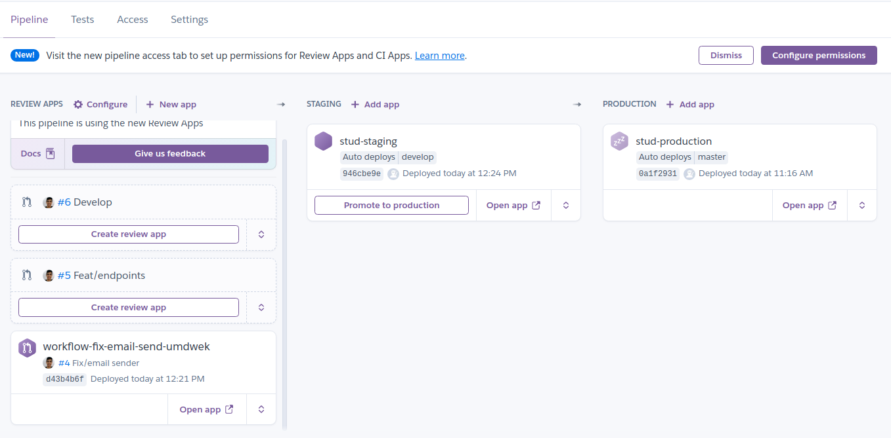
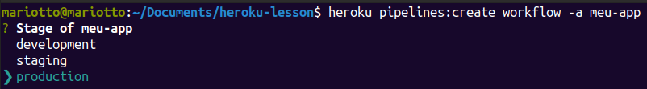
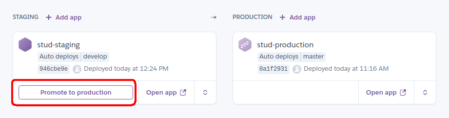
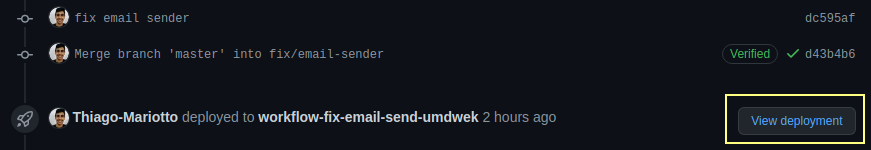
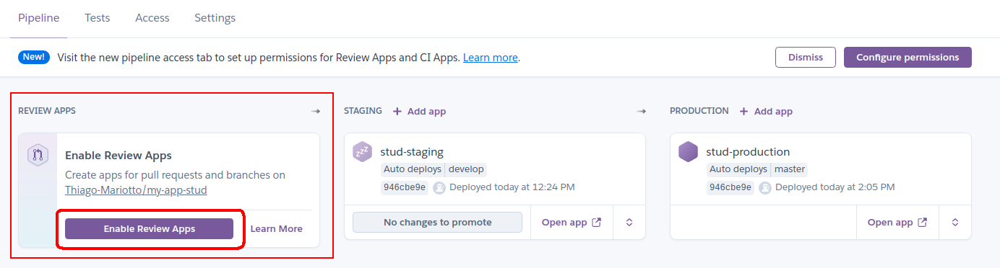

## Criando uma Pipeline com Heroku

Uma pipeline é um grupo de aplicativos do Heroku que compartilham a mesma base de código, onde cada aplicativo representa um estágio da pipeline seguindo um fluxo de trabalho de entrega contínua:

Desenvolvimento
Análise
Staging
Produção

A pipeline possui um papel fundamental para gerenciar diversos ambientes de seu produto. No fluxo de uma pipeline é comum encontrar as seguintes etapas:

Uma pessoa desenvolvedora realiza um pull request enviando uma alteração para a aplicação.

O Heroku cria automaticamente um aplicativo de revisão para a solicitação pull, permitindo que as mudanças possam ser testadas.

Quando a mudança está finalizada e testada ela é incorporada para a branch master .

A branch master é implementada automaticamente em um aplicativo de testes do pipeline.

Quando todas as mudanças estiverem prontas uma pessoa desenvolvedora promove o aplicativo de testes para a produção.

A página de visão geral de um pipeline ilustra os estágios desse fluxo e fornece o status de cada estágio. Por exemplo, você pode ver se seu aplicativo de produção está executando um código diferente do teste.

## Criando a pipeline via CLI
É possível criar uma pipeline tanto pelo painel do Heroku quanto via CLI .

Vamos realizar a criação via CLI onde já nos acostumamos a trabalhar :D

É possível utilizar o comando pipelines:create para criar uma nova pipeline . É necessário especificar um aplicativo existente que será adicionado a pipeline

heroku pipelines:create workflow -a meu-app
heroku : especifica que iremos utilizar o heroku cli ;
pipelines:create : cria uma nova pipeline ;
workflow : nome atribuido a pipeline
-a : flag para apontar um aplicativo;
meu-app : nome do aplicativo a ser adicionado.

Em seu terminal você deverá selecionar qual o ambiente desejado para o app adicionado, podemos começar selecionando production , caso queira adicionar mais um estágio da pipeline, crie um novo aplicativo para adiciona-lo em staging .

## Adicionar aplicativos a uma pipeline

heroku pipelines:add workflow -a meu-app-test
heroku : especifica que iremos utilizar o heroku cli ;
pipelines:add : adiciona um aplicativo a uma pipeline ;
workflow : nome da pipeline que receberá o aplicativo;
-a : flag para apontar um aplicativo;
meu-app : nome do aplicativo a ser adicionado.

## Deploy de um ambiente de staging para produção

Depois de testar totalmente uma mudança em um estágio de pipeline específico (no exemplo: staging), você pode promove-lo para o(s) aplicativo(s) no estágio de downstream*.

Downstream : se refere ao próximo estágio do ambiente em um pipeline. Por exemplo, dado um development --> staging --> production pipeline, o staging é a continuação do development e a produção é a continuação da staging.

heroku pipelines:promote -a meu-app
pipelines:promote : irá promover o código de um estágio para outro;

Por padrão, este comando promove o aplicativo de origem para todos os aplicativos no estágio de downstream. Você pode especificar um subconjunto desses aplicativos para promover com a opção --to

heroku pipelines:promote -a meu-app --to meu-app-production-one,meu-app-production-two
pipelines:promote : irá promover o código de um estágio para outro;
--to : informa o(s) aplicativos onde o código será promovido;

## Configurando Review Apps
Review app ou aplicativo de revisão executa o código em qualquer solicitação de pull request do GitHub em um aplicativo Heroku completo e descartável após a utilização. Cada solicitação de pull request gera uma URL exclusiva contendo toda alteração solicitada que pode ser compartilhada, o que torna uma ótima maneira de testar alterações do código.

É possível gerar aplicativos de revisão de forma automatizada a cada pull request ou de forma manual na página da pipeline . Se a automatização estiver ativa, o próprio Heroku fica responsável por criar o aplicativo, publicá-lo, gerar um comentário em seu pull request no GitHub com um botão para visualizar código enviado.

É gerada uma URL parecida com essa: https://PIPELINENAME-xxxxx-xxxxx.herokuapp.com/ .

Acesse sua pipeline criada na seção anterior e vamos adicionar os Reviews apps . Acesse a pipeline em Heroku Apps

No fluxo de Review Apps , clique no botão Connect to GitHub para adicionar o repositório a este estágio, selecione o repositório e retorne para a aba inicial da pipeline .
O botão Enable Review Apps está disponível para iniciar os apps de review.

No canto direito um modal será aberto para aplicar as configurações, três check box estarão disponíveis e todas elas serão assinaladas:

Create new review apps for new pull requests automatically : Ativa a criação automática dos aplicativos de revisão a cada pull request , ative essa opção.

Wait for CI pass : já visto antes, essa opção espera todas as validações executadas pelo CI .

Destroy stale review apps automatically : Com essa opção assinalada é possível definir um tempo de vida útil para nossos review apps .

Finalize a configuração clicando no botao Enable Review Apps .

Pronto, a cada novo pull request um novo review app será criado pelo Heroku , além de ser gerado um comentário contendo o link do mesmo dentro do GitHub , realize o teste criando um novo pull request .

Nota: a versão free do Heroku permite o build simultâneo de apenas um aplicativo de review app , então só será possível visualizar um por vez.

